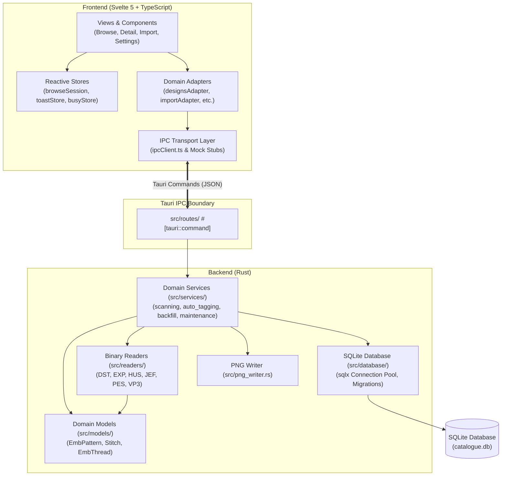

# Rust Embroidery Catalogue

[](https://www.rust-lang.org)
[](https://tauri.app)
[](https://svelte.dev)
[](LICENSE)

A high-performance, cross-platform desktop application designed to catalog, search, preview, and organize machine embroidery designs (`.pes`, `.dst`, `.jef`, `.exp`, `.hus`, `.vp3`).

Built with **Tauri v2**, **Rust**, **SQLite**, and **Svelte 5**.

---

## Key Features

- **Fast Multi-Format Ingestion:** Native Rust binary parsers extract stitch geometry, bounding boxes, and thread palettes from Tajima (`.dst`), Melco (`.exp`), Husqvarna Viking (`.hus`), Janome (`.jef`), Brother (`.pes`), and Pfaff (`.vp3`).
- **Real-Time Visual Rendering:** Generates realistic thread previews with lighting, shading, and jump stitch suppression directly from raw stitch coordinates.
- **Smart Cataloging & AI Tagging:** Automated rule-based tagging and optional Google Gemini AI integration for intelligent subject classification. Evaluated in September 2026 against Claude Sonnet and Hugging Face models; Gemini AI Vision was selected as the primary backend provider due to superior tagging accuracy.
- **Robust SQLite Storage:** Single-file catalog database with WAL (Write-Ahead Logging), multi-root library support, and portable drive relocation.
- **Batch Operations & Maintenance:** Asynchronous thumbnail regeneration, database compaction, automated backups, and recovery tooling.

---

## Architecture Overview



---

## Repository Directory Map

```text
Rust-Embroidery-Catalogue/
├── src/                        # Rust Backend (Tauri Core)
│   ├── database/               # SQLite connection pool, schema, & migrations
│   ├── models/                 # Core domain models (EmbPattern, Stitch, EmbThread)
│   ├── readers/                # Binary embroidery format parsers (DST, PES, JEF, etc.)
│   ├── routes/                 # Tauri IPC command handlers (#[tauri::command])
│   ├── services/               # Pure business logic (scanning, AI tagging, backfill)
│   ├── config.rs & settings.rs # App configuration & user preferences
│   ├── error.rs                # Unified error handling (AppError)
│   ├── logging.rs              # File & console structured logging
│   ├── paths.rs                # Multi-root storage paths & portable mode detection
│   ├── png_writer.rs           # Stitch-to-PNG visual rasterizer
│   └── main.rs                 # Application entry point & Tauri runtime bootstrap
├── frontend/                   # Frontend Application (Svelte 5 + TypeScript)
│   └── src/
│       ├── App.svelte          # Root application component & layout
│       └── lib/
│           ├── api/            # Typed IPC client & domain adapters (*Adapter.ts)
│           ├── components/     # Reusable UI components (modals, grids, buttons)
│           ├── services/       # Frontend service coordinators & event listeners
│           ├── stores/         # Svelte writable/derived state stores
│           ├── types/          # TypeScript interfaces & domain types
│           ├── utils/          # Formatting, DOM, and routing helpers
│           └── views/          # Top-level screen views (Browse, Detail, Import, etc.)
├── migrations/                 # Sequential SQL migrations for SQLite schema
├── tests/                      # Integration test assets & Playwright E2E suites
└── docs/                       # Developer guides, recipes, and architecture specs
```

---

## Quick Start (Local Development)

### Prerequisites

- **Rust:** `1.80.0+` (managed via `rustup`, see `rust-toolchain.toml`)
- **Node.js:** `v18+` (LTS recommended) and `npm`
- **Tauri CLI:** `cargo install tauri-cli --version "^2.0.0"`
- **Build Tools:**
  - **Windows:** Visual Studio C++ Build Tools (MSVC)
  - **macOS:** Xcode Command Line Tools
  - **Linux:** `libwebkit2gtk-4.1-dev`, `build-essential`, `curl`, `wget`, `libssl-dev`, `libgtk-3-dev`

### 3-Step Setup

```bash
# 1. Clone repository
git clone https://github.com/JulieStenning/Rust-Embroidery-Catalogue.git
cd Rust-Embroidery-Catalogue

# 2. Install frontend dependencies
npm install

# 3. Launch in development mode (hot-reloading frontend + compiled Rust backend)
cargo tauri dev
```

---

## Running Quality Checks & Tests

Before submitting pull requests, run the project test suites:

```bash
# Run Rust unit tests (1400+ tests across readers, services, routes, migrations)
cargo test

# Run Rust linter & formatting checks
cargo clippy --all-targets -- -D warnings
cargo fmt --check

# Run Frontend Vitest test suite (1200+ unit & store tests)
npm test

# Run End-to-End Playwright test suite
npm run e2e
```

---

## Documentation & Developer Guides

- 📘 [**Developer Guide & How-To Recipes**](docs/DEVELOPER_GUIDE.md): Step-by-step recipes for adding new embroidery formats, adding IPC commands, and writing database migrations.
- 🤝 [**Contributing Guidelines**](CONTRIBUTING.md): Branch naming, PR process, and code formatting rules.
- 📂 [**Documentation Portal**](docs/README.md): Index of all architectural specifications, test plans, and release SOPs.
- 📖 [**In-Code Rustdoc**](target/doc/embroidery_catalogue/index.html): Generate with `cargo doc --no-deps --open`.

---

## Licence

Embroidery Catalogue is free software: you can redistribute it and/or modify it under the terms of
the **GNU General Public License** as published by the Free Software Foundation, either version 3 of
the License, or (at your option) any later version (`GPL-3.0-or-later`).

Embroidery Catalogue is distributed in the hope that it will be useful, but WITHOUT ANY WARRANTY;
without even the implied warranty of MERCHANTABILITY or FITNESS FOR A PARTICULAR PURPOSE. See the
GNU General Public License for more details.

You should have received a copy of the GNU General Public License along with this program. If not,
see <https://www.gnu.org/licenses/>.

- Full licence text (verbatim, unmodified): [LICENSE](LICENSE)
- Third-party notices, attributions and Corresponding Source location: [NOTICE](NOTICE)

The embroidery binary readers under `src/readers/` (`.pes`, `.jef`, `.hus`, `.vp3`, `.dst`, `.exp`)
and the PNG preview renderer in `src/png_writer.rs` are ported or derived from
[pyembroidery](https://github.com/EmbroidePy/pyembroidery), Copyright (c) 2018 Tatarize and the
EmbroidePy pyembroidery contributors, and are used under the MIT License. The verbatim MIT notice is
reproduced in [NOTICE](NOTICE) and in the application under About.

Every source file in this repository carries an SPDX header
(`SPDX-License-Identifier: GPL-3.0-or-later`) so the licence is machine-readable.
