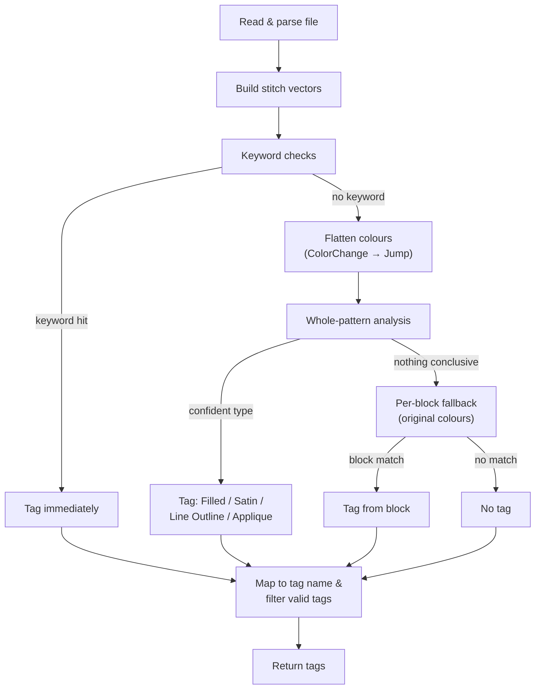
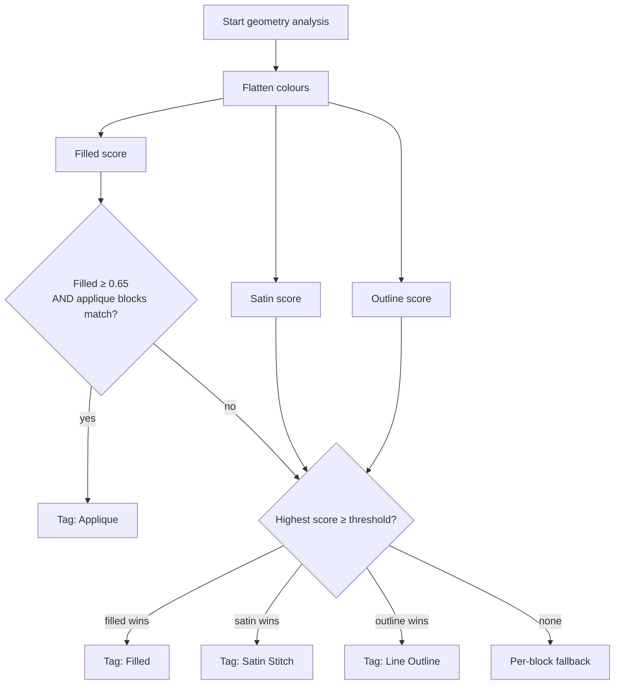
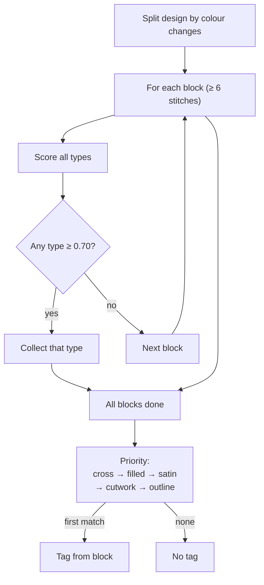

# Stitch Identifier Architecture

## Overview

The stitch identifier (`src/services/stitch_identifier.rs`) classifies the **dominant stitch type** of an embroidery design and maps it to a system tag (e.g. "Satin Stitch", "Filled", "Line Outline"). It is invoked from the database import/backfill pipeline via `suggest_stitching_from_pattern_file()` or `suggest_stitching_from_pattern()`.

A design is treated as having **ONE primary stitch character**. Stitch types are checked in a priority chain, most specific first, and the first confidently-matched type is returned alone. Lower-priority types are never considered once a higher-priority one has matched.

## Diagrams

The overall flow is split into three smaller diagrams for readability.

### Overview



### Keyword checks & whole-pattern analysis



*Thresholds:* filled `0.65`, satin `0.70`, outline `0.70`. See [Design decision 5](#5-whole-pattern-priority-picker).

### Per-block fallback



## Key Design Decisions

### 1. Keyword checks run first

Before any geometry analysis, the filename and folder name are checked for keywords:

| Stitch type | Keywords |
|---|---|
| `lace` | `lace`, `fsl`, `freestanding lace`, `free standing lace` |
| `ith` | `in the hoop`, `ith`, `hoop` |
| `applique` | `applique`, `appliquee`, `appliqué`, `appique` |
| `cross_stitch` | `cross stitch`, `cross-stitch`, `cross_stitch` |

If a designer names a file "my_fsl_lace.pes", geometry analysis is irrelevant — keywords win immediately. These are checked in priority order: lace → ITH → applique → cross-stitch.

### 2. Colour flattening (the 89343.hus fix)

**Problem:** Stitch density does not depend on the number of colours — a 3-colour filled mailbox is still one filled region. Previously, per-colour fragmentation locked out the single-block fill boosts, so a sparse block could win the priority chain and tag the whole design "Line Outline".

**Solution:** `flatten_colors()` clones the pattern and converts every `ColorChange` stitch into a `Jump`:

```rust
fn flatten_colors(pattern: &EmbPattern) -> EmbPattern {
    let mut flattened = pattern.clone();
    for stitch in &mut flattened.stitches {
        if stitch.stitch_type == StitchType::ColorChange {
            stitch.stitch_type = StitchType::Jump;
        }
    }
    flattened
}
```

The whole-pattern fill/satin/outline detectors are then computed on this flattened view, so `count_color_changes() == 0` (unlocking the single-block fill boost).

### 3. "Jump instead of Delete" (the mixed-design test fix)

`ColorChange` is **replaced** with `Jump` — not deleted. This is critical because `build_vectors()` resets its "previous stitch" tracking whenever it sees a non-`Stitch` command. Deleting the stitch would concatenate two far-apart colour regions into one vector chain, creating a synthetic long "stitch" that corrupts the geometry detectors (running score, density, satin). The existing test `identifies_single_priority_type_for_multi_block_mixed_design` (two regions 2000 units apart) caught this: with delete, the whole-pattern analysis wrongly returned a non-filled type.

### 4. Applique geometry gate

Applique is detected by finding **two near-identical outline blocks** (placement + tack-down) with matching bounding boxes. This runs **after** the whole-pattern scores are computed but **before** the priority picker, so it can intercept designs that are about to be wrongly classified. However, it only fires when the design is **not** confidently filled — in a dense fill, matching sparse blocks are just interior elements (windows, details), not applique layers.

### 5. Whole-pattern priority picker

`max_by(filled, satin, outline)` selects the highest scorer and checks it against a confidence threshold:

| Type | Threshold |
|---|---|
| filled | `0.65` (allows a small margin below 0.70 because sparse interior holes dilute density) |
| satin | `0.70` |
| outline | `0.70` |

This catches multi-colour fill designs whose individual colour blocks are too fragmented to pass the threshold on their own (e.g. long-row teapot house fills).

### 6. Per-block fallback

When the whole-pattern pass yields nothing conclusive, the identifier re-analyses each colour block **from the original (unflattened) pattern**. Each block gets its own local `StitchIdentifier` and `get_detailed_analysis()`. Types scoring ≥ 0.70 are collected, then the priority chain picks the first match:

```
cross_stitch → filled → satin → cutwork → outline
```

This catches mixed designs with disjoint regions (e.g. a sparse outline plus a dense fill 2000 units apart), where the whole-pattern bounding box dilutes density to near-zero.

### 7. Satin uses the zigzag signature, not stitch length

Satin's defining signature is the **zigzag**: the leg direction flips between the two column edges on essentially every stitch, so the consecutive direction-change rate (`direction_change_score()`) is very high. Long-row serpentine fills keep a constant direction within each row and only reverse at row ends, so they show a low change rate.

`detect_satin()` therefore:
- Returns `0.0` if `turns < 0.50` (not a zigzag)
- Returns `0.0` if mean length > 80 (coarse sanity gate for jumps/outlines)
- Boosts the score to `0.70 + 0.40 × (turns − 0.60)` when `turns ≥ 0.60`

This replaced the old mean-length cap of 20 units, which wrongly killed wide satin motifs (like `10434.PES`, whose legs average ~30 units) while still separating them from long-row fills.

## Detector Formulas

| Detector | Formula |
|---|---|
| `running_like_score` | fraction of stitches ≤ 1.35 × mean length — uniform step lengths |
| `stitch_density_score` | `min(1, 50 × stitch_count / area)` |
| `detect_satin_like_score` | `0.45×long_ratio + 0.35×axis_ratio + 0.20×turns` |
| `detect_filled_like_score` | `0.6×density + 0.4×turns` |
| `detect_outline` | `clamp(0.8×running + 0.2×(1−density) − 0.25×satin_like − 0.2×fill_like, 0, 1)` |
| `direction_change_score` | fraction of consecutive angle changes > 45° |
| `geometric_angle_score` | fraction of stitches within 16° of the 8 anchor angles (0/45/90/…/315) |

## Tests

The identifier has a `#[path]`-included test module `src/services/stitch_identifier_tests.rs`. Fixture-dependent tests skip gracefully when the file is absent (CI / fresh checkouts do not depend on a local Design folder):

- `filled_suppresses_satin_and_outline` / `identifies_filled_for_dense_pattern` — synthetic dense fill → "Filled" only
- `identifies_outline_for_sparse_lines` — sparse perimeter → "Line Outline"
- `real_53505_hus_is_filled_only` — the original dense-fill regression
- `real_10434_pes_is_satin_not_outline` — wide satin motif (zigzag fix)
- `real_89343_hus_is_filled_not_outline` — 3-colour filled mailbox (colour-flattening fix)
- `identifies_single_priority_type_for_multi_block_mixed_design` — disjoint-region fallback must stay green
- `identifies_applique_geometric_matching` / `does_not_identify_applique_for_single_outline` — applique geometry gate
- `ith_keyword_beats_filled` / `applique_keyword_beats_filled` / `identifies_metadata_priority_keyword` — keyword priority
- `tea_pot_houses_files_are_filled_not_cross_stitch` — long-diagonal fills are not cross-stitch