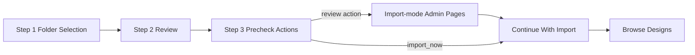

# Import UI Specification

## Status
- Type: Current behavior baseline (UI only)
- Audience: Agents
- Last validated: 2026-05-26
- Backend companion: [docs/Specs/import-backend-spec.md](docs/Specs/import-backend-spec.md)
- User guide companion: [docs/User-Facing-Guidance/IMPORT_WORKFLOW.md](docs/User-Facing-Guidance/IMPORT_WORKFLOW.md)

## Purpose
Define the import wizard UI contract for structure, controls, states, and interactions across all import steps.

## Scope
In scope:
- Wizard page anatomy and control contracts.
- Form field naming and validation behavior that shape backend payloads.
- Decision/action surfaces for first and subsequent imports.
- Loading and disabled states for long-running actions.
- Accessibility and responsive behavior expectations.

Out of scope:
- Backend orchestration details.
- Service-level assignment and format internals.
- Non-import admin UX outside import mode.

## Source of Truth
- [templates/import/step1_folder.html](templates/import/step1_folder.html)
- [templates/import/step2_review.html](templates/import/step2_review.html)
- [templates/import/step3_precheck.html](templates/import/step3_precheck.html)
- [templates/import/step3_confirm_skip_hoops.html](templates/import/step3_confirm_skip_hoops.html)
- [src/routes/bulk_import.py](src/routes/bulk_import.py)

## Wizard Flow UI Map

## Step 1 - Folder Selection UI
Template: [templates/import/step1_folder.html#L1](templates/import/step1_folder.html#L1)

### Visual anatomy
- Page title and import help link.
- Folder rows container with at least one row visible.
- Add another folder control.
- Primary submit button (Scan Folder(s) ->).
- Full-page scan loading overlay.

### Field and action contract
- Form action/method:
  - [templates/import/step1_folder.html#L12](templates/import/step1_folder.html#L12)
- Folder input name:
  - folder_paths in repeatable rows.
- Add/remove row behavior:
  - remove hidden while only one row remains.
- Browse behavior:
  - opens /import/browse-folder, appends unique selections, preserves user-entered row if empty.

### Validation and state
- Client-side guard requires at least one non-empty folder path.
- On submit:
  - scan overlay is shown,
  - submit and browse controls are disabled.

## Step 2 - Scan Review UI
Template: [templates/import/step2_review.html#L1](templates/import/step2_review.html#L1)

### Visual anatomy
- Summary line with folder count and file count.
- Optional warning surface for .art without Spider sidecars.
- Optional global Designer/Source controls (shown for multi-folder scans).
- Per-folder grouped result panels.
- Continue and cancel controls.
- Full-page import loading overlay.

### Field contract
- Form action/method:
  - [templates/import/step2_review.html#L41](templates/import/step2_review.html#L41)
- Hidden source folder pass-through fields:
  - [templates/import/step2_review.html#L44](templates/import/step2_review.html#L44)
- Global controls:
  - global_designer_choice/global_designer_id/global_designer_name
  - global_source_choice/global_source_id/global_source_name
- Per-folder mapping fields:
  - designer_choice_<folder_key>, designer_id_<folder_key>, designer_name_<folder_key>
  - source_choice_<folder_key>, source_id_<folder_key>, source_name_<folder_key>
  - folder_root_<folder_key>
- Selected file fields:
  - selected_files hidden in summary mode,
  - selected_files checkboxes in detail mode.

### Interaction contract
- Select all / deselect all applies to selected_files checkboxes in detail mode.
- Large scans auto-select valid files and show paginated error table.
- Continue submits to precheck route.

### Validation and state
- At least one selected file is required for forward progress (enforced server-side).
- On submit:
  - import overlay appears,
  - submit buttons disabled,
  - cancel/back interactions disabled.

## Step 3 - Precheck Actions UI
Template: [templates/import/step3_precheck.html#L1](templates/import/step3_precheck.html#L1)

### Visual anatomy
- AI status banner (no key vs key present variants).
- Image preference radio controls for session override.
- First-import framing block or subsequent-import optional framing.
- Action buttons for review_hoops, review_tags, review_sources, review_designers, import_now, cancel.
- Import loading overlay for import_now action.

### Field and action contract
- Action form endpoint:
  - /import/precheck-action
- Hidden import_token and action value fields per button.
- Image preference radios:
  - 2d / 3d values posted with import_now path.

### State behavior
- First import path emphasizes hoop review and setup warning.
- Subsequent import path keeps all review actions optional.
- import_now shows overlay and disables submit controls.

## Step 3b - Skip Hoops Confirmation UI
Template: [templates/import/step3_confirm_skip_hoops.html#L1](templates/import/step3_confirm_skip_hoops.html#L1)

### Visual anatomy
- Warning card explains consequences of importing before hoop setup.
- Two clear choices:
  - Review Hoops.
  - Confirm import_now with confirm_skip_hoops=yes.
- Cancel link back to /import/.
- Import loading overlay on confirmed import_now.

### Contract behavior
- Confirmation posts back to /import/precheck-action with import_token and action=import_now.
- confirm_skip_hoops=yes is required to bypass the first-import hoop warning gate.

## Import-Mode Admin Review UI Contract
When review actions are chosen in Step 3:
- Tags page accepts import_token and keeps token-aware redirects.
  - [src/routes/tags.py#L70](src/routes/tags.py#L70)
- Hoops page accepts import_token and keeps token-aware redirects.
  - [src/routes/hoops.py#L42](src/routes/hoops.py#L42)
- Sources page accepts import_token and keeps token-aware redirects.
  - [src/routes/sources.py#L42](src/routes/sources.py#L42)
- Designers page accepts import_token and keeps token-aware redirects.
  - [src/routes/designers.py#L42](src/routes/designers.py#L42)

UI expectations in import mode:
- Import context banner should remain visible.
- Continue with import controls should remain present.
- Cross-links among review pages should remain available.

## Accessibility and Responsiveness
- All inputs and selects must remain label-associated and keyboard reachable.
- Focus-visible indicators must be clear on all primary actions.
- Submit-disable state must prevent accidental duplicate submissions.
- Loading overlays must not hide critical status text.
- Layout must remain usable on desktop and mobile viewports.

## Non-Goals and Deferred Work
- No backend contract details here; use backend import spec.
- No style-system redesign requirements; this is behavior contract only.
- Any future UI restructuring should preserve current field naming contracts unless migration is documented.

## Change Management Notes
- Treat this as the canonical UI baseline for import wizard behavior.
- If form names, control flow, or action surfaces change, update this spec in the same change set.