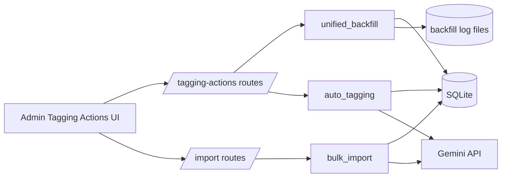
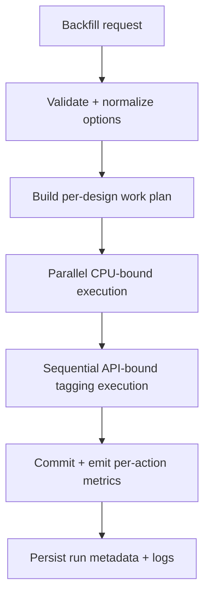

# Backfilling Backend Specification

## Status
- Type: Current behavior + target architecture
- Audience: Agents
- Last validated: 2026-05-24
- Companion checklist: [docs/Specs/backfilling-refactor-checklist.md](docs/Specs/backfilling-refactor-checklist.md)
- Feature companion: [docs/Specs/colour-count-backend-spec.md](docs/Specs/colour-count-backend-spec.md)
- First import actions companion: [docs/Specs/first-import-actions-backend-spec.md](docs/Specs/first-import-actions-backend-spec.md)

## Purpose
Define backend architecture and functionality for:
- AI-assisted tagging during import.
- Backfilling existing catalogue data from Admin Tagging Actions.

## Scope
In scope:
- Endpoint contracts and payloads.
- Service orchestration for unified backfill and import tagging.
- Commit, stop, logging, and action-selection behavior.
- Confirmed gaps and forward target architecture.

Out of scope:
- Frontend styling/UX details beyond request shape.
- User-facing guidance details (see docs/User-Facing-Guidance).

## Terminology
- Tier 1: Local keyword tagging.
- Tier 2: Gemini text tagging.
- Tier 3: Gemini vision tagging.
- Unified backfill: One request running any combination of tagging/stitching/images/color-counts.

## Current Behavior Architecture

### Component Map

Key modules:
- [src/routes/tagging_actions.py](src/routes/tagging_actions.py)
- [src/routes/bulk_import.py](src/routes/bulk_import.py)
- [src/services/unified_backfill.py](src/services/unified_backfill.py)
- [src/services/auto_tagging.py](src/services/auto_tagging.py)
- [src/services/bulk_import.py](src/services/bulk_import.py)
- [src/services/settings_service.py](src/services/settings_service.py)
- [src/services/pattern_analysis.py](src/services/pattern_analysis.py)
- [src/models.py](src/models.py)

### Release Posture (Pre-Release)
- Canonical execution path: **Admin -> Tagging Actions** via `/admin/tagging-actions/run-unified-backfill`.
- Import remains a canonical population path for newly added designs.
- Colour-count non-UI route/script decommission is complete.
- Remaining non-UI maintenance image routes are still transitional and should be retired before release.

### Core Data Touchpoints
- `Design` model: [src/models.py#L136](src/models.py#L136)
- `Tag` model: [src/models.py#L73](src/models.py#L73)
- `design_tags` relation: [src/models.py#L94](src/models.py#L94)

Fields used by these flows:
- `Design.tags`, `Design.tags_checked`, `Design.tagging_tier`
- `Design.image_data`, `Design.image_type`, `Design.width_mm`, `Design.height_mm`, `Design.hoop_id`
- `Design.stitch_count`, `Design.color_count`, `Design.color_change_count`
- `Tag.description`, `Tag.tag_group`

### Endpoint Contracts (Current)

| Method | Path | Handler | Evidence |
|---|---|---|---|
| POST | `/admin/tagging-actions/run-unified-backfill` | `run_unified_backfill` | [src/routes/tagging_actions.py#L79](src/routes/tagging_actions.py#L79) |
| POST | `/admin/tagging-actions/stop-unified-backfill` | `stop_unified_backfill` | [src/routes/tagging_actions.py#L115](src/routes/tagging_actions.py#L115) |
| GET | `/admin/tagging-actions/download-backfill-log` | `download_backfill_log` | [src/routes/tagging_actions.py#L125](src/routes/tagging_actions.py#L125) |
| POST | `/admin/tagging-actions/run-stitching-backfill` | `run_stitching_backfill_route` | [src/routes/tagging_actions.py#L135](src/routes/tagging_actions.py#L135) |
| POST | `/import/do-confirm` | `do_confirm_from_token` | [src/routes/bulk_import.py#L440](src/routes/bulk_import.py#L440) |
| POST | `/import/confirm` | `confirm` | [src/routes/bulk_import.py#L591](src/routes/bulk_import.py#L591) |

Transitional maintenance endpoints (present in code, not release-target contracts):
- `POST /admin/maintenance/clear-images`: [src/routes/maintenance.py#L348](src/routes/maintenance.py#L348)
- `POST /admin/maintenance/backfill-images`: [src/routes/maintenance.py#L381](src/routes/maintenance.py#L381)

Completed removals:
- `POST /admin/maintenance/backfill-color-counts` (removed)
- standalone script `backfill_color_counts.py` (removed)

#### Unified Backfill Request/Response
Request body is assembled in the admin template JS and posted to `/run-unified-backfill`:
- Request assembly: [templates/admin/tagging_actions.html#L281](templates/admin/tagging_actions.html#L281)
- Fetch call: [templates/admin/tagging_actions.html#L319](templates/admin/tagging_actions.html#L319)

Route defaults and propagation:
- `batch_size` default 100: [src/routes/tagging_actions.py#L91](src/routes/tagging_actions.py#L91)
- `commit_every` default 100: [src/routes/tagging_actions.py#L92](src/routes/tagging_actions.py#L92)
- `workers` default 4: [src/routes/tagging_actions.py#L93](src/routes/tagging_actions.py#L93)
- `preview_3d` propagation: [src/routes/tagging_actions.py#L97](src/routes/tagging_actions.py#L97)

Service return summary keys (`processed`, `errors`, `stopped`, `actions`):
- summary initialization: [src/services/unified_backfill.py#L799](src/services/unified_backfill.py#L799)

#### Stop/Log Endpoints
- stop returns `stopping` or `already_stopping`: [src/routes/tagging_actions.py#L118](src/routes/tagging_actions.py#L118)
- download uses `ERROR_LOG_PATH`: [src/routes/tagging_actions.py#L128](src/routes/tagging_actions.py#L128)

### Unified Backfill Service Behavior (Current)

Main orchestrator:
- `unified_backfill`: [src/services/unified_backfill.py#L655](src/services/unified_backfill.py#L655)

Work-item model and merged action flags:
- `DesignWorkItem`: [src/services/unified_backfill.py#L43](src/services/unified_backfill.py#L43)

Action selection (design query) logic:
- tagging selection: [src/services/unified_backfill.py#L704](src/services/unified_backfill.py#L704)
- stitching selection: [src/services/unified_backfill.py#L727](src/services/unified_backfill.py#L727)
- images selection: [src/services/unified_backfill.py#L740](src/services/unified_backfill.py#L740)
- color-counts selection: [src/services/unified_backfill.py#L768](src/services/unified_backfill.py#L768)

Bulk clear existing stitching tags option:
- preprocessing clear branch: [src/services/unified_backfill.py#L808](src/services/unified_backfill.py#L808)

Parallel vs sequential:
- parallel branch check: [src/services/unified_backfill.py#L853](src/services/unified_backfill.py#L853)
- sequential fallback: [src/services/unified_backfill.py#L1136](src/services/unified_backfill.py#L1136)
- tagging forced sequential after parallel phase: [src/services/unified_backfill.py#L1101](src/services/unified_backfill.py#L1101)

Single-read pattern behavior:
- worker single-read gate: [src/services/unified_backfill.py#L484](src/services/unified_backfill.py#L484)
- sequential single-read gate: [src/services/unified_backfill.py#L1167](src/services/unified_backfill.py#L1167)

Commit cadence:
- service default `commit_every=500`: [src/services/unified_backfill.py#L659](src/services/unified_backfill.py#L659)
- periodic commit check in loops: [src/services/unified_backfill.py#L1082](src/services/unified_backfill.py#L1082), [src/services/unified_backfill.py#L1244](src/services/unified_backfill.py#L1244)
- final commit before pragma restore: [src/services/unified_backfill.py#L1253](src/services/unified_backfill.py#L1253)

SQLite optimization:
- optimize pragmas: [src/services/unified_backfill.py#L594](src/services/unified_backfill.py#L594)
- restore pragmas: [src/services/unified_backfill.py#L629](src/services/unified_backfill.py#L629)

Stop mechanism:
- request stop: [src/services/unified_backfill.py#L86](src/services/unified_backfill.py#L86)
- clear stop signal: [src/services/unified_backfill.py#L100](src/services/unified_backfill.py#L100)
- stop check: [src/services/unified_backfill.py#L108](src/services/unified_backfill.py#L108)
- sentinel path: [src/services/unified_backfill.py#L397](src/services/unified_backfill.py#L397)

Logging behavior:
- error log path: [src/services/unified_backfill.py#L73](src/services/unified_backfill.py#L73)
- info log path: [src/services/unified_backfill.py#L74](src/services/unified_backfill.py#L74)
- error writer: [src/services/unified_backfill.py#L127](src/services/unified_backfill.py#L127)
- info writer: [src/services/unified_backfill.py#L171](src/services/unified_backfill.py#L171)
- log clear at run start: [src/services/unified_backfill.py#L802](src/services/unified_backfill.py#L802)

### Import Tagging Service Behavior (Current)

Import entry and orchestrator:
- route confirm: [src/routes/bulk_import.py#L591](src/routes/bulk_import.py#L591)
- route do-confirm: [src/routes/bulk_import.py#L440](src/routes/bulk_import.py#L440)
- `confirm_import`: [src/services/bulk_import.py#L407](src/services/bulk_import.py#L407)

Tier application sequence:
- tier2 apply function: [src/services/bulk_import.py#L278](src/services/bulk_import.py#L278)
- tier3 apply function: [src/services/bulk_import.py#L312](src/services/bulk_import.py#L312)

Shared tier primitives:
- tier1 suggester: [src/services/auto_tagging.py#L426](src/services/auto_tagging.py#L426)
- tier2 suggester: [src/services/auto_tagging.py#L457](src/services/auto_tagging.py#L457)
- tier3 suggester: [src/services/auto_tagging.py#L525](src/services/auto_tagging.py#L525)

Settings keys and defaults:
- keys: [src/services/settings_service.py#L34](src/services/settings_service.py#L34)
- defaults map: [src/services/settings_service.py#L42](src/services/settings_service.py#L42)
- import commit default 1000: [src/services/bulk_import.py#L93](src/services/bulk_import.py#L93)

### Current Known Gaps and Constraints
- Unified result is aggregate (`processed`/`errors`) rather than a per-action success matrix: [src/services/unified_backfill.py#L799](src/services/unified_backfill.py#L799)
- Unified route default `commit_every=100` differs from service default `commit_every=500`: [src/routes/tagging_actions.py#L92](src/routes/tagging_actions.py#L92), [src/services/unified_backfill.py#L659](src/services/unified_backfill.py#L659)
- Logs are truncated at start of each unified run: [src/services/unified_backfill.py#L802](src/services/unified_backfill.py#L802)
- Tier2 internal request batching uses default batch size in the tier2 suggester unless overridden by caller path: [src/services/auto_tagging.py#L457](src/services/auto_tagging.py#L457)
- Transitional non-UI image maintenance entrypoints still exist and should be retired pre-release.

## Target Architecture

This section captures the intended architecture direction for future refactors while preserving current behavior compatibility.

### Target Principles
- One canonical backend entrypoint for backfill execution from Admin Tagging Actions.
- Shared action-result schema with per-action counters for tagging/stitching/images/color-counts.
- Consistent default semantics for batching and commit values across route and service layers.
- Explicit contract for log lifecycle (truncate-per-run vs rotate-with-retention).
- Minimize duplicate path/file-resolution and selection logic across services.

### Target Runtime Shape

### Target Contract Improvements
- Add structured `results_by_action` in unified response.
- Normalize `batch_size` and `commit_every` naming and defaults across import/backfill surfaces.
- Formalize stop semantics with explicit `stopping`, `stopped`, and `completed` lifecycle states.
- Centralize batch/commit retrieval via one resolver with explicit precedence:
  request payload overrides -> persisted settings -> hard defaults.
- Converge assignment execution into one shared end-to-end utility contract used by both import and tagging-actions paths, with explicit per-run flags for stitching/images/color-counts plus shared dry-run and batch/commit semantics.

Target-architecture anchor evidence for convergence needs:
- Tagging-actions route currently accepts request defaults for batch/commit: [src/routes/tagging_actions.py#L91](src/routes/tagging_actions.py#L91)
- Import route currently resolves commit and batch inputs from settings/runtime parse paths: [src/routes/bulk_import.py#L512](src/routes/bulk_import.py#L512), [src/routes/bulk_import.py#L515](src/routes/bulk_import.py#L515), [src/services/bulk_import.py#L93](src/services/bulk_import.py#L93)
- Shared pattern analysis entrypoint already exists and is a convergence candidate for assignment logic: [src/services/pattern_analysis.py#L184](src/services/pattern_analysis.py#L184)

### Compatibility Requirements
- Keep unified tagging-actions and import paths stable through release.
- Remove non-UI maintenance routes/scripts once migration and docs are complete.
- Keep import tier gating based on settings and API key availability.

## Verification and Test Anchors
- unified backfill tests: [tests/test_unified_backfill.py](tests/test_unified_backfill.py)
- tagging action service tests: [tests/test_legacy_tagging_actions.py](tests/test_legacy_tagging_actions.py)
- route tests: [tests/test_routes.py](tests/test_routes.py)
- import coverage extras: [tests/test_bulk_import_extra.py](tests/test_bulk_import_extra.py)
- removed-route regression anchor: [tests/test_routes.py#L350](tests/test_routes.py#L350)

## Companion Refactor Checklist
Use [docs/Specs/backfilling-refactor-checklist.md](docs/Specs/backfilling-refactor-checklist.md) for change-gated implementation and review.

Related import precheck coverage:
- [docs/Specs/first-import-actions-backend-spec.md](docs/Specs/first-import-actions-backend-spec.md)
- [docs/Specs/first-import-actions-refactor-checklist.md](docs/Specs/first-import-actions-refactor-checklist.md)
