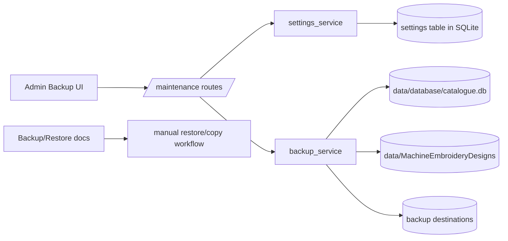
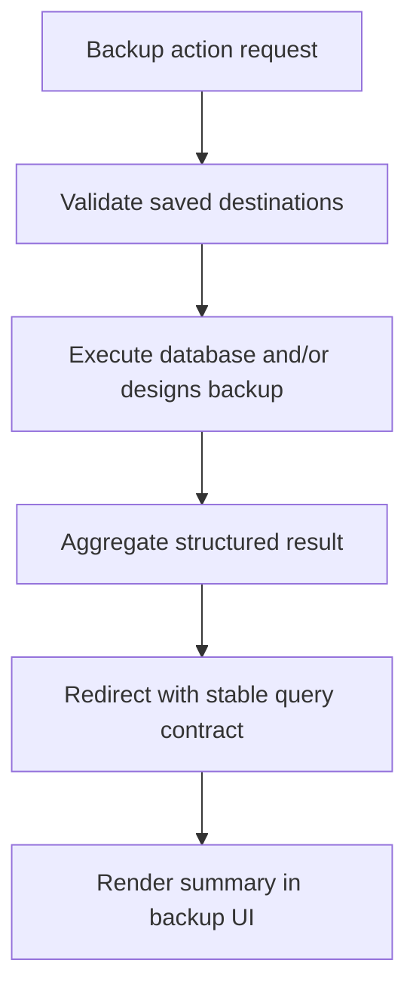

# Backup Backend Specification

## Status
- Type: Current behavior + target architecture
- Audience: Agents
- Last validated: 2026-05-30
- Companion checklist: [docs/Specs/backup-refactor-checklist.md](docs/Specs/backup-refactor-checklist.md)

Desktop status note (2026-05-30):
- Top-menu backup page in the Tauri frontend is now wired to real backend commands for destination loading/saving, browse-folder selection, database backup, designs backup, and combined backup execution.
- Evidence:
  - [src/routes/maintenance.rs](src/routes/maintenance.rs)
  - [src/main.rs](src/main.rs)
  - [frontend/src/lib/api/commandAdapter.js](frontend/src/lib/api/commandAdapter.js)
  - [frontend/src/lib/MainView.svelte](frontend/src/lib/MainView.svelte)

## Purpose
Define backend architecture and functionality for:
- Manual in-app database backup.
- Manual in-app designs incremental backup.
- Restore behavior currently supported by the product (manual restore workflow).

## Scope
In scope:
- Endpoint contracts for backup routes.
- Service orchestration and result semantics for database and designs backups.
- Settings persistence for backup destinations.
- Current restore behavior and constraints.
- Verified test anchors for route/service coverage.

Out of scope:
- Troubleshooting deep dives (disk-space diagnostics, share permissions, antivirus interference).
- Scheduled/automatic backups.
- Full restore automation in-app (not implemented).

## Terminology
- Database backup: Timestamped snapshot of live `catalogue.db`.
- Designs backup: Incremental filesystem mirror of managed designs.
- Deleted archive: Dated folder `_deleted/YYYY-MM-DD/` under designs backup destination.
- Complete backup: Running both database and designs backups.

## Current Behavior Architecture

### Component Map

Key modules:
- [src/routes/maintenance.py](src/routes/maintenance.py)
- [src/services/backup_service.py](src/services/backup_service.py)
- [src/services/settings_service.py](src/services/settings_service.py)
- [templates/admin/backup.html](templates/admin/backup.html)
- [docs/BACKUP_RESTORE.md](docs/BACKUP_RESTORE.md)

### Core Data and Settings Touchpoints
- Backup settings keys:
  - `backup.database_destination`: [src/services/settings_service.py#L31](src/services/settings_service.py#L31)
  - `backup.designs_destination`: [src/services/settings_service.py#L32](src/services/settings_service.py#L32)
- Defaults (empty destinations):
  - [src/services/settings_service.py#L44](src/services/settings_service.py#L44)
  - [src/services/settings_service.py#L45](src/services/settings_service.py#L45)
- Destination descriptions:
  - [src/services/settings_service.py#L65](src/services/settings_service.py#L65)
  - [src/services/settings_service.py#L66](src/services/settings_service.py#L66)

Live sources used by backup operations:
- Database source path resolution from configured database URL: [src/routes/maintenance.py#L129](src/routes/maintenance.py#L129)
- Designs source path from config constant: [src/routes/maintenance.py#L208](src/routes/maintenance.py#L208)

## Endpoint Contracts (Current)

| Method | Path | Handler | Evidence |
|---|---|---|---|
| GET | `/admin/maintenance/backup` | `backup_page` | [src/routes/maintenance.py#L192](src/routes/maintenance.py#L192) |
| GET | `/admin/maintenance/backup/browse-folder` | `backup_browse_folder` | [src/routes/maintenance.py#L167](src/routes/maintenance.py#L167) |
| POST | `/admin/maintenance/backup/save-settings` | `backup_save_settings` | [src/routes/maintenance.py#L212](src/routes/maintenance.py#L212) |
| POST | `/admin/maintenance/backup/database` | `run_database_backup` | [src/routes/maintenance.py#L243](src/routes/maintenance.py#L243) |
| POST | `/admin/maintenance/backup/designs` | `run_designs_backup` | [src/routes/maintenance.py#L265](src/routes/maintenance.py#L265) |
| POST | `/admin/maintenance/backup/both` | `run_both_backups` | [src/routes/maintenance.py#L300](src/routes/maintenance.py#L300) |

### GET `/admin/maintenance/backup`
Contract:
- Renders backup admin page with:
  - Current saved destinations.
  - Display-normalized path values (Windows style).
  - Source path display for live database and live designs location.
- Evidence:
  - [src/routes/maintenance.py#L193](src/routes/maintenance.py#L193)
  - [templates/admin/backup.html#L1](templates/admin/backup.html#L1)

### GET `/admin/maintenance/backup/browse-folder`
Contract:
- Opens native folder picker via `pick_folder`.
- Returns JSON payload:
  - success shape: `{"path": "..."}`
  - fallback shape: `{"error": "..."}` with HTTP 200 when picker unavailable.
- Evidence:
  - [src/routes/maintenance.py#L168](src/routes/maintenance.py#L168)
  - [src/routes/maintenance.py#L180](src/routes/maintenance.py#L180)

### POST `/admin/maintenance/backup/save-settings`
Request form fields:
- `db_destination`
- `designs_destination`

Behavior:
- Normalizes and compares against saved values.
- If unchanged, redirects with `error=no_destinations_to_save`.
- If changed, persists both settings and redirects with `saved=1`.

Redirect contract:
- `303 /admin/maintenance/backup?error=no_destinations_to_save`
- `303 /admin/maintenance/backup?saved=1`

Evidence:
- [src/routes/maintenance.py#L212](src/routes/maintenance.py#L212)
- [src/routes/maintenance.py#L234](src/routes/maintenance.py#L234)
- [src/routes/maintenance.py#L240](src/routes/maintenance.py#L240)

### POST `/admin/maintenance/backup/database`
Precondition:
- `backup.database_destination` must be set.

Behavior:
- Resolves live DB path.
- Executes `backup_service.backup_database`.
- Redirects with summary query params on success or error message on failure.

Success redirect params:
- `db_ok=1`
- `db_path`
- `db_size`
- `db_time`

Failure redirect params:
- `db_error`

Evidence:
- [src/routes/maintenance.py#L243](src/routes/maintenance.py#L243)
- [src/routes/maintenance.py#L251](src/routes/maintenance.py#L251)
- [src/routes/maintenance.py#L256](src/routes/maintenance.py#L256)
- [src/routes/maintenance.py#L262](src/routes/maintenance.py#L262)

### POST `/admin/maintenance/backup/designs`
Precondition:
- `backup.designs_destination` must be set.

Behavior:
- Executes `backup_service.backup_designs` against configured live designs folder.
- Redirects with summary query params on success or error message on failure.

Success redirect params:
- `designs_ok=1`
- `d_scanned`
- `d_copied`
- `d_updated`
- `d_unchanged`
- `d_archived`
- `d_bytes`
- `d_time`

Failure redirect params:
- `designs_error`

Evidence:
- [src/routes/maintenance.py#L265](src/routes/maintenance.py#L265)
- [src/routes/maintenance.py#L272](src/routes/maintenance.py#L272)
- [src/routes/maintenance.py#L282](src/routes/maintenance.py#L282)
- [src/routes/maintenance.py#L296](src/routes/maintenance.py#L296)

### POST `/admin/maintenance/backup/both`
Precondition:
- Both destinations must be set, else `error=no_destinations`.

Behavior:
- Runs database then designs backup sequentially.
- Always returns one consolidated redirect with available success/error params for each operation.

Evidence:
- [src/routes/maintenance.py#L300](src/routes/maintenance.py#L300)
- [src/routes/maintenance.py#L307](src/routes/maintenance.py#L307)
- [src/routes/maintenance.py#L313](src/routes/maintenance.py#L313)
- [src/routes/maintenance.py#L325](src/routes/maintenance.py#L325)

## Backup Service Behavior (Current)

### Database Backup Behavior
Entrypoint:
- `backup_database`: [src/services/backup_service.py#L57](src/services/backup_service.py#L57)

Behavior:
- Verifies source DB exists.
- Creates destination directory if needed.
- Validates destination writability.
- Uses timestamp format `%Y-%m-%d_%H%M` and file pattern `catalogue_<timestamp>.db`.
- Uses SQLite backup API first for live consistency.
- Falls back to `shutil.copy2` only when source cannot be opened as SQLite (`sqlite3.DatabaseError`).
- Returns structured result (`success`, `backup_path`, `size_bytes`, `completed_at`, `error`).

Evidence:
- [src/services/backup_service.py#L75](src/services/backup_service.py#L75)
- [src/services/backup_service.py#L86](src/services/backup_service.py#L86)
- [src/services/backup_service.py#L102](src/services/backup_service.py#L102)
- [src/services/backup_service.py#L108](src/services/backup_service.py#L108)
- [src/services/backup_service.py#L118](src/services/backup_service.py#L118)
- [src/services/backup_service.py#L144](src/services/backup_service.py#L144)

SQLite API helper:
- `_backup_sqlite_database`: [src/services/backup_service.py#L276](src/services/backup_service.py#L276)

### Designs Incremental Backup Behavior
Entrypoint:
- `backup_designs`: [src/services/backup_service.py#L157](src/services/backup_service.py#L157)

Comparison basis:
- relative path
- file size
- modification time with FAT tolerance

Rules:
- New file in source: copy.
- Changed file in source: overwrite backup copy.
- Unchanged file: skip.
- File in backup but missing from source: move to `_deleted/YYYY-MM-DD/...`.
- Empty directories in live backup tree: remove (excluding `_deleted`).

Evidence:
- [src/services/backup_service.py#L212](src/services/backup_service.py#L212)
- [src/services/backup_service.py#L232](src/services/backup_service.py#L232)
- [src/services/backup_service.py#L255](src/services/backup_service.py#L255)
- [src/services/backup_service.py#L295](src/services/backup_service.py#L295)
- [src/services/backup_service.py#L323](src/services/backup_service.py#L323)

Result contract:
- `success`, `copied`, `updated`, `unchanged`, `archived`, `total_bytes_copied`, `scanned`, `completed_at`, `error`.
- dataclass shape: [src/services/backup_service.py#L37](src/services/backup_service.py#L37)

### UI/Route Interaction Contract
- Save button is enabled only when destination values differ from saved values.
- Backup action forms show a blocking overlay while request runs.
- Action buttons are disabled if required destination is not saved.

Evidence:
- [templates/admin/backup.html#L132](templates/admin/backup.html#L132)
- [templates/admin/backup.html#L339](templates/admin/backup.html#L339)
- [templates/admin/backup.html#L209](templates/admin/backup.html#L209)
- [templates/admin/backup.html#L231](templates/admin/backup.html#L231)
- [templates/admin/backup.html#L247](templates/admin/backup.html#L247)

## Restore Behavior (Current)

### Product Behavior
- There is currently no in-app restore endpoint or restore service for database/designs.
- Restore is documented and performed as a manual file-level workflow.

Current restore guidance:
- stop app
- copy backup `data/` back to live `data/`
- start app
- migrations run automatically on startup

Evidence:
- [docs/BACKUP_RESTORE.md#L108](docs/BACKUP_RESTORE.md#L108)
- [docs/BACKUP_RESTORE.md#L123](docs/BACKUP_RESTORE.md#L123)

### Operational Implication
- In-app backup and restore are intentionally asymmetric in current architecture:
  - backup: guided from admin UI
  - restore: explicit manual operation to avoid accidental destructive overwrite in UI

## Current Known Gaps and Constraints
- No scheduled/automatic backup orchestration.
- No in-app restore flow.
- Database backup timestamp is minute-level; repeated runs in the same minute can overwrite the previous file for that minute.
- Designs change detection uses size+mtime (no content hash), by design.
- Per-file designs copy/archive errors are logged and skipped; run may still report success.
- No retention policy enforcement for timestamped DB backups or `_deleted` archive content.

## Target Architecture

This section captures intended architecture direction for future refactors while preserving current behavior compatibility.

### Target Principles
- Preserve endpoint compatibility for existing backup UI workflows.
- Keep backup destinations as explicit user-managed settings.
- Add restore architecture only with explicit safety barriers and rollback support.
- Keep filesystem as source of truth for designs backup semantics.

### Target Runtime Shape

### Target Contract Improvements
- Introduce structured flash/result payload storage to reduce long query-string summaries.
- Add optional retention controls for DB snapshots and `_deleted` archive folders.
- Standardize error codes for backup failures (missing source, invalid destination, not writable).

### Restore Target Guardrails (Future)
- Explicit restore endpoints should require pre-restore snapshot/rollback creation.
- Separate restore actions for database and designs.
- Add confirmation UX with irreversible-change warning.

### Compatibility Requirements
- Keep existing backup endpoint paths and POST forms stable until migration is complete.
- Preserve current summary semantics on backup page while introducing any future structured transport.
- Keep manual restore documentation valid until in-app restore is implemented and documented.

## Verification and Test Anchors
- backup route coverage: [tests/test_routes.py#L3179](tests/test_routes.py#L3179)
- backup service coverage: [tests/test_services.py#L2802](tests/test_services.py#L2802)
- deleted-file archiving test: [tests/test_services.py#L2948](tests/test_services.py#L2948)
- empty-folder cleanup test: [tests/test_services.py#L2976](tests/test_services.py#L2976)
- WAL-preserving DB backup test: [tests/test_services.py#L2855](tests/test_services.py#L2855)

## Companion Refactor Checklist
Use [docs/Specs/backup-refactor-checklist.md](docs/Specs/backup-refactor-checklist.md) for change-gated implementation and review.
