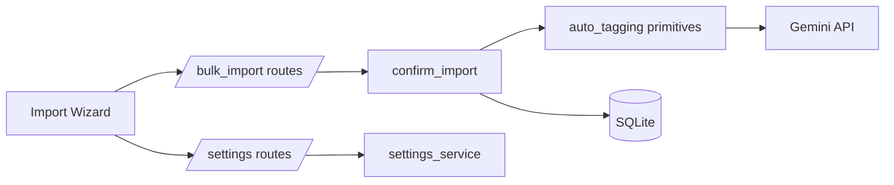

# Batch Tagging Backend Specification

## Status
- Type: Current behavior + target architecture
- Audience: Agents
- Last validated: 2026-05-24
- Companion checklist: [docs/Specs/batch-tagging-refactor-checklist.md](docs/Specs/batch-tagging-refactor-checklist.md)
- Overlap reference: [docs/Specs/backfilling-backend-spec.md](docs/Specs/backfilling-backend-spec.md)

## Purpose
Define backend architecture and functionality for settings-driven AI tagging during import, and document how this behavior overlaps with Admin Tagging Actions unified backfill.

## Scope
In scope:
- Settings keys/defaults and route wiring for import AI behavior.
- Import precheck/confirm contracts and runtime precedence.
- Tier 1/2/3 orchestration and batch-limit semantics in import services.
- Overlap boundaries with unified backfill tagging actions.

Out of scope:
- Frontend visual styling details beyond request/context contracts.
- Unified backfill internals already covered by [docs/Specs/backfilling-backend-spec.md](docs/Specs/backfilling-backend-spec.md).

## Terminology
- Tier 1: Local keyword tagging.
- Tier 2: Gemini text tagging from filename stem.
- Tier 3: Gemini vision tagging from preview image.
- Batch limit (`batch_limit`): Max number of imported designs eligible for Tier 2/3 in one import run.
- Work batch (`batch_size` in unified backfill): Processing chunk size for unified backfill execution.
- Commit batch (`commit_batch_size`): Number of records processed before import commits.

## Current Behavior Architecture

### Component Map

Key modules:
- [src/routes/bulk_import.py](src/routes/bulk_import.py)
- [src/services/bulk_import.py](src/services/bulk_import.py)
- [src/services/settings_service.py](src/services/settings_service.py)
- [src/services/auto_tagging.py](src/services/auto_tagging.py)
- [templates/import/step3_precheck.html](templates/import/step3_precheck.html)

### Settings Keys and Defaults (Current)
- `ai.tier2_auto`: [src/services/settings_service.py#L34](src/services/settings_service.py#L34)
- `ai.tier3_auto`: [src/services/settings_service.py#L35](src/services/settings_service.py#L35)
- `ai.batch_size`: [src/services/settings_service.py#L36](src/services/settings_service.py#L36)
- `ai.delay`: [src/services/settings_service.py#L37](src/services/settings_service.py#L37)
- `import.commit_batch_size`: [src/services/settings_service.py#L38](src/services/settings_service.py#L38)
- defaults map: [src/services/settings_service.py#L41](src/services/settings_service.py#L41)

### Endpoint Contracts (Current)

| Method | Path | Handler | Evidence |
|---|---|---|---|
| POST | `/import/precheck` | `precheck` | [src/routes/bulk_import.py#L267](src/routes/bulk_import.py#L267) |
| POST | `/import/precheck-action` | `precheck_action` | [src/routes/bulk_import.py#L335](src/routes/bulk_import.py#L335) |
| POST | `/import/do-confirm` | `do_confirm_from_token` | [src/routes/bulk_import.py#L440](src/routes/bulk_import.py#L440) |
| POST | `/import/confirm` | `confirm` | [src/routes/bulk_import.py#L591](src/routes/bulk_import.py#L591) |

### Import Runtime Wiring (Current)
Settings are read and applied in both tokenized and direct confirm paths:
- tokenized path tier gates: [src/routes/bulk_import.py#L506](src/routes/bulk_import.py#L506), [src/routes/bulk_import.py#L509](src/routes/bulk_import.py#L509)
- tokenized path batch settings: [src/routes/bulk_import.py#L512](src/routes/bulk_import.py#L512), [src/routes/bulk_import.py#L515](src/routes/bulk_import.py#L515)
- direct confirm path tier gates: [src/routes/bulk_import.py#L653](src/routes/bulk_import.py#L653), [src/routes/bulk_import.py#L656](src/routes/bulk_import.py#L656)
- direct confirm path batch settings: [src/routes/bulk_import.py#L659](src/routes/bulk_import.py#L659), [src/routes/bulk_import.py#L662](src/routes/bulk_import.py#L662)
- settings propagated to service call: [src/routes/bulk_import.py#L574](src/routes/bulk_import.py#L574), [src/routes/bulk_import.py#L575](src/routes/bulk_import.py#L575), [src/routes/bulk_import.py#L576](src/routes/bulk_import.py#L576), [src/routes/bulk_import.py#L721](src/routes/bulk_import.py#L721), [src/routes/bulk_import.py#L722](src/routes/bulk_import.py#L722)

### Service Behavior (Current)
Import orchestrator:
- `confirm_import`: [src/services/bulk_import.py#L407](src/services/bulk_import.py#L407)

Tier functions:
- Tier 2 apply: [src/services/bulk_import.py#L278](src/services/bulk_import.py#L278)
- Tier 3 apply: [src/services/bulk_import.py#L312](src/services/bulk_import.py#L312)

Tier gating and ordering:
- Tier2/Tier3 gate condition: [src/services/bulk_import.py#L534](src/services/bulk_import.py#L534)
- Tier2 branch: [src/services/bulk_import.py#L541](src/services/bulk_import.py#L541)
- Tier3 branch: [src/services/bulk_import.py#L550](src/services/bulk_import.py#L550)

Batch and commit semantics:
- import commit default (`1000`): [src/services/bulk_import.py#L93](src/services/bulk_import.py#L93)
- `batch_limit` argument: [src/services/bulk_import.py#L414](src/services/bulk_import.py#L414)
- AI candidate slicing: [src/services/bulk_import.py#L539](src/services/bulk_import.py#L539)

### Precheck Visibility Contract (Current)
- no-key warning branch in template: [templates/import/step3_precheck.html#L8](templates/import/step3_precheck.html#L8)
- cost warning branch in template: [templates/import/step3_precheck.html#L22](templates/import/step3_precheck.html#L22)
- settings status lines shown to user: [templates/import/step3_precheck.html#L37](templates/import/step3_precheck.html#L37)

## Overlap With Unified Backfill
Primary unified backfill runtime and contracts remain defined in [docs/Specs/backfilling-backend-spec.md](docs/Specs/backfilling-backend-spec.md).

Shared touchpoints:
- shared tier primitives from [src/services/auto_tagging.py](src/services/auto_tagging.py)
- shared route/UI surface in Tagging Actions for unified execution trigger: [templates/admin/tagging_actions.html#L319](templates/admin/tagging_actions.html#L319)

Important semantic distinction:
- Import `batch_limit` caps which imported designs are AI-eligible for Tier 2/3 in that run.
- Unified `batch_size` controls work-unit chunking in unified backfill execution.

## Current Known Gaps and Constraints
- Import flow stores `ai.delay` setting but import service tier functions do not consume a delay parameter directly in `confirm_import`: [src/services/settings_service.py#L37](src/services/settings_service.py#L37), [src/services/bulk_import.py#L407](src/services/bulk_import.py#L407)
- Tier2 internal request batching semantics are owned by the tier2 suggester path: [src/services/auto_tagging.py#L457](src/services/auto_tagging.py#L457)
- Unified and import commit defaults differ (`100` vs `1000` route-level defaults): [src/routes/tagging_actions.py#L92](src/routes/tagging_actions.py#L92), [src/services/bulk_import.py#L93](src/services/bulk_import.py#L93)

## Target Architecture

### Target Principles
- Keep settings-driven import behavior explicit and testable.
- Preserve semantic separation between AI candidate caps and processing chunk sizes.
- Keep import and unified-backfill overlap documented by cross-reference rather than duplication.

### Target Contract Improvements
- Expose explicit import response metrics for Tier2/Tier3 attempted vs tagged counts.
- Normalize naming guidance for `batch_limit`, `batch_size`, and `commit_batch_size` in docs/UI.
- Clarify `ai.delay` runtime ownership in either import service orchestration or tier primitive adapters.

## Verification and Test Anchors
- import service behavior: [tests/test_bulk_import_extra.py](tests/test_bulk_import_extra.py)
- import and tagging actions route behavior: [tests/test_routes.py](tests/test_routes.py)
- unified route coverage: [tests/test_unified_backfill.py](tests/test_unified_backfill.py)

## Companion Refactor Checklist
Use [docs/Specs/batch-tagging-refactor-checklist.md](docs/Specs/batch-tagging-refactor-checklist.md) for change-gated implementation and review.
