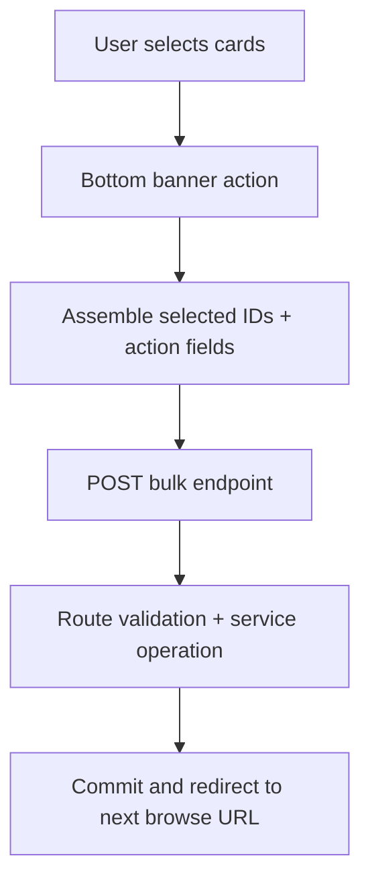

# Browse Bulk Actions Backend Specification

## Status
- Type: Current behavior + target architecture
- Audience: Agents
- Last validated: 2026-05-28
- Companion checklist: [docs/Specs/browse-bulk-actions-refactor-checklist.md](docs/Specs/browse-bulk-actions-refactor-checklist.md)
- UI companion: [docs/Specs/UI/browse-bulk-actions-ui-spec.md](docs/Specs/UI/browse-bulk-actions-ui-spec.md)
- User guidance companion: [docs/User-Facing-Guidance/BROWSE_BULK_ACTIONS.md](docs/User-Facing-Guidance/BROWSE_BULK_ACTIONS.md)

## Purpose
Define backend architecture and functionality for Browse-page bottom-banner bulk actions:
- Bulk verify selected designs.
- Bulk set/replace tags for selected designs.
- Bulk add selected designs to a project.

## Scope
In scope:
- Endpoint contracts and payloads.
- Request/redirect semantics for Browse-page bulk actions.
- Service-level project assignment behavior used by bulk add.
- Selection-state implications relevant to backend contract behavior.
- Confirmed gaps and forward target architecture.

Out of scope:
- Browse page visual styling and detailed UX layout (see UI companion spec).
- General browse search/filter implementation details unrelated to bulk actions.

## Release Posture (Pre-Release)
- Canonical user entrypoint: Browse bottom banner on `/designs/`.
- Canonical backend endpoints: `/designs/bulk-verify`, `/designs/bulk-set-tags`, and `/designs/bulk-add-to-project`.
- Current bulk-actions contract is redirect-based and keeps users on Browse after submission.

## Terminology
- Bottom banner: Sticky action bar shown on Browse when one or more cards are selected.
- Selected designs: IDs gathered from checked card checkboxes on the current Browse page.
- Next redirect target: Hidden `next` form value set to current Browse URL.
- Bulk set tags: Replace tags on each selected design and mark verified.

## Current Behavior Architecture

### Component Map

```mermaid
flowchart LR
  UI[Browse UI bottom banner] --> BR[/designs routes/]
  UI --> JS[Inline browse JS]

  JS --> BV[/designs/bulk-verify]
  JS --> BT[/designs/bulk-set-tags]
  JS --> BP[/designs/bulk-add-to-project]

  BR --> DB[(SQLite)]
  BP --> PS[projects.add_designs]
  PS --> DB
```

Key modules:
- [templates/designs/browse.html](templates/designs/browse.html)
- [src/routes/designs.py](src/routes/designs.py)
- [src/services/projects.py](src/services/projects.py)
- [src/models.py](src/models.py)

### Core Data Touchpoints
- `Design.tags_checked` verification flag.
- `Design.tags` relationship replacement during bulk set tags.
- `Project.designs` relationship updates during bulk add.

Primary contract anchors:
- bulk verify route: [src/routes/designs.py#L301](src/routes/designs.py#L301)
- bulk set tags route: [src/routes/designs.py#L318](src/routes/designs.py#L318)
- bulk add to project route: [src/routes/designs.py#L345](src/routes/designs.py#L345)
- project assignment service: [src/services/projects.py#L71](src/services/projects.py#L71)

### Endpoint Contracts (Current)

| Method | Path | Handler | Evidence |
|---|---|---|---|
| POST | `/designs/bulk-verify` | `bulk_verify` | [src/routes/designs.py#L301](src/routes/designs.py#L301) |
| POST | `/designs/bulk-set-tags` | `bulk_set_tags` | [src/routes/designs.py#L318](src/routes/designs.py#L318) |
| POST | `/designs/bulk-add-to-project` | `bulk_add_to_project` | [src/routes/designs.py#L345](src/routes/designs.py#L345) |

#### POST `/designs/bulk-verify`
Request fields:
- `design_ids: list[int]` via form posts.
- `next: str | None` optional redirect target.

Behavior:
- If `design_ids` provided, updates matching rows to `tags_checked=True` in one update call.
- Commits once after update.
- Redirects `303` to `next` or `/designs/`.

Evidence:
- route contract and update path: [src/routes/designs.py#L301](src/routes/designs.py#L301)
- hidden form wiring in browse template: [templates/designs/browse.html#L435](templates/designs/browse.html#L435)

#### POST `/designs/bulk-set-tags`
Request fields:
- `design_ids: list[int]` via form posts.
- `tag_ids: list[int]` via form posts (empty list allowed to clear all tags).
- `next: str | None` optional redirect target.

Behavior:
- Resolves selected tags from IDs.
- For each selected design found: replaces `design.tags` with selected tag objects and sets `tags_checked=True`.
- Commits once after loop.
- Redirects `303` to `next` or `/designs/`.

Evidence:
- route contract and replacement behavior: [src/routes/designs.py#L318](src/routes/designs.py#L318)
- hidden form wiring in browse template: [templates/designs/browse.html#L427](templates/designs/browse.html#L427)
- modal apply post trigger: [templates/designs/browse.html#L825](templates/designs/browse.html#L825)

#### POST `/designs/bulk-add-to-project`
Request fields:
- `project_id: int` required.
- `design_ids: list[int]` via form posts.
- `next: str | None` optional redirect target.

Behavior:
- Calls shared `projects.add_designs` service.
- Returns `400` if service raises `ValueError` (project missing or selected design missing).
- Redirects `303` to `next` or `/designs/` on success.

Evidence:
- route contract and error mapping: [src/routes/designs.py#L345](src/routes/designs.py#L345)
- service dedupe/validation behavior: [src/services/projects.py#L71](src/services/projects.py#L71)
- hidden form wiring in browse template: [templates/designs/browse.html#L442](templates/designs/browse.html#L442)

### Browse Template Orchestration (Contract-Relevant)
Bottom banner controls and forms:
- sticky bar container: [templates/designs/browse.html#L449](templates/designs/browse.html#L449)
- Choose tags button: [templates/designs/browse.html#L452](templates/designs/browse.html#L452)
- Verify selected button: [templates/designs/browse.html#L456](templates/designs/browse.html#L456)
- project selector + add button: [templates/designs/browse.html#L461](templates/designs/browse.html#L461)
- Clear selection button: [templates/designs/browse.html#L479](templates/designs/browse.html#L479)

Selection and submit flow:
- selection collector: [templates/designs/browse.html#L708](templates/designs/browse.html#L708)
- bar visibility and selected count: [templates/designs/browse.html#L712](templates/designs/browse.html#L712)
- modal open + tag intersection pre-tick: [templates/designs/browse.html#L728](templates/designs/browse.html#L728)
- verify submit population: [templates/designs/browse.html#L783](templates/designs/browse.html#L783)
- project submit population: [templates/designs/browse.html#L796](templates/designs/browse.html#L796)
- apply tags submit population: [templates/designs/browse.html#L825](templates/designs/browse.html#L825)
- clear selection: [templates/designs/browse.html#L848](templates/designs/browse.html#L848)

Redirect target propagation:
- `next` hidden input for all bulk forms uses current request URL.
- anchors: [templates/designs/browse.html#L428](templates/designs/browse.html#L428), [templates/designs/browse.html#L436](templates/designs/browse.html#L436), [templates/designs/browse.html#L443](templates/designs/browse.html#L443)

### Current Known Gaps and Constraints
- Selection scope is page-local and client-side; selected IDs are not persisted across pagination navigations.
- Modal semantics are replace-all tags, not additive merge tagging.
- Bulk verify and bulk set routes do not surface per-design success/error counts; result is redirect-only contract.
- Invalid `project_id` or missing selected design IDs in bulk add map to `400` via service `ValueError` conversion.

Evidence anchors:
- pagination links with preserved filters but fresh page navigation: [templates/designs/browse.html#L410](templates/designs/browse.html#L410)
- replace semantics copy: [templates/designs/browse.html#L494](templates/designs/browse.html#L494)
- redirect-only route responses: [src/routes/designs.py#L313](src/routes/designs.py#L313), [src/routes/designs.py#L340](src/routes/designs.py#L340), [src/routes/designs.py#L361](src/routes/designs.py#L361)

## Target Architecture

This section captures intended direction while preserving compatibility through release.

### Target Principles
- Keep one canonical bulk-actions entry surface on Browse with stable endpoint contracts.
- Preserve explicit `next` redirect behavior so user context (filters/page) remains stable.
- Minimize duplicated bulk-selection request assembly logic by converging hidden-form population patterns.
- Improve operability with optional structured result feedback (without breaking redirect workflows).

### Target Runtime Shape



### Target Contract Improvements
- Add optional flash or query-param status markers for bulk action outcomes while keeping redirect contract.
- Add optional validation feedback path for empty selection submissions (currently no-op redirect).
- Consider shared server utility for bulk route ID validation to align verify/set-tags/add-to-project behavior.

### Compatibility Requirements
- Keep existing paths/methods stable:
  - `/designs/bulk-verify`
  - `/designs/bulk-set-tags`
  - `/designs/bulk-add-to-project`
- Preserve `next` redirect behavior from current Browse URL.
- Preserve replace-tags semantics for bulk set tags unless an explicit migration plan is shipped.

## Verification and Test Anchors
Primary route tests:
- bulk verify route: [tests/test_routes.py#L1566](tests/test_routes.py#L1566)
- bulk set tags route: [tests/test_routes.py#L1580](tests/test_routes.py#L1580)
- bulk add to project route: [tests/test_routes.py#L1597](tests/test_routes.py#L1597)
- browse shows bulk project selector: [tests/test_routes.py#L2209](tests/test_routes.py#L2209)
- pagination params preserved: [tests/test_routes.py#L2353](tests/test_routes.py#L2353)

## Companion Refactor Checklist
Use [docs/Specs/browse-bulk-actions-refactor-checklist.md](docs/Specs/browse-bulk-actions-refactor-checklist.md) for change-gated implementation and review.