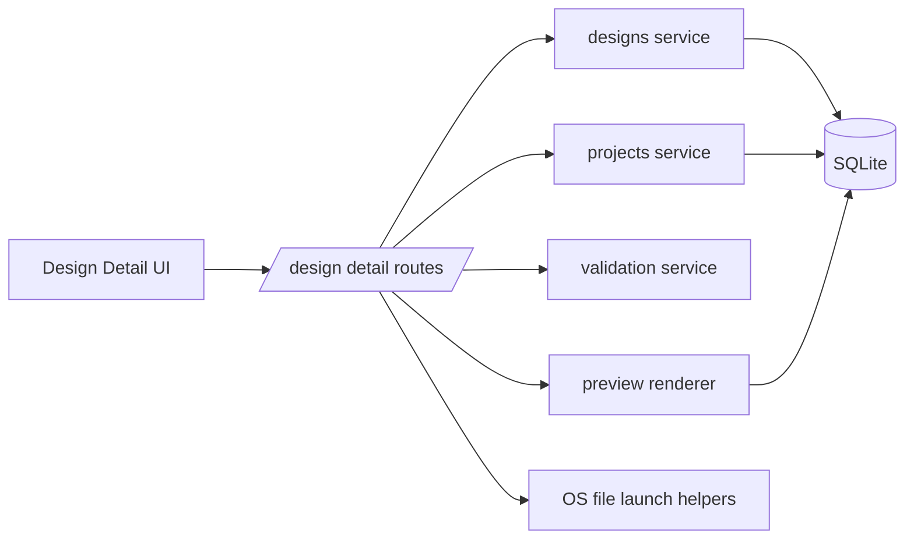
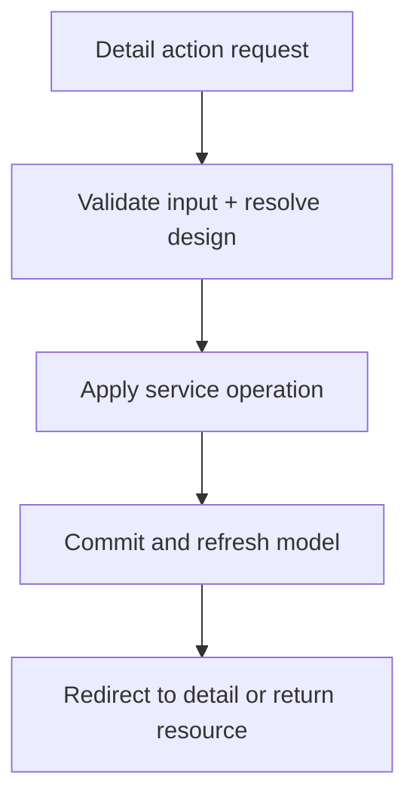

# Design Detail Backend Specification

## Status
- Type: Current behavior + target architecture
- Audience: Agents
- Last validated: 2026-05-26
- Companion checklist: [docs/Specs/design-detail-refactor-checklist.md](docs/Specs/design-detail-refactor-checklist.md)
- Related UI spec: [docs/Specs/UI/design-detail-ui-spec.md](docs/Specs/UI/design-detail-ui-spec.md)
- User guide companion: [docs/User-Facing-Guidance/DESIGN_DETAIL.md](docs/User-Facing-Guidance/DESIGN_DETAIL.md)
- Feature inventory companion: [docs/feature-inventory.md](docs/feature-inventory.md)

## Purpose
Define backend architecture and runtime behavior for the Design Detail feature, including:

Current branch note:
- The same contract is now implemented through Rust/Tauri commands in the desktop app, with the Svelte UI consuming those commands through the route shell.

## Scope
In scope:
- Route contracts under `/designs/{design_id}` that power detail interactions.
- Service-layer boundaries for design updates and related helpers.
- Data fields written and read by detail-page actions.
- Test anchors for key happy-path and error-path coverage.

Out of scope:
- Browse-page filtering and pagination semantics.
- Bulk import and tagging-actions orchestration.
- Styling-level UI behavior (see UI spec).

## Terminology
- Detail route: `GET /designs/{design_id}`.
- Print route: `GET /designs/{design_id}/print`.
- Launch actions: open design file via default app or open containing folder in Explorer.
- Verified state: `Design.tags_checked` boolean used for review state.

## Current Behavior Architecture

### Component Map

The legacy Python route table below remains the parity reference, but the active desktop implementation now exposes the same user-facing actions through Rust commands and hash-based navigation.

Key modules:
- [src/routes/designs.py](src/routes/designs.py)
- [src/services/designs.py](src/services/designs.py)
- [src/services/projects.py](src/services/projects.py)
- [src/services/validation.py](src/services/validation.py)
- [src/services/preview.py](src/services/preview.py)
- [templates/designs/detail.html](templates/designs/detail.html)
- [templates/designs/print.html](templates/designs/print.html)

### Core Data Touchpoints
- `Design` model: [src/models.py#L136](src/models.py#L136)
- image and size fields: [src/models.py#L146](src/models.py#L146), [src/models.py#L148](src/models.py#L148)
- counts and notes/rating/stitched fields: [src/models.py#L150](src/models.py#L150), [src/models.py#L153](src/models.py#L153), [src/models.py#L154](src/models.py#L154), [src/models.py#L155](src/models.py#L155)
- verification and tier fields: [src/models.py#L156](src/models.py#L156), [src/models.py#L157](src/models.py#L157)
- tag relationship: [src/models.py#L176](src/models.py#L176)
- project relationship: [src/models.py#L181](src/models.py#L181)

### Endpoint Contracts (Current)

| Method | Path | Handler | Behavior | Evidence |
|---|---|---|---|---|
| GET | `/designs/{design_id}` | `detail` | Render design detail page with metadata, tags, available projects | [src/routes/designs.py#L369](src/routes/designs.py#L369) |
| GET | `/designs/{design_id}/image` | `design_image` | Return raw `image/png` bytes from `image_data` | [src/routes/designs.py#L400](src/routes/designs.py#L400) |
| POST | `/designs/{design_id}/edit` | `edit_design` | Persist notes/rating/stitched/designer/source/hoop (and filename/filepath payload) | [src/routes/designs.py#L413](src/routes/designs.py#L413) |
| GET | `/designs/{design_id}/open-in-editor` | `open_in_editor` | Attempt OS default-app launch, then redirect back to detail | [src/routes/designs.py#L451](src/routes/designs.py#L451) |
| GET | `/designs/{design_id}/open-in-explorer` | `open_in_explorer` | Open Explorer selected file or nearest existing folder fallback | [src/routes/designs.py#L470](src/routes/designs.py#L470) |
| POST | `/designs/{design_id}/render-3d-preview` | `render_3d_preview` | Re-read design file, regenerate 3D preview, update dimensions | [src/routes/designs.py#L504](src/routes/designs.py#L504) |
| POST | `/designs/{design_id}/toggle-tags-checked` | `toggle_tags_checked` | Set `tags_checked` using posted `true` value check | [src/routes/designs.py#L550](src/routes/designs.py#L550) |
| POST | `/designs/{design_id}/set-tags` | `set_tags` | Replace assigned tags and force `tags_checked=True` | [src/routes/designs.py#L569](src/routes/designs.py#L569) |
| POST | `/designs/{design_id}/toggle-stitched` | `toggle_stitched` | Set `is_stitched` boolean | [src/routes/designs.py#L590](src/routes/designs.py#L590) |
| POST | `/designs/{design_id}/rate` | `rate_design` | Set/clear rating with validation | [src/routes/designs.py#L604](src/routes/designs.py#L604) |
| POST | `/designs/{design_id}/delete` | `delete_design` | Delete design record | [src/routes/designs.py#L618](src/routes/designs.py#L618) |
| POST | `/designs/{design_id}/add-to-project` | `add_to_project` | Add design to project | [src/routes/designs.py#L632](src/routes/designs.py#L632) |
| POST | `/designs/{design_id}/remove-from-project/{project_id}` | `remove_from_project` | Remove design from project | [src/routes/designs.py#L646](src/routes/designs.py#L646) |
| GET | `/designs/{design_id}/print` | `print_design` | Render print-friendly detail view | [src/routes/designs.py#L657](src/routes/designs.py#L657) |

### Route-to-Service Boundaries
Primary design service operations:
- aggregate loader for detail/print: [src/services/designs.py#L208](src/services/designs.py#L208)
- update path for edit/tags set: [src/services/designs.py#L297](src/services/designs.py#L297)
- stitched setter: [src/services/designs.py#L320](src/services/designs.py#L320)
- rating setter and validation call: [src/services/designs.py#L330](src/services/designs.py#L330), [src/services/validation.py#L19](src/services/validation.py#L19)
- verification-state setter: [src/services/designs.py#L341](src/services/designs.py#L341)
- image encoding helper for template embedding: [src/services/designs.py#L351](src/services/designs.py#L351)
- delete operation: [src/services/designs.py#L312](src/services/designs.py#L312)

Project membership operations:
- add design: [src/services/projects.py#L58](src/services/projects.py#L58)
- remove design: [src/services/projects.py#L99](src/services/projects.py#L99)

3D render path dependencies:
- preview renderer used by route: [src/services/preview.py#L304](src/services/preview.py#L304)

### Launch and Path Resolution Semantics
- Full path assembly uses managed designs base path + stored relative filepath: [src/routes/designs.py#L35](src/routes/designs.py#L35)
- Explorer fallback resolves nearest existing folder when file is missing: [src/routes/designs.py#L46](src/routes/designs.py#L46)
- Default-app launch helper is platform-aware (`startfile`/`open`/`xdg-open`): [src/routes/designs.py#L59](src/routes/designs.py#L59)
- Launches are suppressed when external launches are disabled: [src/routes/designs.py#L16](src/routes/designs.py#L16), [src/routes/designs.py#L458](src/routes/designs.py#L458), [src/routes/designs.py#L477](src/routes/designs.py#L477)

### Response/Error Semantics (Current)
- Detail/print/image not-found conditions return `404`.
- Most mutating operations redirect to detail (`303`) on success.
- Error code shape is mixed by endpoint:
  - invalid rating on `/rate` returns `400`.
  - missing design for `/toggle-stitched` returns `404`.
  - missing design for `/set-tags` currently returns `400` (service `ValueError` mapped to 400).

Evidence:
- route implementation mapping: [src/routes/designs.py#L550](src/routes/designs.py#L550), [src/routes/designs.py#L569](src/routes/designs.py#L569), [src/routes/designs.py#L590](src/routes/designs.py#L590), [src/routes/designs.py#L604](src/routes/designs.py#L604)
- route tests for gaps/error behavior: [tests/test_routes.py#L2069](tests/test_routes.py#L2069), [tests/test_routes.py#L2077](tests/test_routes.py#L2077), [tests/test_routes.py#L2085](tests/test_routes.py#L2085), [tests/test_routes.py#L2093](tests/test_routes.py#L2093)

### Print View Contract (Current)
- Print route renders a standalone document template: [src/routes/designs.py#L657](src/routes/designs.py#L657)
- Template includes image, metadata, tags, rating stars, stitched indicator, notes when present: [templates/designs/print.html#L17](templates/designs/print.html#L17), [templates/designs/print.html#L21](templates/designs/print.html#L21), [templates/designs/print.html#L48](templates/designs/print.html#L48), [templates/designs/print.html#L51](templates/designs/print.html#L51), [templates/designs/print.html#L54](templates/designs/print.html#L54), [templates/designs/print.html#L57](templates/designs/print.html#L57)

## Current Known Gaps and Constraints
- Metadata-only saves no longer depend on hidden filename/filepath pass-through in the Rust UI path.
- Verification toggle control is rendered only when tags exist on the design.
- Error semantics are not fully normalized across detail endpoints (`400` vs `404` for missing design depending on route).
- Launch routes are intentionally best-effort (exceptions logged and redirected), which favors UX continuity over explicit in-page error messaging.
- Per-run operation telemetry (for edit/rate/toggle/project operations) is not exposed beyond logs.

## Target Architecture

### Target Principles
- Keep detail-page route paths and methods stable.
- Normalize status/error semantics for missing-resource behavior.
- Keep launch safeguards explicit and test-covered.
- Preserve print-route compatibility while allowing template evolution.

### Target Runtime Shape

### Target Contract Improvements
- Consolidate edit payload semantics so immutable identity fields are not required for metadata-only updates.
- Align missing-design behavior consistently across mutating endpoints.
- Introduce explicit operation-result messaging contract for launch failures (optional flash/status channel) while preserving redirect flow.
- Keep tag-save => verified coupling explicit unless product policy changes.

### Compatibility Requirements
- Preserve all current detail route paths and methods.
- Preserve print route and printable metadata set.
- Preserve launch suppression behavior under test/disabled-launch contexts.
- Preserve project add/remove action surfaces from detail page.

## Verification and Test Anchors
- Core detail and toggle baseline:
  - [tests/test_routes.py#L190](tests/test_routes.py#L190)
  - [tests/test_routes.py#L199](tests/test_routes.py#L199)
- Edit/rate/delete/tag toggles and image route coverage:
  - [tests/test_routes.py#L1365](tests/test_routes.py#L1365)
  - [tests/test_routes.py#L1378](tests/test_routes.py#L1378)
  - [tests/test_routes.py#L1392](tests/test_routes.py#L1392)
  - [tests/test_routes.py#L1400](tests/test_routes.py#L1400)
  - [tests/test_routes.py#L1414](tests/test_routes.py#L1414)
- Open in Editor behavior and launch suppression tests:
  - [tests/test_routes.py#L1453](tests/test_routes.py#L1453)
  - [tests/test_routes.py#L1510](tests/test_routes.py#L1510)
  - [tests/test_routes.py#L1515](tests/test_routes.py#L1515)
- Print and project membership behavior:
  - [tests/test_routes.py#L1558](tests/test_routes.py#L1558)
  - [tests/test_routes.py#L1670](tests/test_routes.py#L1670)
  - [tests/test_routes.py#L1684](tests/test_routes.py#L1684)
- Open in Explorer behavior and launch suppression tests:
  - [tests/test_routes.py#L2118](tests/test_routes.py#L2118)
  - [tests/test_routes.py#L2145](tests/test_routes.py#L2145)

## Companion Checklist
Use [docs/Specs/design-detail-refactor-checklist.md](docs/Specs/design-detail-refactor-checklist.md) for change-gated implementation and review.