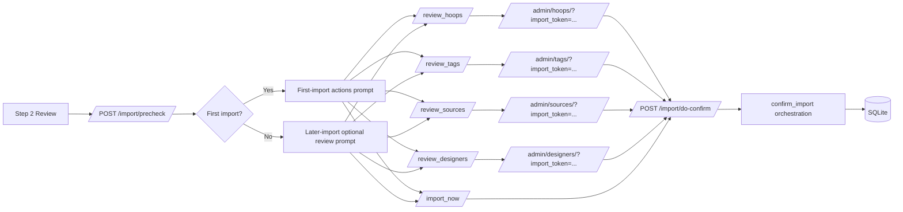

# First Import Actions Backend Specification

## Status
- Type: Current behavior + target architecture for first import actions
- Audience: Agents
- Last validated: 2026-05-24
- Companion checklist: [docs/Specs/first-import-actions-refactor-checklist.md](docs/Specs/first-import-actions-refactor-checklist.md)
- User guidance: [docs/User-Facing-Guidance/FIRST_IMPORT_ACTIONS.md](docs/User-Facing-Guidance/FIRST_IMPORT_ACTIONS.md)
- Source plan: [docs/Plans/first-tag-mgt.md](docs/Plans/first-tag-mgt.md)

## Purpose
Define backend architecture and behavior for first import actions in the bulk import wizard, including:
- pre-import decisioning,
- first-import review requirements,
- optional review paths on later imports,
- import context token lifecycle,
- continuation/cancel behavior back into import execution.

## Scope
In scope:
- Wizard Step 3 precheck and precheck-action orchestration.
- Import-mode review surfaces for tags, hoops, sources, and designers.
- Token storage/validation/pop semantics and continuation endpoints.
- Current constraints and target architecture direction.

Out of scope:
- Styling-level frontend concerns.
- General import scanning mechanics not specific to first import actions.
- Non-import admin workflows when import mode is not active.

## Terminology
- First import: a precheck request where catalogue design count is zero.
- Subsequent import: a precheck request where catalogue design count is greater than zero.
- First import actions: pre-import review and decision actions across hoops, tags, sources, and designers.
- Import mode: admin management pages rendered with a valid import_token context.
- Import context token: opaque UUIDv4 key used to preserve pending import state between precheck and confirm.

## Current Behavior Architecture

### Component Map

Key modules:
- [src/routes/bulk_import.py](src/routes/bulk_import.py)
- [src/routes/tags.py](src/routes/tags.py)
- [src/routes/hoops.py](src/routes/hoops.py)
- [src/routes/sources.py](src/routes/sources.py)
- [src/routes/designers.py](src/routes/designers.py)
- [templates/import/step3_precheck.html](templates/import/step3_precheck.html)
- [templates/import/step3_confirm_skip_hoops.html](templates/import/step3_confirm_skip_hoops.html)
- [templates/admin/tags.html](templates/admin/tags.html)
- [templates/admin/hoops.html](templates/admin/hoops.html)
- [templates/admin/sources.html](templates/admin/sources.html)
- [templates/admin/designers.html](templates/admin/designers.html)

### Data Touchpoints
- Design model anchor: [src/models.py#L136](src/models.py#L136)
- Tag verification state: [src/models.py#L156](src/models.py#L156)
- Tagging tier field: [src/models.py#L157](src/models.py#L157)
- Designer reference field: [src/models.py#L160](src/models.py#L160)
- Source reference field: [src/models.py#L166](src/models.py#L166)
- Hoop reference field: [src/models.py#L172](src/models.py#L172)

## Endpoint Contracts (Current)

| Method | Path | Handler | Behavior | Evidence |
|---|---|---|---|---|
| POST | /import/precheck | precheck | Builds import context, classifies first vs later import, renders Step 3 decisions | [src/routes/bulk_import.py#L260](src/routes/bulk_import.py#L260) |
| POST | /import/precheck-action | precheck_action | Handles review/cancel/import-now action branching | [src/routes/bulk_import.py#L351](src/routes/bulk_import.py#L351) |
| POST | /import/do-confirm | do_confirm_from_token | Pops context token and runs confirm path | [src/routes/bulk_import.py#L439](src/routes/bulk_import.py#L439) |
| GET | /admin/tags/ | list_tags | Import-mode tag review with token-preserving redirects on write actions | [src/routes/tags.py#L70](src/routes/tags.py#L70) |
| GET | /admin/hoops/ | list_hoops | Import-mode hoop review with token-preserving redirects on write actions | [src/routes/hoops.py#L42](src/routes/hoops.py#L42) |
| GET | /admin/sources/ | list_sources | Import-mode source review with token-preserving redirects on write actions | [src/routes/sources.py#L42](src/routes/sources.py#L42) |
| GET | /admin/designers/ | list_designers | Import-mode designer review with token-preserving redirects on write actions | [src/routes/designers.py#L42](src/routes/designers.py#L42) |

Decision actions accepted by /import/precheck-action:
- review_hoops
- review_tags
- review_sources
- review_designers
- import_now
- cancel

Action evidence:
- Review action forms on precheck page: [templates/import/step3_precheck.html#L100](templates/import/step3_precheck.html#L100)
- First-import heading and framing: [templates/import/step3_precheck.html#L79](templates/import/step3_precheck.html#L79)
- Subsequent-import optional framing: [templates/import/step3_precheck.html#L152](templates/import/step3_precheck.html#L152)

## First Import Decision Semantics
- First import is detected when design count is zero: [src/routes/bulk_import.py#L292](src/routes/bulk_import.py#L292)
- Hoops setup gap is detected when first import and hoop count is zero: [src/routes/bulk_import.py#L293](src/routes/bulk_import.py#L293)
- If user selects import_now while hoops setup is still missing, an extra confirmation screen is enforced: [src/routes/bulk_import.py#L372](src/routes/bulk_import.py#L372), [templates/import/step3_confirm_skip_hoops.html#L13](templates/import/step3_confirm_skip_hoops.html#L13)

## Import Context Token Lifecycle (Explicit Policy)

### Current Implemented Mechanics
- Context store is in-memory module state in the import routes module: [src/routes/bulk_import.py#L53](src/routes/bulk_import.py#L53)
- Token creation uses UUIDv4 and stores full context payload: [src/routes/bulk_import.py#L71](src/routes/bulk_import.py#L71)
- Token format validation uses strict UUIDv4 regex gates: [src/routes/bulk_import.py#L56](src/routes/bulk_import.py#L56)
- Read-without-consuming used for precheck-action branching: [src/routes/bulk_import.py#L85](src/routes/bulk_import.py#L85)
- Pop-on-confirm semantics remove context before running import: [src/routes/bulk_import.py#L78](src/routes/bulk_import.py#L78), [src/routes/bulk_import.py#L448](src/routes/bulk_import.py#L448)

### Context Payload Contract
Stored payload keys currently include:
- folder_paths
- selected_files
- extra
- is_first_import
- needs_hoop_setup
- image_preference (optional override captured on precheck-action)

### Continuation and Cancellation Rules
- cancel in precheck-action redirects to /import/: [src/routes/bulk_import.py#L365](src/routes/bulk_import.py#L365)
- unknown or expired token redirects to /import/: [src/routes/bulk_import.py#L369](src/routes/bulk_import.py#L369), [src/routes/bulk_import.py#L450](src/routes/bulk_import.py#L450)
- confirm endpoint consumes token exactly once (single-use for do-confirm path): [src/routes/bulk_import.py#L448](src/routes/bulk_import.py#L448)

### Explicit Policy for This Feature Specification
- Token shape: UUIDv4 only.
- Token transport: request body in confirm endpoint, not URL, for continuation submission.
- Token validity checks: required before any import-mode operation.
- Token consumption: single-use on import execution path (do-confirm and import_now path that pops context).
- Expiry semantics: operationally bound to process memory lifetime until consumed.
- Failure behavior: invalid/unknown token resolves to safe redirect to /import/ without partial import.

## Settings and Runtime Behavior Integration
Precheck and confirm pathways integrate settings values for import execution readiness:
- API key lookup: [src/services/settings_service.py#L151](src/services/settings_service.py#L151)
- Tier toggles: [src/services/settings_service.py#L34](src/services/settings_service.py#L34), [src/services/settings_service.py#L35](src/services/settings_service.py#L35)
- AI batch size setting: [src/services/settings_service.py#L36](src/services/settings_service.py#L36)
- Import commit batch setting: [src/services/settings_service.py#L38](src/services/settings_service.py#L38)
- Image preference setting: [src/services/settings_service.py#L39](src/services/settings_service.py#L39)
- Import service default commit batch: [src/services/bulk_import.py#L93](src/services/bulk_import.py#L93)
- Import orchestrator entry: [src/services/bulk_import.py#L407](src/services/bulk_import.py#L407)

Precheck UI evidence for these settings:
- API key/off banner: [templates/import/step3_precheck.html#L12](templates/import/step3_precheck.html#L12)
- API key/on cost banner: [templates/import/step3_precheck.html#L25](templates/import/step3_precheck.html#L25)
- 2D/3D image preference toggle: [templates/import/step3_precheck.html#L56](templates/import/step3_precheck.html#L56)

## Verification and Test Anchors
Primary route-level coverage:
- Precheck route and action suite: [tests/test_routes.py#L360](tests/test_routes.py#L360)
- Review action rendering for tags/hoops/sources/designers: [tests/test_routes.py#L464](tests/test_routes.py#L464), [tests/test_routes.py#L485](tests/test_routes.py#L485), [tests/test_routes.py#L876](tests/test_routes.py#L876), [tests/test_routes.py#L984](tests/test_routes.py#L984)
- Token-preserving redirects on admin writes: [tests/test_routes.py#L660](tests/test_routes.py#L660), [tests/test_routes.py#L922](tests/test_routes.py#L922), [tests/test_routes.py#L1030](tests/test_routes.py#L1030)
- Unknown token hard-fail redirect behavior: [tests/test_routes.py#L455](tests/test_routes.py#L455), [tests/test_routes.py#L595](tests/test_routes.py#L595)

Additional behavior anchors:
- First-vs-subsequent precheck behavior: [tests/test_bulk_import_extra.py#L1710](tests/test_bulk_import_extra.py#L1710)
- Hoops-first journey regression: [tests/test_regression_e2e.py#L803](tests/test_regression_e2e.py#L803)

## Current Known Gaps and Constraints
- Import context storage is process-local memory only; tokens do not survive process restart.
- No explicit time-based TTL or background cleanup currently exists for unconsumed tokens.
- Cancel path currently redirects safely but does not explicitly purge token context in precheck-action.
- Precheck-action returns HTMLResponse and mixes direct template rendering with direct import execution; this is functional but keeps orchestration complexity in route layer.

## Target Architecture

### Target Principles
- Keep first import actions explicitly framed as a multi-entity setup gate (not tags-only).
- Preserve safe defaults: invalid token means no import.
- Maintain low-friction review loop across all four admin entities.
- Keep import continuation single-submit and idempotent from UI perspective.

### Target Runtime Improvements
- Introduce token expiry metadata and opportunistic cleanup for unconsumed contexts.
- Add explicit cancel-time token invalidation for deterministic cleanup.
- Introduce structured result telemetry for first import actions decisions (review path chosen, skip-hoops confirmation usage).

### Compatibility Requirements
- Keep /import/precheck, /import/precheck-action, and /import/do-confirm contracts stable.
- Preserve import-mode behavior in /admin/tags/, /admin/hoops/, /admin/sources/, and /admin/designers/.
- Preserve first-import hoop warning and extra-confirm behavior semantics.

## Terminology Guardrail
This specification documents first import actions as a complete pre-import decision and setup flow. Any mention of tag review is scoped as one action within first import actions, never the feature boundary itself.
