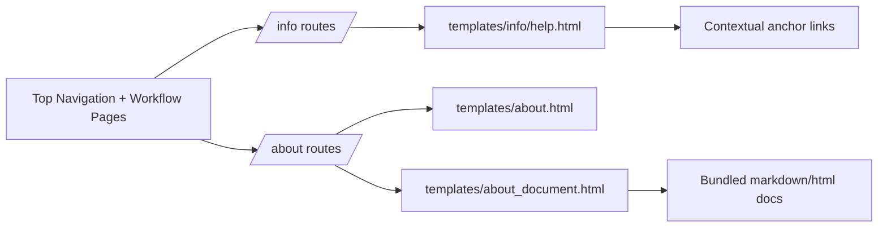

# Help Backend Specification

## Status
- Type: Current behavior + target architecture
- Audience: Agents
- Last validated: 2026-05-29
- Companion checklist: [docs/Specs/help-refactor-checklist.md](docs/Specs/help-refactor-checklist.md)
- UI companion: [docs/Specs/UI/help-ui-spec.md](docs/Specs/UI/help-ui-spec.md)
- User guidance companion: [docs/User-Facing-Guidance/HELP.md](docs/User-Facing-Guidance/HELP.md)

## Purpose
Define backend architecture and behavior for in-app Help and information discovery surfaces, including:
- Help route and template delivery.
- About document hub and in-app document rendering.
- Navigation and contextual help entry points across core workflows.
- Current known gaps and future direction.

## Scope
In scope:
- Route contracts for /help, /about, and /about/document/{slug}.
- Template touchpoints that expose help links from key user/admin workflows.
- Test anchors that validate route availability and help-page content expectations.
- Known gaps and target architecture direction.

Out of scope:
- Full documentation portal architecture outside current in-app pages.
- Styling-level refinements not affecting behavior or contract shape.
- Non-help legal/policy content authoring itself.

## Terminology
- Help hub: The in-app guidance page at /help.
- About hub: The in-app document index at /about.
- About document route: /about/document/{slug}, rendering bundled project docs.
- Contextual help link: A workflow-local link that jumps to a help section anchor.

## Current Behavior Architecture

### Component Map



Key modules:
- [src/routes/info.py](src/routes/info.py)
- [src/routes/about.py](src/routes/about.py)
- [src/main.py](src/main.py)
- [templates/base.html](templates/base.html)
- [templates/info/help.html](templates/info/help.html)

## Endpoint Contracts (Current)

| Method | Path | Handler | Behavior | Evidence |
|---|---|---|---|---|
| GET | /help | help_page | Renders consolidated help hub template | [src/routes/info.py](src/routes/info.py) |
| GET | /about | about_page | Renders about document index page | [src/routes/about.py](src/routes/about.py) |
| GET | /about/document/{slug} | about_document_page | Renders bundled document content by slug | [src/routes/about.py](src/routes/about.py) |

Router registration and middleware exemption:
- info and about routers are both active in app startup: [src/main.py](src/main.py)
- disclaimer middleware exempts /help and /about: [src/main.py](src/main.py)

## Help Hub Behavior (Current)

### Help Template Structure
The Help hub is delivered from [templates/info/help.html](templates/info/help.html) and includes anchored sections for:
- #search
- #importing
- #ai-tagging
- #tagging-actions
- #projects
- #maintenance
- #troubleshooting

The help page is guidance-first and links directly to key workflow routes.

### Navigation Exposure
Primary navigation exposes Help from top nav:
- Help link in global layout: [templates/base.html](templates/base.html)

Footer continues to expose About as a separate destination:
- About footer link: [templates/base.html](templates/base.html)

### Contextual Help Touchpoints
Current workflow-local pointers include:
- Browse search syntax/help links: [templates/designs/browse.html](templates/designs/browse.html)
- Import step 1 and step 2 help links: [templates/import/step1_folder.html](templates/import/step1_folder.html), [templates/import/step2_review.html](templates/import/step2_review.html)
- Projects list/form help links: [templates/projects/list.html](templates/projects/list.html), [templates/projects/form.html](templates/projects/form.html)
- Orphans maintenance and troubleshooting links: [templates/admin/orphans.html](templates/admin/orphans.html)

## About Hub Behavior (Current)

### About Document Index
/about renders a list of bundled project documents defined by slug mapping in [src/routes/about.py](src/routes/about.py).

Current mapped document set includes:
- Disclaimer
- Privacy
- Security
- AI Tagging Guide
- Third-Party Notices
- Licence

### About Document Rendering
/about/document/{slug}:
- Validates slug against configured map.
- Reads source file from repository path.
- Renders document text in about document template.
- Returns 404 for unknown slug or missing file.

Evidence:
- Route and mapping behavior: [src/routes/about.py](src/routes/about.py)

## Tests and Verification Anchors

Route-level coverage:
- About route/document behavior tests: [tests/test_routes.py](tests/test_routes.py)
- Help route and section-content tests: [tests/test_routes.py](tests/test_routes.py)

Current test shape verifies:
- /help returns 200.
- Help includes core guidance headings.
- Help includes a link to /about.
- /about and document sub-routes return expected content.

## Current Known Gaps and Constraints
- No dedicated #about section exists inside [templates/info/help.html](templates/info/help.html); About is currently a separate hub.
- /about does not alias or redirect to /help; it remains an independent document index route.
- Help content is template-embedded and does not yet have a structured content registry or settings-backed editorial model.
- No route-level telemetry or metrics exist for help section usage or about-document usage.
- There is no dedicated backend abstraction for contextual-help link inventory; links are maintained inline across templates.
- Help coverage tests validate core headings/links but do not assert all contextual help links across every template.

## Target Architecture

This section captures intended direction for future changes while preserving compatibility.

### Target Principles
- Preserve /help as the primary in-app guidance destination.
- Keep /about as the project-document discovery destination.
- Maintain low-friction contextual entry points from key workflows.
- Keep route contracts stable while improving content maintainability and test depth.

### Target Runtime Shape

```mermaid
flowchart TD
  A[User workflow page] --> B[Contextual help link]
  B --> C[/help with section anchor]
  C --> D[Task guidance section]
  D --> E[Escalate to /about docs or troubleshooting docs]
```

### Target Contract Improvements
- Introduce explicit help content inventory metadata to reduce drift between templates and tests.
- Add broader test coverage for contextual help links on core workflow pages.
- Add lightweight analytics hooks for help/about route usage (if privacy posture allows).
- Establish periodic content validation checks against user-facing guidance docs.

### Compatibility Requirements
- Keep /help, /about, and /about/document/{slug} endpoints stable.
- Keep top-nav Help discoverability in global layout.
- Preserve in-app about-document rendering behavior for bundled docs.

## Rust/Svelte Migration Addendum

This section captures implementation-neutral invariants for rebuilding Help/About in Rust + Svelte while preserving user-visible behavior.

### Migration Contract Invariants
- Route and method invariants:
  - `GET /help`
  - `GET /about`
  - `GET /about/document/{slug}`
- Help section invariants:
  - Keep anchor IDs unchanged: `search`, `importing`, `ai-tagging`, `tagging-actions`, `projects`, `maintenance`, `troubleshooting`.
  - Keep quick-jump and section heading labels unchanged (including emoji and wording).
  - Keep section order unchanged.
- About slug invariants:
  - Preserve current slugs and semantic mapping:
    - `disclaimer`
    - `privacy`
    - `security`
    - `ai-tagging`
    - `third-party-notices`
    - `licence`
- Error behavior invariants:
  - Unknown slug returns HTTP 404.
  - Known slug with missing source file returns HTTP 404.
- Discoverability invariants:
  - Global Help entry remains in top navigation.
  - About remains discoverable and routed as a separate hub.
  - Contextual workflow links continue targeting Help anchors from Browse, Import, Projects, and Orphans flows.

### Rust Translation Notes (Implementation-Neutral)
- The Python implementation uses template rendering, but the migration target only needs to preserve observable contracts and content structure.
- For About documents, preserve the current behavior boundary:
  - route-level slug validation,
  - file-backed content retrieval,
  - safe not-found handling.
- Preserve copy-level guidance intent for Help sections; this is relied upon by existing tests and user workflows.
- Keep route compatibility first; styling framework differences are acceptable if interaction and content contracts remain equivalent.

## Companion Refactor Checklist
Use [docs/Specs/help-refactor-checklist.md](docs/Specs/help-refactor-checklist.md) for change-gated implementation and review.
