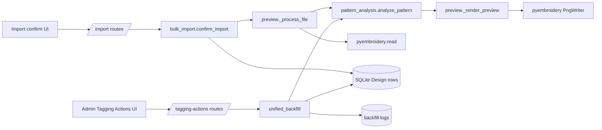
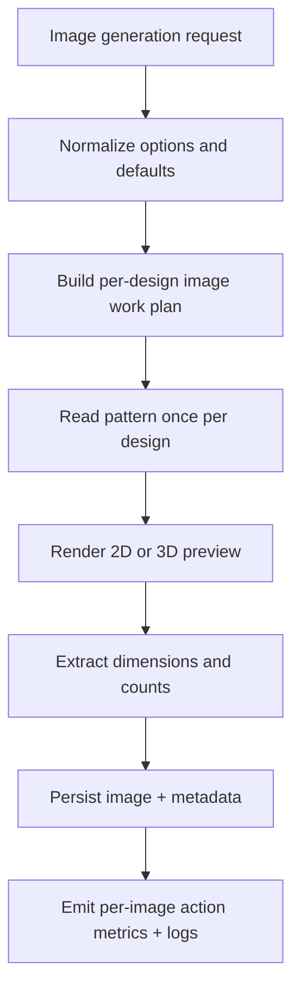

# Image Generation Backend Specification

## Status
- Type: Current behavior + target architecture
- Audience: Agents
- Last validated: 2026-05-26
- Companion checklist: [docs/Specs/image-generation-refactor-checklist.md](docs/Specs/image-generation-refactor-checklist.md)
- Backfill companion: [docs/Specs/backfilling-backend-spec.md](docs/Specs/backfilling-backend-spec.md)
- Import-format companion: [docs/Specs/import-format-support-backend-spec.md](docs/Specs/import-format-support-backend-spec.md)

## Purpose
Define backend architecture and functionality for image generation where embroidery design files are inspected and digitising commands are interpreted to produce preview images and related metadata.

## Scope
In scope:
- Endpoint contracts and payloads for image-generation paths.
- Service orchestration across import and unified backfill image actions.
- Pyembroidery-based preview rendering and metadata extraction behavior.
- Stop, commit, and logging behavior where it affects image generation.
- Confirmed gaps and forward target architecture.

Out of scope:
- Frontend styling and page layout details.
- Non-image tagging tier internals except where they intersect image generation.
- Full user walkthroughs (see docs/User-Facing-Guidance).

## Terminology
- 2D preview: Flat render path with `preview_3d=False`.
- 3D preview: Stitch-simulation render path with `preview_3d=True`.
- Redo-all images: Regenerate previews even when image data already exists.
- Upgrade 2D to 3D: Regenerate only records currently tagged as 2D (or legacy `None`).
- Spider fallback: ART-adjacent sidecar image/dimension extraction from Embird/Spider folders.

## Current Behavior Architecture

### Component Map

Key modules:
- [src/routes/tagging_actions.py](src/routes/tagging_actions.py)
- [src/routes/bulk_import.py](src/routes/bulk_import.py)
- [src/routes/designs.py](src/routes/designs.py)
- [src/services/unified_backfill.py](src/services/unified_backfill.py)
- [src/services/bulk_import.py](src/services/bulk_import.py)
- [src/services/pattern_analysis.py](src/services/pattern_analysis.py)
- [src/services/preview.py](src/services/preview.py)
- [src/services/hoops.py](src/services/hoops.py)
- [src/models.py](src/models.py)

### Release Posture (Pre-Release)
- Canonical backfill execution path for image regeneration is **Admin -> Tagging Actions** via `/admin/tagging-actions/run-unified-backfill`.
- Canonical initial-population path is import confirmation via `/import/do-confirm` and `/import/confirm`.
- Single-design rerender endpoint exists (`POST /designs/{design_id}/render-3d-preview`) as a secondary utility path.
- Non-UI maintenance image endpoints remain transitional and should be retired before release completion.

### Core Data Touchpoints
- `Design` model: [src/models.py#L136](src/models.py#L136)
- `Tag` model: [src/models.py#L73](src/models.py#L73)
- `design_tags` relation: [src/models.py#L94](src/models.py#L94)

Primary fields affected by image generation:
- `Design.image_data`: [src/models.py#L146](src/models.py#L146)
- `Design.image_type`: [src/models.py#L147](src/models.py#L147)
- `Design.width_mm`, `Design.height_mm`: [src/models.py#L148](src/models.py#L148), [src/models.py#L149](src/models.py#L149)
- `Design.hoop_id`: [src/models.py#L172](src/models.py#L172)
- `Design.stitch_count`, `Design.color_count`, `Design.color_change_count`: [src/models.py#L150](src/models.py#L150), [src/models.py#L151](src/models.py#L151), [src/models.py#L152](src/models.py#L152)

### Endpoint Contracts (Current)

| Method | Path | Handler | Evidence |
|---|---|---|---|
| POST | `/admin/tagging-actions/run-unified-backfill` | `run_unified_backfill` | [src/routes/tagging_actions.py#L79](src/routes/tagging_actions.py#L79) |
| POST | `/admin/tagging-actions/stop-unified-backfill` | `stop_unified_backfill` | [src/routes/tagging_actions.py#L114](src/routes/tagging_actions.py#L114) |
| GET | `/admin/tagging-actions/download-backfill-log` | `download_backfill_log` | [src/routes/tagging_actions.py#L124](src/routes/tagging_actions.py#L124) |
| POST | `/import/do-confirm` | `do_confirm_from_token` | [src/routes/bulk_import.py#L439](src/routes/bulk_import.py#L439) |
| POST | `/import/confirm` | `confirm` | [src/routes/bulk_import.py#L590](src/routes/bulk_import.py#L590) |
| POST | `/designs/{design_id}/render-3d-preview` | `render_3d_preview` | [src/routes/designs.py#L503](src/routes/designs.py#L503) |
| GET | `/designs/{design_id}/image` | `design_image` | [src/routes/designs.py#L400](src/routes/designs.py#L400) |

Transitional maintenance endpoints (present, non-release-target):
- `POST /admin/maintenance/clear-images`: [src/routes/maintenance.py#L348](src/routes/maintenance.py#L348)
- `POST /admin/maintenance/backfill-images`: [src/routes/maintenance.py#L381](src/routes/maintenance.py#L381)

#### Unified Backfill Request/Response (Image-Relevant)
Request payload assembly in admin template:
- `preview_3d` checkbox inversion (`images_2d`): [templates/admin/tagging_actions.html#L262](templates/admin/tagging_actions.html#L262)
- fetch to unified endpoint: [templates/admin/tagging_actions.html#L264](templates/admin/tagging_actions.html#L264)
- JSON payload shape: [templates/admin/tagging_actions.html#L267](templates/admin/tagging_actions.html#L267)

Route defaults and propagation:
- `batch_size=100`: [src/routes/tagging_actions.py#L91](src/routes/tagging_actions.py#L91)
- `commit_every=100`: [src/routes/tagging_actions.py#L92](src/routes/tagging_actions.py#L92)
- `workers=4`: [src/routes/tagging_actions.py#L93](src/routes/tagging_actions.py#L93)
- `preview_3d` extraction and propagation to images action: [src/routes/tagging_actions.py#L94](src/routes/tagging_actions.py#L94), [src/routes/tagging_actions.py#L98](src/routes/tagging_actions.py#L98)

Unified summary shape (aggregate):
- `processed`, `errors`, `stopped`, `actions`: [src/services/unified_backfill.py#L800](src/services/unified_backfill.py#L800)

Stop/log responses:
- stop returns `already_stopping` or `stopping`: [src/routes/tagging_actions.py#L118](src/routes/tagging_actions.py#L118), [src/routes/tagging_actions.py#L121](src/routes/tagging_actions.py#L121)
- log download checks and returns `ERROR_LOG_PATH`: [src/routes/tagging_actions.py#L127](src/routes/tagging_actions.py#L127), [src/routes/tagging_actions.py#L130](src/routes/tagging_actions.py#L130)

#### Import Request/Response (Image-Relevant)
- Image preference source and parse path: [src/routes/bulk_import.py#L534](src/routes/bulk_import.py#L534)
- `preview_3d` resolution (`image_preference != "2d"`): [src/routes/bulk_import.py#L535](src/routes/bulk_import.py#L535)
- Same resolution in `/confirm` path: [src/routes/bulk_import.py#L681](src/routes/bulk_import.py#L681), [src/routes/bulk_import.py#L682](src/routes/bulk_import.py#L682)
- Import orchestrator signature includes `preview_3d`: [src/services/bulk_import.py#L407](src/services/bulk_import.py#L407), [src/services/bulk_import.py#L420](src/services/bulk_import.py#L420)

Settings keys for image preference and import commit behavior:
- `SETTING_IMAGE_PREFERENCE`: [src/services/settings_service.py#L39](src/services/settings_service.py#L39)
- default image preference value (`"2d"`): [src/services/settings_service.py#L52](src/services/settings_service.py#L52)
- import commit batch key: [src/services/settings_service.py#L38](src/services/settings_service.py#L38)

### Rendering and Analysis Service Behavior (Current)

#### Preview Rendering Primitive
Main renderer:
- `_render_preview`: [src/services/preview.py#L304](src/services/preview.py#L304)
- pyembroidery render call: [src/services/preview.py#L321](src/services/preview.py#L321)
- explicit logging around render attempt/success/failure: [src/services/preview.py#L320](src/services/preview.py#L320), [src/services/preview.py#L323](src/services/preview.py#L323), [src/services/preview.py#L326](src/services/preview.py#L326)

Behavior:
- `preview_3d=True` uses 3D stitch simulation path.
- `preview_3d=False` uses faster 2D path with the same rendering primitive, different setting.
- On render exception, returns `None` and caller determines fallback.

#### Shared Pattern Analysis Contract
- `_render_preview_and_bounds`: [src/services/pattern_analysis.py#L57](src/services/pattern_analysis.py#L57)
- `analyze_pattern`: [src/services/pattern_analysis.py#L184](src/services/pattern_analysis.py#L184)

Image semantics in `analyze_pattern`:
- input flags: `needs_images`, `preview_3d`, `redo`, `upgrade_2d_to_3d`: [src/services/pattern_analysis.py#L187](src/services/pattern_analysis.py#L187), [src/services/pattern_analysis.py#L191](src/services/pattern_analysis.py#L191), [src/services/pattern_analysis.py#L192](src/services/pattern_analysis.py#L192), [src/services/pattern_analysis.py#L193](src/services/pattern_analysis.py#L193)
- upgrade gate (`existing_image_type in ("2d", None)`): [src/services/pattern_analysis.py#L79](src/services/pattern_analysis.py#L79)
- image type assignment: [src/services/pattern_analysis.py#L87](src/services/pattern_analysis.py#L87)
- bounds-derived mm dimensions extraction: [src/services/pattern_analysis.py#L91](src/services/pattern_analysis.py#L91)

#### Import File Processing and Fallbacks
- `_process_file` import path: [src/services/preview.py#L330](src/services/preview.py#L330)
- primary read path (`pyembroidery.read`): [src/services/preview.py#L349](src/services/preview.py#L349)
- shared analysis call: [src/services/preview.py#L371](src/services/preview.py#L371)

ART and Spider fallback helpers:
- spider image lookup: [src/services/preview.py#L41](src/services/preview.py#L41)
- spider text decode: [src/services/preview.py#L74](src/services/preview.py#L74)
- mm regex parse helper and regex: [src/services/preview.py#L35](src/services/preview.py#L35), [src/services/preview.py#L92](src/services/preview.py#L92)
- spider dimensions extraction: [src/services/preview.py#L104](src/services/preview.py#L104)
- ART embedded icon decode: [src/services/preview.py#L150](src/services/preview.py#L150)
- ART metadata read (stitch/color/vendor): [src/services/preview.py#L173](src/services/preview.py#L173)

Hoop assignment:
- hoop selector entrypoint: [src/services/hoops.py#L61](src/services/hoops.py#L61)

#### Unified Backfill Image Execution
Main orchestrator:
- `unified_backfill`: [src/services/unified_backfill.py#L656](src/services/unified_backfill.py#L656)

Image options to analysis path:
- sequential image runner forwards `preview_3d` and `upgrade_2d_to_3d`: [src/services/unified_backfill.py#L321](src/services/unified_backfill.py#L321), [src/services/unified_backfill.py#L323](src/services/unified_backfill.py#L323)
- parallel worker forwards same options into `analyze_pattern`: [src/services/unified_backfill.py#L425](src/services/unified_backfill.py#L425), [src/services/unified_backfill.py#L535](src/services/unified_backfill.py#L535)

Parallel/sequential model:
- parallel action split and gate: [src/services/unified_backfill.py#L847](src/services/unified_backfill.py#L847), [src/services/unified_backfill.py#L848](src/services/unified_backfill.py#L848)
- parallel branch marker: [src/services/unified_backfill.py#L855](src/services/unified_backfill.py#L855)
- process pool usage: [src/services/unified_backfill.py#L901](src/services/unified_backfill.py#L901)
- worker results written sequentially to DB: [src/services/unified_backfill.py#L932](src/services/unified_backfill.py#L932)
- sequential fallback marker: [src/services/unified_backfill.py#L1126](src/services/unified_backfill.py#L1126)

Commit, stop, and logging:
- stop signal request: [src/services/unified_backfill.py#L86](src/services/unified_backfill.py#L86)
- clear stop state at run start: [src/services/unified_backfill.py#L100](src/services/unified_backfill.py#L100)
- stop checks (`is_stop_requested`): [src/services/unified_backfill.py#L105](src/services/unified_backfill.py#L105)
- sqlite optimise/restore: [src/services/unified_backfill.py#L595](src/services/unified_backfill.py#L595), [src/services/unified_backfill.py#L630](src/services/unified_backfill.py#L630)
- logs truncated at run start: [src/services/unified_backfill.py#L803](src/services/unified_backfill.py#L803)
- error/info log paths: [src/services/unified_backfill.py#L73](src/services/unified_backfill.py#L73), [src/services/unified_backfill.py#L74](src/services/unified_backfill.py#L74)

### Current Known Gaps and Constraints
- Unified result is aggregate and not per-action metric-rich: [src/services/unified_backfill.py#L800](src/services/unified_backfill.py#L800).
- Route and template defaults for commit cadence differ (`100` in route, `500` fallback in template JS): [src/routes/tagging_actions.py#L92](src/routes/tagging_actions.py#L92), [templates/admin/tagging_actions.html#L260](templates/admin/tagging_actions.html#L260).
- Log files are reset at unified run start (no rotation/retention policy): [src/services/unified_backfill.py#L803](src/services/unified_backfill.py#L803).
- ART behavior still depends on sidecar and icon fallbacks rather than one canonical decode path: [src/services/preview.py#L104](src/services/preview.py#L104), [src/services/preview.py#L150](src/services/preview.py#L150).
- Transitional maintenance image routes still exist outside the release-target UI contract: [src/routes/maintenance.py#L348](src/routes/maintenance.py#L348), [src/routes/maintenance.py#L381](src/routes/maintenance.py#L381).

## Target Architecture

This section captures intended architecture direction while preserving compatibility with current import and tagging-actions paths.

### Target Principles
- One canonical image-generation utility contract reused by import and unified backfill.
- Consistent defaults and precedence semantics for `batch_size`, `commit_every`, and preview mode.
- Structured image-action results (rendered/skipped/failed by reason) in response payloads.
- Explicit fallback contract for ART/Spider behavior with deterministic priority ordering.
- Explicit log lifecycle policy (truncate-per-run versus retention) and operational visibility.

### Target Runtime Shape

### Target Contract Improvements
- Add `results_by_action.images` with counters such as `rendered`, `skipped_existing`, `upgraded_2d_to_3d`, `errors`.
- Centralize default resolution with explicit precedence: request payload overrides -> persisted settings -> hard defaults.
- Keep `preview_3d` and `image_preference` naming coherent across route/service surfaces.
- Formalize fallback order for ART image materialization and dimensions extraction.
- Converge import and unified-backfill assignment of `image_type`, dimensions, and hoop selection through one utility adapter around `analyze_pattern`.

Target-architecture anchor evidence for convergence need:
- unified path currently accepts request-time batch/commit/preview options: [src/routes/tagging_actions.py#L91](src/routes/tagging_actions.py#L91), [src/routes/tagging_actions.py#L94](src/routes/tagging_actions.py#L94)
- import path currently resolves preview mode from `image_preference`: [src/routes/bulk_import.py#L535](src/routes/bulk_import.py#L535), [src/routes/bulk_import.py#L682](src/routes/bulk_import.py#L682)
- shared pattern-analysis entrypoint already exists: [src/services/pattern_analysis.py#L184](src/services/pattern_analysis.py#L184)

### Compatibility Requirements
- Keep `/admin/tagging-actions/run-unified-backfill` and `/import/*confirm` behavior stable through release.
- Preserve existing `redo_all_images` and `upgrade_2d_to_3d` behavior unless an explicit migration is shipped.
- Preserve stop and final-commit safety properties for long-running backfills.
- Keep non-UI maintenance image routes transitional until replacement/migration is complete.

## Verification and Test Anchors
- preview rendering settings and failure behavior: [tests/test_bulk_import_extra.py#L495](tests/test_bulk_import_extra.py#L495), [tests/test_bulk_import_extra.py#L523](tests/test_bulk_import_extra.py#L523)
- upgrade path behavior in shared analysis: [tests/test_bulk_import_extra.py#L566](tests/test_bulk_import_extra.py#L566)
- import propagation of `preview_3d`: [tests/test_bulk_import_extra.py#L2064](tests/test_bulk_import_extra.py#L2064), [tests/test_bulk_import_extra.py#L2138](tests/test_bulk_import_extra.py#L2138)
- unified backfill image behavior (2D/3D/redo/upgrade): [tests/test_unified_backfill.py#L2000](tests/test_unified_backfill.py#L2000), [tests/test_unified_backfill.py#L2092](tests/test_unified_backfill.py#L2092), [tests/test_unified_backfill.py#L3545](tests/test_unified_backfill.py#L3545), [tests/test_unified_backfill.py#L3630](tests/test_unified_backfill.py#L3630)
- combined run matrix coverage: [tests/backfill-import-tests.md#L62](tests/backfill-import-tests.md#L62), [tests/backfill-import-tests.md#L65](tests/backfill-import-tests.md#L65)

## Companion Refactor Checklist
Use [docs/Specs/image-generation-refactor-checklist.md](docs/Specs/image-generation-refactor-checklist.md) for change-gated implementation and review.

Related operational guidance:
- [docs/User-Facing-Guidance/IMAGE_GENERATION.md](docs/User-Facing-Guidance/IMAGE_GENERATION.md)
- [docs/User-Facing-Guidance/TAGGING_ACTIONS_BACKFILL.md](docs/User-Facing-Guidance/TAGGING_ACTIONS_BACKFILL.md)
