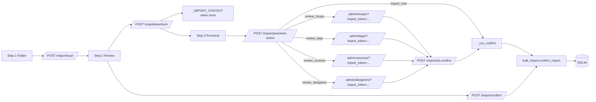

# Import Backend Specification

## Status
- Type: Current behavior + target architecture
- Audience: Agents
- Last validated: 2026-05-26
- Companion checklist: [docs/Specs/import-refactor-checklist.md](docs/Specs/import-refactor-checklist.md)
- Related deep specs:
  - [docs/Specs/first-import-actions-backend-spec.md](docs/Specs/first-import-actions-backend-spec.md)
  - [docs/Specs/import-folder-assignment-backend-spec.md](docs/Specs/import-folder-assignment-backend-spec.md)
  - [docs/Specs/import-format-support-backend-spec.md](docs/Specs/import-format-support-backend-spec.md)
- Related UI spec: [docs/Specs/UI/import-ui-spec.md](docs/Specs/UI/import-ui-spec.md)
- User guide: [docs/User-Facing-Guidance/IMPORT_WORKFLOW.md](docs/User-Facing-Guidance/IMPORT_WORKFLOW.md)

## Purpose
Define end-to-end backend architecture and runtime behavior for the import wizard, including:
- folder selection and scan entrypoints,
- review payload contracts,
- first-import decisioning and optional pre-import review routes,
- tokenized continuation and confirm execution,
- assignment/format/tagging integration boundaries,
- failure, cancellation, and recovery behavior.

## Scope
In scope:
- Route contracts for all import endpoints.
- Orchestration boundaries between route and service layers.
- Import context token lifecycle and continuation semantics.
- Integration handoff to folder assignment, format support, and tagging services.

Out of scope:
- Styling-level UI design (see UI spec).
- Deep per-topic internals already covered by focused specs.
- Admin workflows outside import mode.

## Terminology
- Import wizard: Step 1 folder selection -> Step 2 review -> Step 3 precheck/actions -> Step 4 confirm/save.
- Import mode: admin list pages opened with a valid import_token context.
- Import context token: opaque UUIDv4 key used to resume a pending import from precheck to confirm.
- First import: precheck request while the catalogue has zero designs.
- Subsequent import: precheck request while the catalogue already has one or more designs.

## Current Behavior Architecture

### Component Map

Key modules:
- [src/routes/bulk_import.py](src/routes/bulk_import.py)
- [src/services/scanning.py](src/services/scanning.py)
- [src/services/bulk_import.py](src/services/bulk_import.py)
- [src/services/preview.py](src/services/preview.py)
- [src/services/folder_picker.py](src/services/folder_picker.py)

### Endpoint Contracts (Current)

| Method | Path | Handler | Primary behavior | Evidence |
|---|---|---|---|---|
| GET | /import/ | import_form | Render Step 1 folder page | [src/routes/bulk_import.py#L132](src/routes/bulk_import.py#L132) |
| GET | /import/browse-folder | browse_folder | Open native picker and return one or more paths | [src/routes/bulk_import.py#L96](src/routes/bulk_import.py#L96) |
| POST | /import/scan | scan | Validate folder paths, scan files, render Step 2 review | [src/routes/bulk_import.py#L141](src/routes/bulk_import.py#L141) |
| POST | /import/precheck | precheck | Build import context token and render Step 3 decisions | [src/routes/bulk_import.py#L261](src/routes/bulk_import.py#L261) |
| POST | /import/precheck-action | precheck_action | Route decision to admin review, import now, or cancel | [src/routes/bulk_import.py#L352](src/routes/bulk_import.py#L352) |
| POST | /import/do-confirm | do_confirm_from_token | Pop token context and run confirm | [src/routes/bulk_import.py#L440](src/routes/bulk_import.py#L440) |
| POST | /import/confirm | confirm | Legacy direct confirm path from Step 2 payload | [src/routes/bulk_import.py#L591](src/routes/bulk_import.py#L591) |

Import-mode admin list routes:
- [src/routes/tags.py#L70](src/routes/tags.py#L70)
- [src/routes/hoops.py#L42](src/routes/hoops.py#L42)
- [src/routes/sources.py#L42](src/routes/sources.py#L42)
- [src/routes/designers.py#L42](src/routes/designers.py#L42)

### Wizard Runtime Sequence
1. Step 1 accepts one or more folder paths and optional native picker selection.
2. Step 2 shows grouped scan results and captures selected files plus folder/global assignment choices.
3. Step 3 stores pending import context under a token, then presents first/subsequent import actions.
4. Review actions open admin pages in import mode with token-preserving redirects.
5. Continue action posts token to do-confirm; import_now can execute immediately from precheck-action.
6. Confirm path processes selected files, applies assignment precedence, persists records, and optionally runs Tier 2/3 tagging according to settings.

### Context Token Lifecycle (Current)
- Store: module-level dictionary in route module.
  - [src/routes/bulk_import.py#L61](src/routes/bulk_import.py#L61)
- Validation: strict UUIDv4 regex.
  - [src/routes/bulk_import.py#L66](src/routes/bulk_import.py#L66)
- Create/read/pop helpers:
  - [src/routes/bulk_import.py#L71](src/routes/bulk_import.py#L71)
  - [src/routes/bulk_import.py#L85](src/routes/bulk_import.py#L85)
  - [src/routes/bulk_import.py#L78](src/routes/bulk_import.py#L78)
- Consumption: single-use on do-confirm and import_now execution path.
  - [src/routes/bulk_import.py#L387](src/routes/bulk_import.py#L387)
  - [src/routes/bulk_import.py#L450](src/routes/bulk_import.py#L450)

### Route-to-Service Boundaries
Scanning and selection:
- SUPPORTED_EXTENSIONS / EXTENSION_PRIORITY policy:
  - [src/services/scanning.py#L15](src/services/scanning.py#L15)
  - [src/services/scanning.py#L56](src/services/scanning.py#L56)
- Multi-folder scan and selected-file reconstruction:
  - [src/services/scanning.py#L208](src/services/scanning.py#L208)
  - [src/services/scanning.py#L251](src/services/scanning.py#L251)

Confirm orchestration:
- Confirm entry orchestrator:
  - [src/routes/bulk_import.py#L457](src/routes/bulk_import.py#L457)
- Main import service orchestrator:
  - [src/services/bulk_import.py#L407](src/services/bulk_import.py#L407)
- Commit batch default:
  - [src/services/bulk_import.py#L93](src/services/bulk_import.py#L93)

Preview and format processing:
- Core file processing path:
  - [src/services/preview.py#L330](src/services/preview.py#L330)
- .art limited support helpers:
  - [src/services/preview.py#L41](src/services/preview.py#L41)
  - [src/services/preview.py#L104](src/services/preview.py#L104)
  - [src/services/preview.py#L150](src/services/preview.py#L150)

Folder picker:
- Cross-platform picker entrypoint:
  - [src/services/folder_picker.py#L66](src/services/folder_picker.py#L66)

### Failure and Recovery Semantics
- Empty selected_files at precheck or confirm redirects safely to /import/.
  - [src/routes/bulk_import.py#L279](src/routes/bulk_import.py#L279)
  - [src/routes/bulk_import.py#L611](src/routes/bulk_import.py#L611)
- Unknown/invalid token redirects safely to /import/.
  - [src/routes/bulk_import.py#L369](src/routes/bulk_import.py#L369)
  - [src/routes/bulk_import.py#L452](src/routes/bulk_import.py#L452)
- Per-file processing errors are isolated to file-level error values.
  - [src/services/preview.py#L417](src/services/preview.py#L417)

## Deep-Dive Specifications
This document is the canonical end-to-end flow map. Topic-specific semantics remain canonical in:
- First import actions and precheck action policy:
  - [docs/Specs/first-import-actions-backend-spec.md](docs/Specs/first-import-actions-backend-spec.md)
- Per-folder Designer/Source assignment contracts and precedence:
  - [docs/Specs/import-folder-assignment-backend-spec.md](docs/Specs/import-folder-assignment-backend-spec.md)
- Format allowlist, priority, and .art behavior:
  - [docs/Specs/import-format-support-backend-spec.md](docs/Specs/import-format-support-backend-spec.md)

## Current Known Gaps and Constraints
- Context tokens are in-memory only; they do not survive process restart.
- No explicit token TTL/cap policy is enforced yet.
- Two confirm execution surfaces remain active (/import/do-confirm and /import/confirm).
- Cancel action is safe but does not explicitly purge context in precheck-action path.

## Target Architecture

### Target Principles
- Keep contracts stable for all current import routes.
- Converge toward one canonical confirm execution path.
- Maintain strict token safety and fail-safe behavior.
- Keep route layer orchestration-focused while service layer owns assignment/format/tagging semantics.

### Target Runtime Improvements
- Add deterministic token retention policy (TTL and/or bounded capacity).
- Invalidate token on cancel for explicit cleanup.
- Improve observability for precheck action outcomes (review path, skip-hoops confirmation use).
- Keep legacy direct confirm as compatibility shim when convergence is complete.

### Compatibility Requirements
- Preserve methods and paths for existing import endpoints.
- Preserve import-mode behavior on admin list pages.
- Preserve first-import hoop warning and confirmation semantics.
- Preserve assignment precedence and format support policy unless explicitly approved.

## Verification and Test Anchors
- Route behavior and import-mode redirects:
  - [tests/test_routes.py](tests/test_routes.py)
- Import assignment and format regressions:
  - [tests/test_bulk_import_extra.py](tests/test_bulk_import_extra.py)
- Flow-level regression anchors:
  - [tests/test_regression_e2e.py](tests/test_regression_e2e.py)

## Companion Checklist
Use [docs/Specs/import-refactor-checklist.md](docs/Specs/import-refactor-checklist.md) as the primary gate for import changes. It links to all focused import checklists for deep validation.