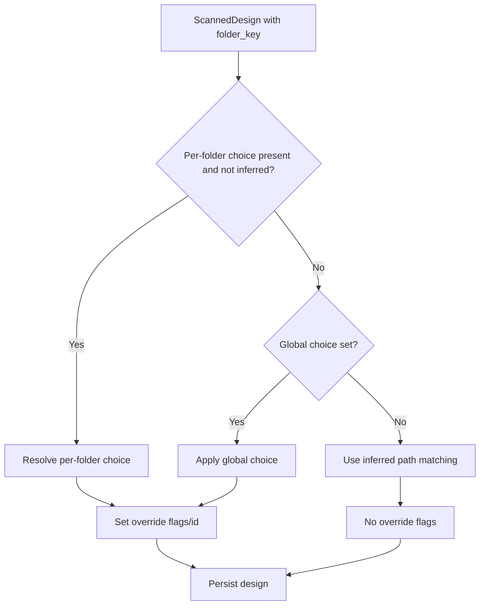
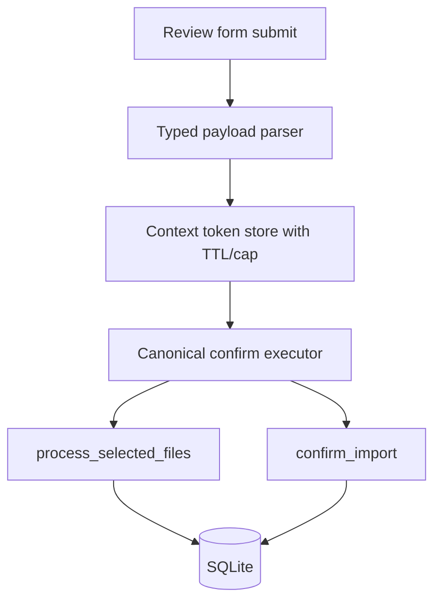

# Import Folder Assignment Backend Specification

## Status
- Type: Current behavior + target architecture
- Audience: Agents
- Last validated: 2026-05-24
- Companion checklist: [docs/Specs/import-folder-assignment-refactor-checklist.md](docs/Specs/import-folder-assignment-refactor-checklist.md)
- Unified import spec: [docs/Specs/import-backend-spec.md](docs/Specs/import-backend-spec.md)
- Unified import checklist: [docs/Specs/import-refactor-checklist.md](docs/Specs/import-refactor-checklist.md)
- Related import format spec: [docs/Specs/import-format-support-backend-spec.md](docs/Specs/import-format-support-backend-spec.md)
- User-facing quick guide: [docs/User-Facing-Guidance/IMPORT_FOLDER_ASSIGNMENT.md](docs/User-Facing-Guidance/IMPORT_FOLDER_ASSIGNMENT.md)

## Purpose
Define backend architecture and runtime behavior for per-folder Designer/Source assignment during bulk import, including:
- multi-folder selection and grouped review,
- assignment precedence (per-folder, global, inferred, blank),
- create-on-import behavior for missing Designer/Source values,
- tokenized precheck/confirm orchestration,
- test-backed current behavior and structural refactor targets.

## Scope
In scope:
- import route contracts and wizard step transitions.
- UI form fields that directly shape backend request payloads.
- scanning, selected-file resolution, and folder identity mapping.
- assignment resolution and persistence orchestration.
- create-on-import deduplication behavior.
- coverage matrix and known gaps.

Out of scope:
- visual styling and general UX content beyond payload-shaping fields.
- unified backfill execution internals (covered elsewhere).
- broader user troubleshooting guidance.

## Terminology
- Folder key: string index for each selected folder (`"0"`, `"1"`, ...).
- Folder root: managed top-level alias used in imported relative paths.
- Per-folder choice: folder-scoped metadata choice from review form.
- Global choice: metadata choice applied where no explicit per-folder override exists.
- Inferred: resolve Designer/Source by normalized path matching.
- Blank: explicit `NULL` assignment for Designer/Source.

## Current Behavior Architecture

### Component Map

```mermaid
flowchart LR
  S1[Step 1 UI<br/>folder picker + rows] --> R1[/POST /import/scan/]
  R1 --> SC[scanning.scan_folders]
  SC --> S2[Step 2 UI<br/>grouped review form]

  S2 --> R2[/POST /import/precheck/]
  R2 --> CTX[_IMPORT_CONTEXT token store]
  CTX --> R3[/POST /import/precheck-action/]
  R3 --> R4[/POST /import/do-confirm/]

  S2 --> R5[/POST /import/confirm (legacy direct path)/]
  R4 --> RC[_run_confirm]
  R5 --> RC
  RC --> PS[scanning.process_selected_files]
  RC --> CI[bulk_import.confirm_import]
  PS --> DB[(SQLite)]
  CI --> DB
```

Key modules:
- [src/routes/bulk_import.py](src/routes/bulk_import.py)
- [src/services/scanning.py](src/services/scanning.py)
- [src/services/bulk_import.py](src/services/bulk_import.py)
- [src/services/folder_picker.py](src/services/folder_picker.py)
- [templates/import/step1_folder.html](templates/import/step1_folder.html)
- [templates/import/step2_review.html](templates/import/step2_review.html)

### Import Endpoint Contracts (Current)

| Method | Path | Handler | Evidence |
|---|---|---|---|
| GET | `/import/browse-folder` | `browse_folder` | [src/routes/bulk_import.py#L95](src/routes/bulk_import.py#L95) |
| POST | `/import/scan` | `scan` | [src/routes/bulk_import.py#L140](src/routes/bulk_import.py#L140) |
| POST | `/import/precheck` | `precheck` | [src/routes/bulk_import.py#L260](src/routes/bulk_import.py#L260) |
| POST | `/import/precheck-action` | `precheck_action` | [src/routes/bulk_import.py#L351](src/routes/bulk_import.py#L351) |
| POST | `/import/do-confirm` | `do_confirm_from_token` | [src/routes/bulk_import.py#L439](src/routes/bulk_import.py#L439) |
| POST | `/import/confirm` | `confirm` (legacy direct path) | [src/routes/bulk_import.py#L590](src/routes/bulk_import.py#L590) |

### UI-to-Backend Contract Surface
Step 1 folder selection fields:
- scan form submission to `/import/scan`: [templates/import/step1_folder.html#L12](templates/import/step1_folder.html#L12)
- multi-value `folder_paths`: [templates/import/step1_folder.html#L19](templates/import/step1_folder.html#L19)
- browse endpoint call: [templates/import/step1_folder.html#L145](templates/import/step1_folder.html#L145)

Step 2 review fields:
- form submits to `/import/precheck`: [templates/import/step2_review.html#L41](templates/import/step2_review.html#L41)
- global Designer choice fields: [templates/import/step2_review.html#L57](templates/import/step2_review.html#L57)
- per-folder root hidden field: [templates/import/step2_review.html#L131](templates/import/step2_review.html#L131)
- per-folder Designer choice fields: [templates/import/step2_review.html#L154](templates/import/step2_review.html#L154)
- per-folder Source choice fields: [templates/import/step2_review.html#L176](templates/import/step2_review.html#L176)
- selected file list fields: [templates/import/step2_review.html#L201](templates/import/step2_review.html#L201), [templates/import/step2_review.html#L225](templates/import/step2_review.html#L225)

### Folder Selection and Picker Integration
- picker unavailability error type: [src/services/folder_picker.py#L23](src/services/folder_picker.py#L23)
- safe initial-directory resolver: [src/services/folder_picker.py#L34](src/services/folder_picker.py#L34)
- native picker entrypoint: [src/services/folder_picker.py#L66](src/services/folder_picker.py#L66)
- Windows multi-select flag: [src/services/folder_picker.py#L118](src/services/folder_picker.py#L118), [src/services/folder_picker.py#L319](src/services/folder_picker.py#L319)
- Windows native picker implementation: [src/services/folder_picker.py#L291](src/services/folder_picker.py#L291)
- route-level fallback messaging: [src/routes/bulk_import.py#L123](src/routes/bulk_import.py#L123)

### Scan and Selection Pipeline
- scanned design model includes folder metadata fields: [src/services/scanning.py#L100](src/services/scanning.py#L100), [src/services/scanning.py#L114](src/services/scanning.py#L114), [src/services/scanning.py#L116](src/services/scanning.py#L116)
- multi-folder scan entrypoint: [src/services/scanning.py#L208](src/services/scanning.py#L208)
- duplicate-basename managed root disambiguation (`__2` suffix): [src/services/scanning.py#L231](src/services/scanning.py#L231)
- selected-file reconstruction entrypoint: [src/services/scanning.py#L251](src/services/scanning.py#L251)
- folder-root map support: [src/services/scanning.py#L255](src/services/scanning.py#L255), [src/services/scanning.py#L272](src/services/scanning.py#L272)
- relative-path resolution safety helper: [src/services/scanning.py#L151](src/services/scanning.py#L151), [src/services/scanning.py#L294](src/services/scanning.py#L294)

### Import Context Token Lifecycle
- module-level token store: [src/routes/bulk_import.py#L61](src/routes/bulk_import.py#L61)
- context create/read/pop helpers: [src/routes/bulk_import.py#L71](src/routes/bulk_import.py#L71), [src/routes/bulk_import.py#L85](src/routes/bulk_import.py#L85), [src/routes/bulk_import.py#L78](src/routes/bulk_import.py#L78)
- precheck stores context token: [src/routes/bulk_import.py#L305](src/routes/bulk_import.py#L305)
- precheck-action uses get/pop based on action: [src/routes/bulk_import.py#L367](src/routes/bulk_import.py#L367), [src/routes/bulk_import.py#L387](src/routes/bulk_import.py#L387)
- do-confirm consumes token then executes import: [src/routes/bulk_import.py#L450](src/routes/bulk_import.py#L450), [src/routes/bulk_import.py#L454](src/routes/bulk_import.py#L454)

## Assignment Semantics

### Resolution Functions
- Designer resolver: [src/services/bulk_import.py#L345](src/services/bulk_import.py#L345)
- Source resolver: [src/services/bulk_import.py#L378](src/services/bulk_import.py#L378)
- create-on-import lookups: `find_or_create_designer`, `find_or_create_source` in [src/services/bulk_import.py#L368](src/services/bulk_import.py#L368), [src/services/bulk_import.py#L398](src/services/bulk_import.py#L398)

### Assignment Precedence (Current)
Defined in service contract:
- precedence statement: [src/services/bulk_import.py#L435](src/services/bulk_import.py#L435)
- runtime implementation in `confirm_import`: [src/services/bulk_import.py#L407](src/services/bulk_import.py#L407), [src/services/bulk_import.py#L492](src/services/bulk_import.py#L492), [src/services/bulk_import.py#L509](src/services/bulk_import.py#L509)

Precedence order:
1. explicit per-folder choice,
2. global choice,
3. inferred path match,
4. blank/null.

### Precedence Flow



### Commit and Persistence Behavior
- default commit batch constant: [src/services/bulk_import.py#L93](src/services/bulk_import.py#L93)
- batch coercion helper: [src/services/bulk_import.py#L96](src/services/bulk_import.py#L96)
- confirm orchestrator: [src/services/bulk_import.py#L407](src/services/bulk_import.py#L407)
- selected-file pre-persistence path: [src/services/scanning.py#L251](src/services/scanning.py#L251)

## Test Evidence Matrix

| Requirement | Existing coverage | Status |
|---|---|---|
| Multi-folder scanning returns folder-keyed groups | [tests/test_bulk_import_extra.py#L968](tests/test_bulk_import_extra.py#L968) | Covered |
| Duplicate basename folders get unique managed roots | [tests/test_bulk_import_extra.py#L947](tests/test_bulk_import_extra.py#L947) | Covered |
| Multi-folder selected-file matching resolves correct source | [tests/test_bulk_import_extra.py#L1054](tests/test_bulk_import_extra.py#L1054) | Covered |
| Per-folder choice overrides global choice | [tests/test_bulk_import_extra.py#L1348](tests/test_bulk_import_extra.py#L1348) | Covered |
| Per-folder inferred falls back to global | [tests/test_bulk_import_extra.py#L1365](tests/test_bulk_import_extra.py#L1365) | Covered |
| Confirm route forwards per-folder/global choices | [tests/test_bulk_import_extra.py#L1541](tests/test_bulk_import_extra.py#L1541) | Covered |
| Scan route handles multiple folder paths | [tests/test_routes.py#L321](tests/test_routes.py#L321) | Covered |
| Browse route still uses picker when external launches disabled | [tests/test_routes.py#L301](tests/test_routes.py#L301) | Covered |
| Create-on-import dedupe for same normalized name across folders | [tests/test_bulk_import_extra.py#L1307](tests/test_bulk_import_extra.py#L1307) | Covered |
| Token lifecycle expiry/eviction policy (TTL/cap) | No direct test | Gap |
| Direct `/import/confirm` and token `/import/do-confirm` parity beyond happy path | No explicit parity test set | Gap |
| Invalid per-folder create input (`create` + blank name) feedback contract | No explicit route contract test | Gap |

## Current Known Gaps
- Two confirm execution surfaces remain active (`/import/confirm` and `/import/do-confirm`) with overlapping orchestration and parsing logic.
- `_IMPORT_CONTEXT` is in-memory only and has no explicit TTL/cap lifecycle policy documented in code-level contract.
- Folder/global choice parsing is stringly-typed in route code; no typed DTO boundary.
- Form field parsing and assignment-mapping concerns are route-heavy and partially duplicated between `_run_confirm` and `confirm`.

## Target Architecture

### Target Principles
- one canonical confirm execution path for imports,
- typed parsing for import review payloads,
- explicit context-token lifecycle policy,
- deterministic and centralized assignment resolution contract,
- minimal route logic with service-owned orchestration.

### Proposed Structural Refactors
1. Converge confirm execution paths.
   - Keep `do-confirm` token path as canonical execution entrypoint.
   - Convert direct `confirm` route into compatibility shim that builds context and delegates.
2. Extract typed parsing layer.
   - Introduce a parser/DTO for folder choices, global choices, folder roots, and selected files.
   - Ensure validation and normalization are shared by both confirm surfaces.
3. Isolate context-store policy.
   - Wrap `_IMPORT_CONTEXT` in a small service that enforces max entries and token age.
   - Keep current local-process behavior but make retention deterministic and testable.
4. Centralize assignment payload contract.
   - Establish explicit schema for `designer_choice_*`, `source_choice_*`, and `folder_root_*` mapping.
   - Avoid route-local ad hoc field loops in multiple functions.
5. Tighten scan/confirm boundary.
   - Keep scanning responsible for folder identity (`folder_key`, `folder_root`) and selected-file resolver.
   - Keep `confirm_import` responsible for precedence and create-on-import, with route not mutating semantics.

### Target Runtime Shape



## Companion Refactor Checklist
Use [docs/Specs/import-folder-assignment-refactor-checklist.md](docs/Specs/import-folder-assignment-refactor-checklist.md) for change-gated implementation and review.