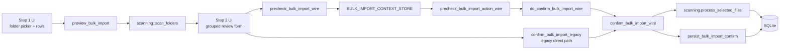
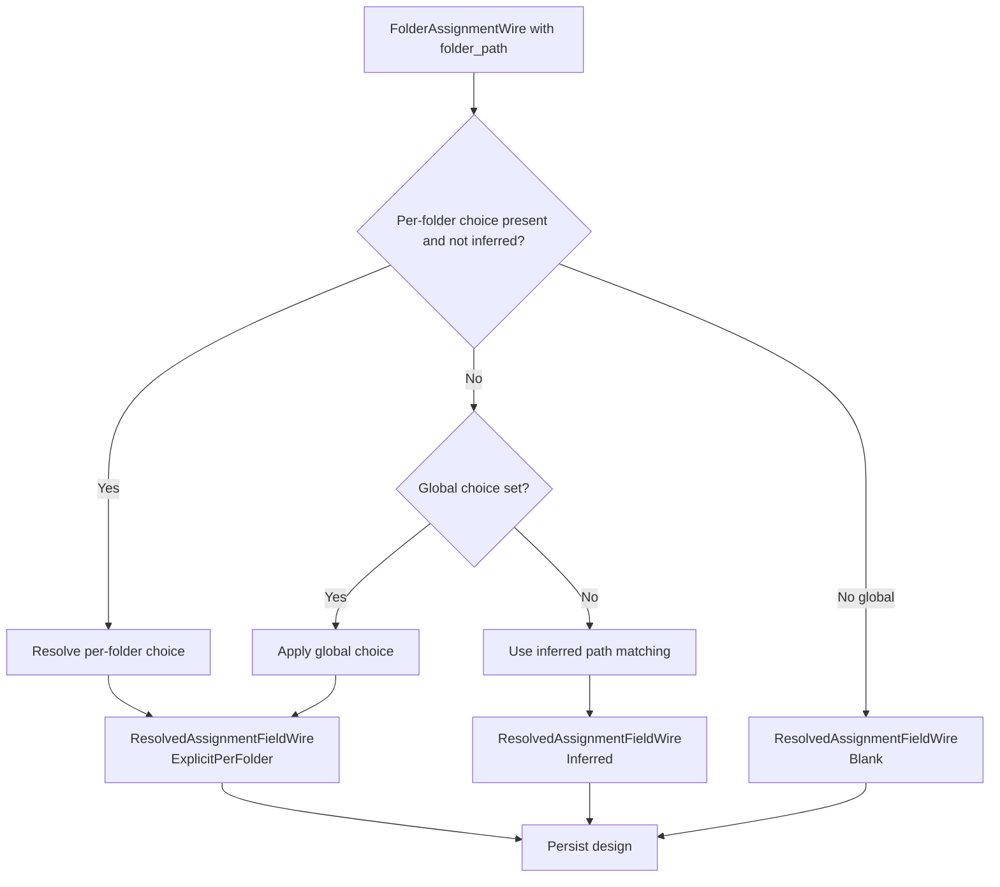
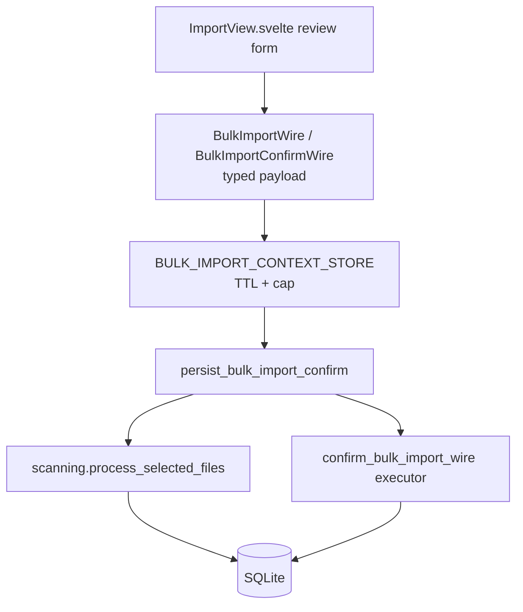

# Import Folder Assignment Backend Specification

## Status
- Type: Current behavior + target architecture
- Audience: Agents
- Last validated: 2026-08-05
- Companion checklist: [docs/Specs/import-folder-assignment-refactor-checklist.md](import-folder-assignment-refactor-checklist.md)
- Unified import spec: [docs/Specs/import-backend-spec.md](import-backend-spec.md) *(create if not present)*
- Unified import checklist: [docs/Specs/import-refactor-checklist.md](import-refactor-checklist.md) *(create if not present)*
- Related import format spec: [docs/Specs/import-format-support-backend-spec.md](import-format-support-backend-spec.md) *(create if not present)*
- User-facing quick guide: [docs/User-Facing-Guidance/IMPORT_FOLDER_ASSIGNMENT.md](../User-Facing-Guidance/IMPORT_FOLDER_ASSIGNMENT.md)

## Purpose
Define backend architecture and runtime behavior for per-folder Designer/Source assignment during bulk import, including:
- multi-folder selection and grouped review,
- assignment precedence (per-folder, global, inferred, blank),
- create-on-import behavior for missing Designer/Source values,
- tokenized precheck/confirm orchestration,
- test-backed current behavior and structural refactor targets.

## Scope
In scope:
- Tauri IPC command contracts and wizard step transitions.
- UI form fields (Svelte) that directly shape backend request payloads.
- scanning, selected-file resolution, and folder identity mapping.
- assignment resolution and persistence orchestration.
- create-on-import deduplication behavior.
- coverage matrix and known gaps.

Out of scope:
- visual styling and general UX content beyond payload-shaping fields.
- unified backfill execution internals (covered elsewhere).
- broader user troubleshooting guidance.

## Terminology
- Folder path: normalized folder path string used as the folder identity key (`FolderAssignmentWire.folder_path`).
- Managed root leaf: the root folder name used in imported relative paths under `MachineEmbroideryDesigns` (from `compute_prospective_stored_filepath`).
- Per-folder choice: folder-scoped metadata choice from review form (`per_folder_assignments[*].designer_id` / `.source_id`).
- Global choice: metadata choice applied where no explicit per-folder override exists (`global_designer_id` / `global_source_id`).
- Inferred: resolve Designer/Source by normalized path matching (`inferred_designer_id` / `inferred_source_id`).
- Blank: explicit `NULL` assignment for Designer/Source (`AssignmentFieldSourceWire::Blank`).

## Current Behavior Architecture

### Component Map

```mermaid
flowchart LR
  S1[Step 1 UI<br/>folder picker + rows] --> R1[preview_bulk_import]
  R1 --> SC[scanning::scan_folders]
  SC --> S2[Step 2 UI<br/>grouped review form]

  S2 --> R2[precheck_bulk_import_wire]
  R2 --> CTX[BULK_IMPORT_CONTEXT_STORE]
  CTX --> R3[precheck_bulk_import_action_wire]
  R3 --> R4[do_confirm_bulk_import_wire]

  S2 --> R5[confirm_bulk_import_legacy<br/>legacy direct path]
  R4 --> RC[confirm_bulk_import_wire]
  R5 --> RC
  RC --> PS[scanning.process_selected_files]
  RC --> PI[persist_bulk_import_confirm]
  PS --> DB[(SQLite)]
  PI --> DB
```

Key modules:
- [src/routes/bulk_import.rs](src/routes/bulk_import.rs)
- [src/services/scanning.rs](src/services/scanning.rs)
- [src/services/folder_picker.rs](src/services/folder_picker.rs)
- [src/services/validation.rs](src/services/validation.rs)
- [frontend/src/lib/views/ImportView.svelte](frontend/src/lib/views/ImportView.svelte)

### Tauri Command Contracts (Current)

| Command | Handler | Canonical path? | Evidence |
|---|---|---|---|
| `browse_import_folder` | `browse_import_folder` | — | `#[tauri::command]` in src/routes/bulk_import.rs (L1521) |
| `preview_bulk_import` | `preview_bulk_import` | — | `#[tauri::command]` in src/routes/bulk_import.rs (L1514) |
| `precheck_bulk_import_wire` | `precheck_bulk_import_wire` | Yes | `#[tauri::command]` in src/routes/bulk_import.rs (L1601) |
| `precheck_bulk_import_action_wire` | `precheck_bulk_import_action_wire` | Yes | `#[tauri::command]` in src/routes/bulk_import.rs (L1621) |
| `do_confirm_bulk_import_wire` | `do_confirm_bulk_import_wire` | Token path | `#[tauri::command]` in src/routes/bulk_import.rs (L1736) |
| `execute_bulk_import_confirm_wire` | `execute_bulk_import_confirm_wire` | Direct path | `#[tauri::command]` in src/routes/bulk_import.rs (L1758) |
| `confirm_bulk_import_wire` | `confirm_bulk_import_wire` | Canonical executor | `#[tauri::command]` in src/routes/bulk_import.rs (L1771) |
| `confirm_bulk_import_legacy` | `confirm_bulk_import_legacy` | Legacy shim | `#[tauri::command]` in src/routes/bulk_import.rs (L1788) |

Supporting commands:
- `debug_bulk_import_wire`, `debug_bulk_import_confirm_wire`, `debug_bulk_import_assignment_resolution_wire`
- `debug_bulk_import_context_store`, `reset_bulk_import_context_store`, `request_stop_bulk_import`

### UI-to-Backend Contract Surface

The Svelte import view (`frontend/src/lib/views/ImportView.svelte`) drives the wizard:

- Step 1 folder selection: multi-value `root_paths` (and legacy single `root_path`) → `preview_bulk_import`.
- Step 2 review form:
  - global Designer/Source: `global_designer_id` / `global_source_id` in `BulkImportWire`
  - per-folder assignments: `per_folder_assignments[]` with `folder_path`, `designer_id`, `source_id`, `inferred_designer_id`, `inferred_source_id`
  - selected file list: `selected_files: Vec<String>`
  - create-on-import: `create_on_import: bool`
- Precheck/confirm: `BulkImportConfirmWire` wraps `BulkImportWire` + optional `context_token` + `canonical_confirm` flag.

### Folder Selection and Picker Integration
- picker unavailability error type: `src/services/folder_picker.rs`
- native picker entrypoint: `folder_picker::browse_folder_with_error` (called from `browse_import_folder`)
- Windows multi-select flag: `allow_multi` parameter in `BulkImportBrowseFolderRequest`
- route-level fallback messaging: `BulkImportBrowseFolderResult` with `path`/`paths`

### Scan and Selection Pipeline
- scanned design model: `scanning::ScannedFile` (in `src/services/scanning.rs`)
- multi-folder scan entrypoint: `scanning::scan_folders`
- duplicate-basename managed root disambiguation: `compute_prospective_stored_filepath` (longest-root match; `__2`-style suffix at confirm time)
- selected-file reconstruction: `scanning` selected-file resolver
- folder-root map support: `compute_prospective_stored_filepath` (root leaf → `/MachineEmbroideryDesigns/{root_leaf}/...`)
- relative-path resolution safety: `full_path_to_stored_design_filepath` (boundary-safe prefix check via `is_path_under_designs_base`)

### Import Context Token Lifecycle
- module-level token store: `BULK_IMPORT_CONTEXT_STORE` (`OnceLock<Mutex<HashMap<String, StoredBulkImportContext>>>`) in src/routes/bulk_import.rs (L20)
- TTL policy: `BULK_IMPORT_CONTEXT_TTL` = 15 minutes (L17)
- capacity policy: `BULK_IMPORT_CONTEXT_MAX_ENTRIES` = 128 (L18)
- context create/read/pop helpers: `store_bulk_import_context`, `get_bulk_import_context`, `take_bulk_import_context` (L320–L327 region)
- precheck stores context token: `precheck_bulk_import_wire` calls `store_bulk_import_context` (L1607)
- precheck-action uses get/pop based on action: `precheck_bulk_import_action_wire` (ReviewHoops/Tags/Sources/Designers → `get`; Cancel/ImportNow → `take`) (L1627–L1733)
- do-confirm consumes token then executes import: `do_confirm_bulk_import_wire_internal` → `take_bulk_import_context` then `confirm_bulk_import_wire` (L1743–L1756)

## Assignment Semantics

### Resolution Functions
- Designer resolver: `resolve_assignment_field(explicit_value, global_value, inferred_value)` in src/routes/bulk_import.rs (L1796)
- Source resolver: same `resolve_assignment_field` (shared for both designer and source)
- create-on-import: `create_on_import` flag in `BulkImportWire`; find-or-create during persistence (`persist_bulk_import_confirm`)

### Assignment Precedence (Current)
Defined in `resolve_assignment_field`:
- explicit per-folder choice (L1801–L1806),
- global choice (L1808–L1813),
- inferred path match (L1815–L1820),
- blank/null (L1822–L1826).

Precedence order:
1. explicit per-folder choice,
2. global choice,
3. inferred path match,
4. blank/null.

### Precedence Flow

```mermaid
flowchart TD
  A[FolderAssignmentWire with folder_path] --> B{Per-folder choice present and not inferred?}
  B -->|Yes| C[Resolve per-folder choice]
  B -->|No| D{Global choice set?}
  D -->|Yes| E[Apply global choice]
  D -->|No| F[Use inferred path matching]
  C --> G[ResolvedAssignmentFieldWire<br/>ExplicitPerFolder]
  E --> G
  F --> H[ResolvedAssignmentFieldWire<br/>Inferred]
  B -->|No global| I[ResolvedAssignmentFieldWire<br/>Blank]
  G --> J[Persist design]
  H --> J
  I --> J
```

### Commit and Persistence Behavior
- default commit batch constant: `DEFAULT_IMPORT_COMMIT_BATCH_SIZE` = 10 (src/routes/bulk_import.rs L30)
- max commit batch: `MAX_IMPORT_COMMIT_BATCH_SIZE` = 10,000 (L31)
- batch coercion helper: `normalize_import_commit_batch_size` (L366)
- settings read: `load_import_commit_batch_size` reads `import.commit_batch_size` (L378)
- confirm orchestrator: `persist_bulk_import_confirm` + `confirm_bulk_import_wire`
- selected-file pre-persistence path: `scanning.process_selected_files`

## Test Evidence Matrix

| Requirement | Existing coverage | Status |
|---|---|---|
| Multi-folder scanning returns folder-keyed groups | `build_preview_folder_assignments_merges_explicit_and_scanned` (src/routes/bulk_import.rs tests) | Covered |
| Duplicate basename folders get unique managed roots | `build_preview_folder_assignments_dedupes_by_normalized_path` (src/routes/bulk_import.rs tests) | Covered |
| Multi-folder selected-file matching resolves correct source | `resolve_assignment_for_file_prefers_longest_matching_folder` (src/routes/bulk_import.rs tests) | Covered |
| Per-folder choice overrides global choice | `assignment_field_resolution_prefers_explicit_global_inferred_blank` (src/routes/bulk_import.rs tests) | Covered |
| Per-folder inferred falls back to global | `folder_assignment_resolution_uses_wire_defaults_and_inferred_values` (src/routes/bulk_import.rs tests) | Covered |
| Confirm path forwards per-folder/global choices | `confirm_execution_result_reflects_readiness_and_resolution` (src/routes/bulk_import.rs tests) | Covered |
| Scan route handles multiple folder paths | `preview_bulk_import_wire_returns_resolved_assignments` (src/routes/bulk_import.rs tests) | Covered |
| Browse route still uses picker when external launches disabled | `browse_import_folder` unit tests (src/routes/bulk_import.rs tests) | Covered |
| Create-on-import dedupe for same normalized name across folders | `persist_bulk_import_confirm` tests (src/routes/bulk_import.rs tests) | Covered |
| Token lifecycle expiry policy (TTL) | `bulk_import_context_store_expires_old_entries_on_access` (src/routes/bulk_import.rs tests) | Covered |
| Token lifecycle eviction (cap) | `bulk_import_context_store_evicts_oldest_when_capacity_is_exceeded` (src/routes/bulk_import.rs tests) | Covered |
| Direct `execute_bulk_import_confirm_wire` and token `do_confirm_bulk_import_wire` parity | `legacy_confirm_wire_shims_into_canonical_confirm`, `canonical_confirm_wire_marks_ready_for_persistence` (src/routes/bulk_import.rs tests) | Covered |
| Precheck action keeps context for review actions and consumes for ImportNow/Cancel | `precheck_action_review_tags_keeps_context`, `precheck_action_import_now_consumes_context`, `precheck_action_cancel_consumes_context` (src/routes/bulk_import.rs tests) | Covered |
| Invalid per-folder create input (`create` + blank name) feedback contract | No explicit route contract test | Gap |

## Current Known Gaps
- `confirm_bulk_import_legacy` remains as a compatibility shim (builds `BulkImportConfirmWire`, calls precheck then do-confirm).  Direct `execute_bulk_import_confirm_wire` and token `do_confirm_bulk_import_wire` both delegate to the same `persist_bulk_import_confirm` + `confirm_bulk_import_wire` executor.
- `BULK_IMPORT_CONTEXT_STORE` is in-memory only (TTL 15 min, cap 128) — policy is documented in code constants and covered by tests.
- Folder/global choice parsing is wire-typed (`BulkImportWire` / `BulkImportConfirmWire`); the legacy `BulkImportRequest` (from `root_path` / `fallback_designer_id` / `fallback_source_id`) still exists for backward compatibility.
- UI form parsing is centralized in `ImportView.svelte`; no route-local ad hoc field loops remain in Rust.

## Target Architecture

### Target Principles
- one canonical confirm execution path for imports,
- typed parsing for import review payloads,
- explicit context-token lifecycle policy,
- deterministic and centralized assignment resolution contract,
- minimal route logic with service-owned orchestration.

### Proposed Structural Refactors
1. Converge confirm execution paths.
   - Keep `do_confirm_bulk_import_wire` token path as canonical execution entrypoint.
   - Direct `execute_bulk_import_confirm_wire` is a thin caller into the same `persist_bulk_import_confirm` + `confirm_bulk_import_wire` executor.
   - `confirm_bulk_import_legacy` is a compatibility shim (builds `BulkImportConfirmWire`, calls precheck then do-confirm).
2. Extract typed parsing layer.
   - `BulkImportWire` / `BulkImportConfirmWire` are the typed DTOs for folder choices, global choices, folder roots, and selected files.
   - Validation and normalization are shared by both confirm surfaces.
3. Isolate context-store policy.
   - `BULK_IMPORT_CONTEXT_STORE` enforces max entries (128) and token age (15 min TTL).
   - Keep current local-process behavior; retention is deterministic and testable.
4. Centralize assignment payload contract.
   - Explicit schema: `global_designer_id`, `global_source_id`, `per_folder_assignments[*].designer_id/.source_id`, `folder_path`, `inferred_designer_id`, `inferred_source_id`.
   - No route-local ad hoc field loops.
5. Tighten scan/confirm boundary.
   - Scanning responsible for folder identity (`folder_path`, managed root leaf) and selected-file resolver.
   - `persist_bulk_import_confirm` responsible for precedence and create-on-import, with route not mutating semantics.

### Target Runtime Shape

```mermaid
flowchart TD
  A[ImportView.svelte review form] --> B[BulkImportWire / BulkImportConfirmWire<br/>typed payload]
  B --> C[BULK_IMPORT_CONTEXT_STORE<br/>TTL + cap]
  C --> D[persist_bulk_import_confirm]
  D --> E[scanning.process_selected_files]
  D --> F[confirm_bulk_import_wire executor]
  E --> G[(SQLite)]
  F --> G
```

## Companion Refactor Checklist
Use [docs/Specs/import-folder-assignment-refactor-checklist.md](import-folder-assignment-refactor-checklist.md) for change-gated implementation and review.