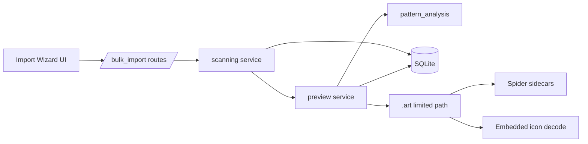
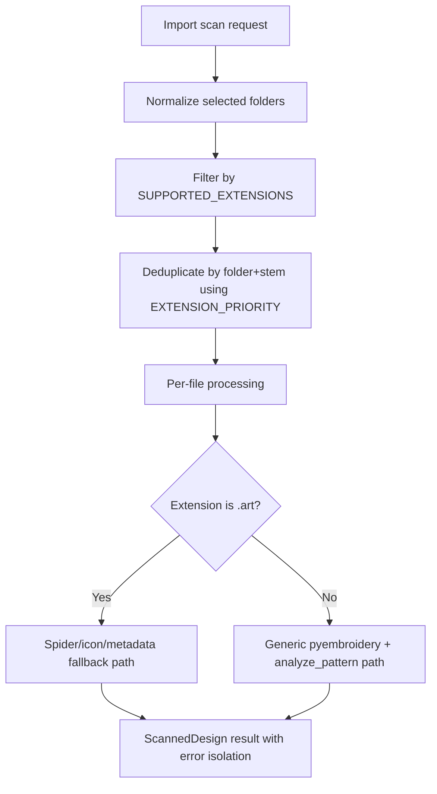

# Import Format Support Backend Specification

## Status
- Type: Current behavior + target architecture
- Audience: Agents
- Last validated: 2026-05-24
- Companion checklist: [docs/Specs/import-format-support-refactor-checklist.md](docs/Specs/import-format-support-refactor-checklist.md)
- Related architecture spec: [docs/Specs/backfilling-backend-spec.md](docs/Specs/backfilling-backend-spec.md)
- User-facing format list: [docs/SUPPORTED_FORMATS.md](docs/SUPPORTED_FORMATS.md)

## Purpose
Define backend architecture and behavior for import format support, including:
- extension allowlisting and deduplication priority,
- per-file scanning and processing flow,
- `.art` limited-support behavior and fallback paths,
- graceful failure behavior for malformed or partially supported files,
- confirmed gaps and target architecture guardrails.

## Scope
In scope:
- `/import/scan`, `/import/do-confirm`, `/import/confirm` contracts relevant to format processing.
- `SUPPORTED_EXTENSIONS` and `EXTENSION_PRIORITY` behavior.
- `scan_folder`, `scan_folders`, `process_selected_files`, and `_process_file` runtime behavior.
- `.art` Spider/icon/metadata fallback behavior.
- `.pmv` inclusion and excluded-format policy.

Out of scope:
- Unified backfill execution model, stop semantics, and log endpoints.
- Detailed AI tagging internals beyond overlap notes.
- Frontend UX details beyond request shape.

## Terminology
- Scanning phase: filesystem walk + extension filter + per-stem deduplication.
- Processing phase: file read + metadata extraction + preview generation.
- Limited support: partial behavior where some metadata/preview paths are fallback-only.
- Generic path: `pyembroidery.read(filepath)` followed by `analyze_pattern(...)`.
- Spider sidecar: Embird-generated companion folder/files used to enrich `.art` metadata/preview.

## Current Behavior Architecture

### Component Map

Key modules:
- [src/routes/bulk_import.py](src/routes/bulk_import.py)
- [src/services/scanning.py](src/services/scanning.py)
- [src/services/preview.py](src/services/preview.py)
- [src/services/pattern_analysis.py](src/services/pattern_analysis.py)
- [src/services/bulk_import.py](src/services/bulk_import.py)
- [src/services/settings_service.py](src/services/settings_service.py)

### Extension Registry and Priority
- Allowlist registry: `SUPPORTED_EXTENSIONS` in [src/services/scanning.py#L15](src/services/scanning.py#L15)
- Deduplication priority: `EXTENSION_PRIORITY` in [src/services/scanning.py#L56](src/services/scanning.py#L56)
- Supported include examples: `.jef`, `.pes`, `.hus`, `.dst`, `.exp`, `.vp3`, `.u01`, `.pec`, `.xxx`, `.tbf`, `.pmv`, and limited `.art`.
- Exclusions are enforced by the extension gate in `scan_folder`: [src/services/scanning.py#L183](src/services/scanning.py#L183)

Deduplication behavior:
- `_pick_preferred` chooses one file per `(parent folder, stem)` group using priority order: [src/services/scanning.py#L123](src/services/scanning.py#L123)
- If no extension in a candidate set matches the explicit priority list, first candidate is used.

### Import Route Contracts (Current)

| Method | Path | Handler | Evidence |
|---|---|---|---|
| POST | `/import/scan` | `scan` | [src/routes/bulk_import.py#L141](src/routes/bulk_import.py#L141) |
| POST | `/import/do-confirm` | `do_confirm_from_token` | [src/routes/bulk_import.py#L440](src/routes/bulk_import.py#L440) |
| POST | `/import/confirm` | `confirm` | [src/routes/bulk_import.py#L591](src/routes/bulk_import.py#L591) |

Route interaction with format processing:
- `scan` calls `scan_folders` to discover and pre-validate files.
- confirm paths call `process_selected_files` for selected file re-processing with preview generation.
- persistence and optional tagging are finalized through `confirm_import` in [src/services/bulk_import.py#L407](src/services/bulk_import.py#L407).

### Scanning and Processing Flow (Current)
1. `scan_folders` normalizes and deduplicates source folders: [src/services/scanning.py#L208](src/services/scanning.py#L208)
2. `scan_folder` walks files and filters by `SUPPORTED_EXTENSIONS`: [src/services/scanning.py#L174](src/services/scanning.py#L174), [src/services/scanning.py#L183](src/services/scanning.py#L183)
3. Candidate duplicates are collapsed via `_pick_preferred`: [src/services/scanning.py#L123](src/services/scanning.py#L123)
4. `_process_file(..., generate_preview=False)` runs during scan for lightweight metadata pass: [src/services/preview.py#L330](src/services/preview.py#L330)
5. `process_selected_files` re-runs selected entries with full preview generation before import persistence: [src/services/scanning.py#L251](src/services/scanning.py#L251)

### `.art` Limited-Support Behavior (Current)
`.art` is treated as a dedicated branch in `_process_file` (`is_art = ext == ".art"`): [src/services/preview.py#L341](src/services/preview.py#L341)

Fallback/enrichment paths:
- Spider sidecar image lookup: `_find_spider_image` in [src/services/preview.py#L41](src/services/preview.py#L41)
- Spider sidecar dimensions lookup: `_read_spider_art_dimensions` in [src/services/preview.py#L104](src/services/preview.py#L104)
- Embedded icon extraction fallback: `_decode_art_icon` in [src/services/preview.py#L150](src/services/preview.py#L150)
- Embedded metadata extraction: `_read_art_metadata` in [src/services/preview.py#L173](src/services/preview.py#L173)

Behavioral notes:
- If `pyembroidery.read(...)` fails for `.art`, processing continues with fallback metadata/preview where available.
- Spider dimensions, when found, are used for width/height and hoop suggestion even if pattern bounds are unavailable.
- Generic `analyze_pattern` still applies when `.art` is readable: [src/services/preview.py#L371](src/services/preview.py#L371), [src/services/pattern_analysis.py#L184](src/services/pattern_analysis.py#L184)

### Generic Format Path (Current)
For non-`.art` supported formats, `_process_file` runs:
- `pyembroidery.read(filepath)`
- shared analysis via `analyze_pattern(...)`
- hoop selection via `select_hoop_for_dimensions(...)`
- `ScannedDesign` population (dimensions, counts, preview where requested).

### Error, Resilience, and Continuation Behavior
- Per-file exceptions are captured into `ScannedDesign.error` and do not stop the overall scan/import pass: [src/services/preview.py#L417](src/services/preview.py#L417)
- Read failures for one file do not abort remaining files.
- Existing DB filepaths are skipped during scan and selected-file processing.

### Shared Concerns with Backfilling Spec
This spec intentionally summarizes and links, rather than duplicating backfill internals:
- Tier orchestration overlap (`confirm_import`, Tier 2/3 helpers): [src/services/bulk_import.py#L278](src/services/bulk_import.py#L278), [src/services/bulk_import.py#L312](src/services/bulk_import.py#L312), [src/services/bulk_import.py#L407](src/services/bulk_import.py#L407)
- Shared settings keys used in both import and backfill flows: [src/services/settings_service.py#L34](src/services/settings_service.py#L34), [src/services/settings_service.py#L38](src/services/settings_service.py#L38), [src/services/settings_service.py#L39](src/services/settings_service.py#L39)
- Import commit default: `DEFAULT_IMPORT_COMMIT_BATCH_SIZE = 1000` in [src/services/bulk_import.py#L93](src/services/bulk_import.py#L93)

For broader orchestration, stop/log behavior, and unified backfill runtime model, see [docs/Specs/backfilling-backend-spec.md](docs/Specs/backfilling-backend-spec.md).

### Current Known Gaps and Constraints
- No import-stop endpoint equivalent to unified backfill stop semantics.
- No import error-log download endpoint; per-file errors are surfaced in scanned/import context.
- Extension policy rationale exists in user docs but is not centralized in service-level code comments.
- Priority ordering is explicit in code but rationale is implicit unless maintained here.

## Target Architecture

This section captures intended direction for future changes while preserving compatibility.

### Target Principles
- Keep extension policy explicit and test-backed (allowlist + priority + exclusions).
- Preserve per-file failure isolation so one malformed file cannot fail a run.
- Preserve `.art` as limited support unless upstream decoding support materially changes.
- Keep overlap with backfill/import-tagging documented through references instead of duplicated specs.

### Target Runtime Shape

### Compatibility Requirements
- Keep existing import route paths and method contracts stable.
- Keep excluded helper/output/vector/data formats out of import flow unless explicitly approved.
- Keep `.pmv` included and `.art` marked limited support.
- Keep `docs/SUPPORTED_FORMATS.md` synchronized with runtime allowlist/exclusions.

## Verification and Test Anchors
- allowlist baseline test: [tests/test_services.py#L1796](tests/test_services.py#L1796)
- expanded format coverage and exclusions: [tests/test_bulk_import_extra.py#L24](tests/test_bulk_import_extra.py#L24)
- priority behavior coverage: [tests/test_bulk_import_extra.py#L94](tests/test_bulk_import_extra.py#L94)
- generic path behavior for new formats: [tests/test_bulk_import_extra.py#L127](tests/test_bulk_import_extra.py#L127)

## Companion Refactor Checklist
Use [docs/Specs/import-format-support-refactor-checklist.md](docs/Specs/import-format-support-refactor-checklist.md) for change-gated implementation and review.