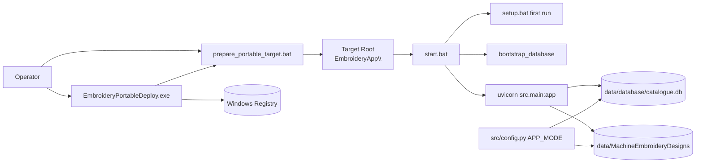

# Portable Deployment Backend Specification

## Status
- Type: Current behavior + target architecture
- Audience: Agents
- Last validated: 2026-05-24
- Companion checklist: [docs/Specs/portable-deployment-refactor-checklist.md](docs/Specs/portable-deployment-refactor-checklist.md)
- User guidance: [docs/USB_DEPLOYMENT.md](docs/USB_DEPLOYMENT.md)
- Related runtime config: [src/config.py](src/config.py)

## Purpose
Define portable deployment architecture and behavior for Windows portable distribution, including:
- deployment preparation via GUI and script paths,
- first-run bootstrap and launch behavior on target devices,
- portable data-path semantics used by runtime mode,
- operator safety behavior (path checks, write checks, secrets handling).

## Scope
In scope:
- Windows portable deployment tool and deployment script behavior.
- Portable runtime bootstrap and startup behavior.
- Portable mode data-root and database-path semantics.
- Test anchors that verify portable deployment behavior.

Out of scope:
- macOS deployment procedures and packaging details (documented separately).
- Windows installer channel workflows and installer UI text.
- Desktop mode release/runbook process.

## Terminology
- Portable deployment tool: GUI tool built from `portable_launcher.py` as `EmbroideryPortableDeploy.exe`.
- Deployment target location: destination root path for portable copy output.
- Portable target: destination folder containing `EmbroideryApp\`.
- Portable runtime mode: `APP_MODE=portable` behavior using self-contained `data\` paths.

## Current Behavior Architecture

### Component Map

Key modules and scripts:
- [portable_launcher.py](portable_launcher.py)
- [prepare_portable_target.bat](prepare_portable_target.bat)
- [build_portable_deployment.bat](build_portable_deployment.bat)
- [EmbroideryPortableDeploy.spec](EmbroideryPortableDeploy.spec)
- [start.bat](start.bat)
- [setup.bat](setup.bat)
- [stop.bat](stop.bat)
- [src/config.py](src/config.py)

### Build/Posture
- Canonical packaged helper name is `EmbroideryPortableDeploy` in the PyInstaller spec: [EmbroideryPortableDeploy.spec](EmbroideryPortableDeploy.spec#L29).
- Portable helper is built as a windowed executable (`console=False`): [EmbroideryPortableDeploy.spec](EmbroideryPortableDeploy.spec#L36).
- Build script targets `EmbroideryPortableDeploy` and copies the deployment batch file beside the exe: [build_portable_deployment.bat](build_portable_deployment.bat).

## Contracts (Current)

### Deployment Tool Contract (GUI)

| Surface | Contract | Evidence |
|---|---|---|
| Window title | Tool title is `Portable Deployment Launcher — Embroidery Catalogue` | [portable_launcher.py](portable_launcher.py#L328) |
| Primary label | Target field label is `Deployment target location` | [portable_launcher.py](portable_launcher.py#L367) |
| Execute action | Run button label is `OK — Run` | [portable_launcher.py](portable_launcher.py#L410) |
| Main execution | Validated values are passed to `_run_batch` | [portable_launcher.py](portable_launcher.py#L564), [portable_launcher.py](portable_launcher.py#L567) |
| Path persistence | Reads/writes `LastDeploymentRoot` | [portable_launcher.py](portable_launcher.py#L99), [portable_launcher.py](portable_launcher.py#L194) |

Launcher persistence keys:
- `Software\EmbroideryCatalogue\LastDeploymentRoot` (primary): [portable_launcher.py](portable_launcher.py#L99)

### Deployment Script Contract (Batch)

Command shape:
- `prepare_portable_target.bat [<target_root>] [--no-designs]`: [prepare_portable_target.bat](prepare_portable_target.bat#L9)

Defaults and argument behavior:
- Default target root is `F:`: [prepare_portable_target.bat](prepare_portable_target.bat#L35)
- Default designs source is `J:\MachineEmbroideryDesigns`: [prepare_portable_target.bat](prepare_portable_target.bat#L36)
- `--no-designs` is supported: [prepare_portable_target.bat](prepare_portable_target.bat#L46)

Safety and copy semantics:
- Write probe path in destination before heavy copy: [prepare_portable_target.bat](prepare_portable_target.bat#L184)
- Live `.env` is never copied; warning is emitted if present: [prepare_portable_target.bat](prepare_portable_target.bat#L240)
- Target `.env` is created from `.env.example`: [prepare_portable_target.bat](prepare_portable_target.bat#L244)
- Optional managed designs mirror copy step: [prepare_portable_target.bat](prepare_portable_target.bat#L257)

### Runtime Contract (Portable Target)

Portable first-run and launch behavior:
- Startup logs write to `logs/startup-error.log`: [start.bat](start.bat#L17)
- Missing portable venv triggers `setup.bat`: [start.bat](start.bat#L49), [start.bat](start.bat#L50)
- Portable environment mode is set to `APP_ENV=portable`: [start.bat](start.bat#L55)
- Default portable port is `8002`: [start.bat](start.bat#L56)
- DB bootstrap runs before server start: [start.bat](start.bat#L90)

Setup behavior:
- Setup logs to `logs/startup-error.log`: [setup.bat](setup.bat)
- Uses embedded Python to bootstrap pip and create `venv`: [setup.bat](setup.bat)
- Installs dependencies offline using wheels (`--no-index --find-links`): [setup.bat](setup.bat)

Stop behavior:
- Stops uvicorn and worker processes and clears listeners on ports 8002/8003: [stop.bat](stop.bat)

## Portable Data and Path Semantics

Config touchpoints:
- Runtime mode source is `APP_MODE`: [src/config.py](src/config.py#L50)
- In non-desktop modes, state root is self-contained under app `data/`: [src/config.py](src/config.py#L182)
- In non-desktop modes, data root is self-contained under app `data/`: [src/config.py](src/config.py#L184)
- Managed designs base path is `data/MachineEmbroideryDesigns`: [src/config.py](src/config.py#L218)

Resulting portable behavior:
- Database and managed design library stay portable with the app tree.
- Relative portability is maintained across drive-letter changes.

## Current Constraints and Known Gaps
- Portable helper uses canonical naming for build output, but some internal error-log strings still carry legacy naming text in launcher internals: [portable_launcher.py](portable_launcher.py#L701).
- Deployment behavior and runtime behavior are strongly Windows-focused in user workflow, while cross-platform helper scripts exist in `scripts/` for separate documentation tracks.

## Target Architecture Direction

This section captures future-safe direction while preserving current behavior.

Target principles:
- One canonical portable naming set across docs, build scripts, and user-facing text.
- Keep deployment target terminology location-neutral.
- Preserve existing root-path persistence compatibility while avoiding new legacy labels.
- Keep copy safety defaults (`.env.example`-only, optional large design mirror).

Future-oriented refinements (non-breaking):
- Retire remaining legacy error-label text in launcher internal logs/UI exceptions.
- Keep portable docs/tests synchronized whenever deployment labels or artifact names change.

## Verification and Test Anchors
- Launcher behavior and compatibility tests: [tests/test_portable_launcher.py](tests/test_portable_launcher.py#L188), [tests/test_portable_launcher.py](tests/test_portable_launcher.py#L364), [tests/test_portable_launcher.py](tests/test_portable_launcher.py#L385)
- Deploy script behavior tests: [tests/test_portable_scripts.py](tests/test_portable_scripts.py#L83), [tests/test_portable_scripts.py](tests/test_portable_scripts.py#L112), [tests/test_portable_scripts.py](tests/test_portable_scripts.py#L170)
- Root-script guardrails and packaging assertions: [tests/test_root_scripts.py](tests/test_root_scripts.py#L29), [tests/test_root_scripts.py](tests/test_root_scripts.py#L51), [tests/test_root_scripts.py](tests/test_root_scripts.py#L71)
