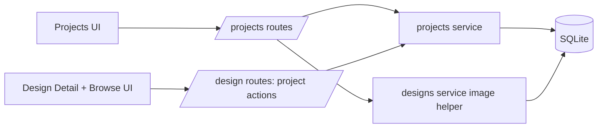
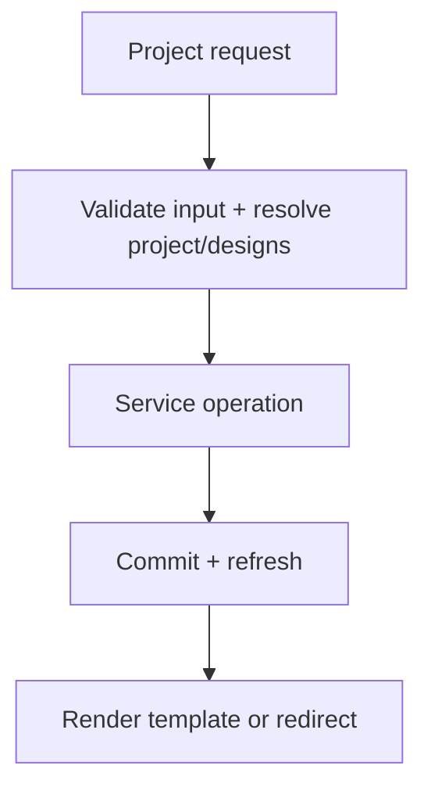

# Projects Backend Specification

## Status
- Type: Current behavior + target architecture
- Audience: Agents
- Last validated: 2026-05-29
- Companion checklist: [docs/Specs/projects-refactor-checklist.md](docs/Specs/projects-refactor-checklist.md)
- UI companion: [docs/Specs/UI/projects-ui-spec.md](docs/Specs/UI/projects-ui-spec.md)
- User guide companion: [docs/User-Facing-Guidance/PROJECTS.md](docs/User-Facing-Guidance/PROJECTS.md)
- Feature inventory companion: [docs/feature-inventory.md](docs/feature-inventory.md)

## Purpose
Define backend architecture and runtime behavior for the Projects feature, including:
- project CRUD routes under `/projects`,
- project print-sheet route behavior,
- project membership actions exposed from Design Detail and Browse bulk actions,
- service-level assignment semantics (dedupe/no-op/error behavior),
- redirect/error contracts and known constraints.

## Scope
In scope:
- Route contracts for project list/create/detail/edit/delete/remove/print.
- Project assignment contracts from `/designs` routes.
- Service boundaries in `src.services.projects`.
- Core model and junction-table semantics for projects.
- Test anchors for project and project-integration behavior.

Out of scope:
- Browse filtering/search contract details unrelated to project actions.
- Non-project metadata/tag behavior on Design Detail.
- Styling-level UI definitions (see UI companion spec).

## Terminology
- Project list route: `GET /projects/`.
- Project detail route: `GET /projects/{project_id}`.
- Project print route: `GET /projects/{project_id}/print`.
- Membership actions: add/remove `Design` records in the `project_designs` relation.
- Bulk add to project: multi-design assignment from Browse bottom banner.

## Current Behavior Architecture

### Component Map

Key modules:
- [src/routes/projects.py](src/routes/projects.py)
- [src/routes/designs.py](src/routes/designs.py)
- [src/services/projects.py](src/services/projects.py)
- [src/services/designs.py](src/services/designs.py)
- [src/models.py](src/models.py)
- [templates/projects/list.html](templates/projects/list.html)
- [templates/projects/form.html](templates/projects/form.html)
- [templates/projects/detail.html](templates/projects/detail.html)
- [templates/projects/print.html](templates/projects/print.html)
- [templates/designs/detail.html](templates/designs/detail.html)
- [templates/designs/browse.html](templates/designs/browse.html)

### Core Data Touchpoints
- junction table `project_designs`: [src/models.py#L112](src/models.py#L112)
- `Design.projects` relationship: [src/models.py#L185](src/models.py#L185)
- `Project` model: [src/models.py#L195](src/models.py#L195)
- `Project.designs` relationship: [src/models.py#L203](src/models.py#L203)

Project fields used directly by the feature:
- `Project.name` (unique)
- `Project.description`
- `Project.date_created`

### Endpoint Contracts (Current)

| Method | Path | Handler | Behavior | Evidence |
|---|---|---|---|---|
| GET | `/projects/` | `list_projects` | Render project list page | [src/routes/projects.py#L18](src/routes/projects.py#L18) |
| GET | `/projects/new` | `new_project_form` | Render create form page | [src/routes/projects.py#L24](src/routes/projects.py#L24) |
| POST | `/projects/` | `create_project` | Create project and redirect to detail (`303`) | [src/routes/projects.py#L29](src/routes/projects.py#L29) |
| GET | `/projects/{project_id}` | `project_detail` | Render project detail and member designs | [src/routes/projects.py#L42](src/routes/projects.py#L42) |
| POST | `/projects/{project_id}/edit` | `edit_project` | Update name/description and redirect (`303`) | [src/routes/projects.py#L54](src/routes/projects.py#L54) |
| POST | `/projects/{project_id}/delete` | `delete_project` | Delete project and redirect to list (`303`) | [src/routes/projects.py#L68](src/routes/projects.py#L68) |
| POST | `/projects/{project_id}/remove-design/{design_id}` | `remove_design` | Remove member design and redirect (`303`) | [src/routes/projects.py#L77](src/routes/projects.py#L77) |
| GET | `/projects/{project_id}/print` | `print_project` | Render standalone printable project sheet | [src/routes/projects.py#L83](src/routes/projects.py#L83) |
| POST | `/designs/bulk-add-to-project` | `bulk_add_to_project` | Add selected designs to project from Browse | [src/routes/designs.py#L345](src/routes/designs.py#L345) |
| POST | `/designs/{design_id}/add-to-project` | `add_to_project` | Add one design to project from detail | [src/routes/designs.py#L632](src/routes/designs.py#L632) |
| POST | `/designs/{design_id}/remove-from-project/{project_id}` | `remove_from_project` | Remove one design from project from detail | [src/routes/designs.py#L646](src/routes/designs.py#L646) |

### Route-to-Service Boundaries
Primary service operations:
- list all projects: [src/services/projects.py#L11](src/services/projects.py#L11)
- get project with joined designs/designers: [src/services/projects.py#L15](src/services/projects.py#L15)
- create/update/delete project: [src/services/projects.py#L24](src/services/projects.py#L24), [src/services/projects.py#L35](src/services/projects.py#L35), [src/services/projects.py#L47](src/services/projects.py#L47)
- add single design to project: [src/services/projects.py#L56](src/services/projects.py#L56)
- add multiple designs to project with dedupe: [src/services/projects.py#L69](src/services/projects.py#L69)
- remove design from project: [src/services/projects.py#L97](src/services/projects.py#L97)

Print composition helper:
- image base64 helper used by print route: [src/routes/projects.py#L88](src/routes/projects.py#L88)

### Assignment Semantics (Current)
- `add_design` is idempotent for existing membership (no duplicate insert): [src/services/projects.py#L63](src/services/projects.py#L63)
- `add_designs` de-duplicates requested IDs (`dict.fromkeys`) before assignment: [src/services/projects.py#L74](src/services/projects.py#L74)
- `add_designs` raises on first missing design ID: [src/services/projects.py#L81](src/services/projects.py#L81)
- `remove_design` is a safe no-op when design missing or not currently linked: [src/services/projects.py#L101](src/services/projects.py#L101)

### Response/Error Semantics (Current)
- `404` when project not found for detail/print/delete routes.
- `400` for validation and service `ValueError` on create/edit and design-surface add actions.
- Mutating project routes use redirect-on-success (`303`) to preserve workflow continuity.

Evidence:
- `create_project` error mapping: [src/routes/projects.py#L36](src/routes/projects.py#L36)
- `project_detail` not found: [src/routes/projects.py#L45](src/routes/projects.py#L45)
- `edit_project` error mapping: [src/routes/projects.py#L63](src/routes/projects.py#L63)
- `delete_project` error mapping: [src/routes/projects.py#L72](src/routes/projects.py#L72)
- `bulk_add_to_project` error mapping: [src/routes/designs.py#L354](src/routes/designs.py#L354)
- `add_to_project` error mapping: [src/routes/designs.py#L640](src/routes/designs.py#L640)

### Print Contract (Current)
- Standalone HTML document (not base layout) optimized for browser print.
- One card per project design with preview image/fallback and optional metadata lines.
- Uses embedded base64 image bytes to avoid external image loading at print time.

Evidence:
- route template binding: [src/routes/projects.py#L90](src/routes/projects.py#L90)
- template structure: [templates/projects/print.html](templates/projects/print.html)

## Current Known Gaps and Constraints
- Error semantics are mixed by operation (`400` vs `404`) and mirror current route implementation.
- Project name uniqueness is enforced in service and schema, but only one canonical user-facing failure mode is exposed (`400` with detail string).
- Project detail currently has remove-only controls; add actions are intentionally surfaced from Design Detail and Browse bulk bar.
- Project design display order is relationship-load order (no explicit project-local ordering contract).
- Print route is HTML/CSS only (no PDF pipeline and no template-level pagination controls beyond `page-break-inside: avoid`).

## Target Architecture

### Target Principles
- Keep project route paths and methods stable for release.
- Keep assignment behavior idempotent and explicit across single and bulk paths.
- Keep print-sheet contract stable while allowing visual improvements in template/CSS.
- Prefer consistent error taxonomy for not-found and validation failures.

### Target Runtime Shape

### Target Contract Improvements
- Normalize missing-resource semantics where practical (for example, align not-found handling across edit/add/remove paths).
- Introduce explicit operation-result messaging for assignment paths (optional flash/status channel) without breaking redirect contracts.
- Define and test stable ordering expectations for project design lists if product needs deterministic ordering.

### Compatibility Requirements
- Preserve existing route methods and paths in `/projects` and design-surface project actions.
- Preserve redirect defaults and `next` behavior for Browse/Detail assignment flows.
- Preserve delete behavior where removing a project does not delete design records.

## Verification and Test Anchors
Route-level anchors:
- project routes baseline: [tests/test_routes.py#L206](tests/test_routes.py#L206)
- design-surface project assignment routes: [tests/test_routes.py#L1597](tests/test_routes.py#L1597), [tests/test_routes.py#L1670](tests/test_routes.py#L1670), [tests/test_routes.py#L1684](tests/test_routes.py#L1684)
- extended project route coverage: [tests/test_routes.py#L1704](tests/test_routes.py#L1704)
- gap/error and print coverage: [tests/test_routes.py#L2028](tests/test_routes.py#L2028)
- browse integration visibility check: [tests/test_routes.py#L2209](tests/test_routes.py#L2209)

Service-level anchors:
- core project service tests: [tests/test_services.py#L206](tests/test_services.py#L206)
- duplicate/not-found guard tests: [tests/test_services.py#L920](tests/test_services.py#L920)

## Companion Checklist
Use [docs/Specs/projects-refactor-checklist.md](docs/Specs/projects-refactor-checklist.md) for change-gated implementation and review.