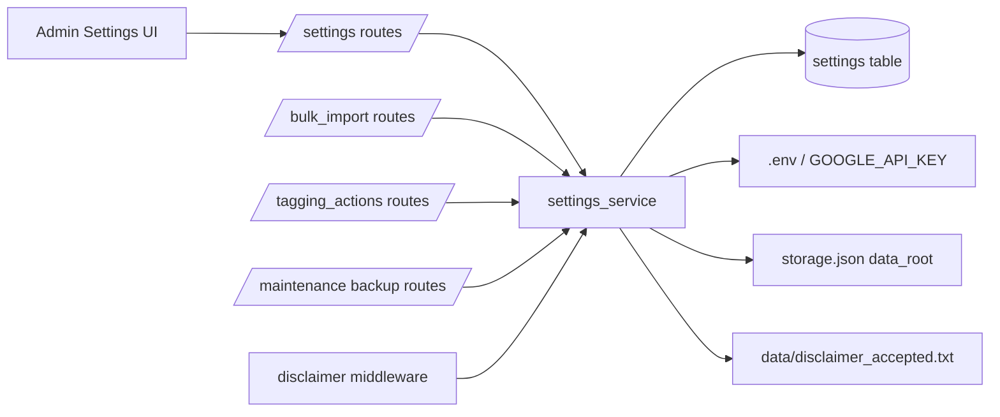
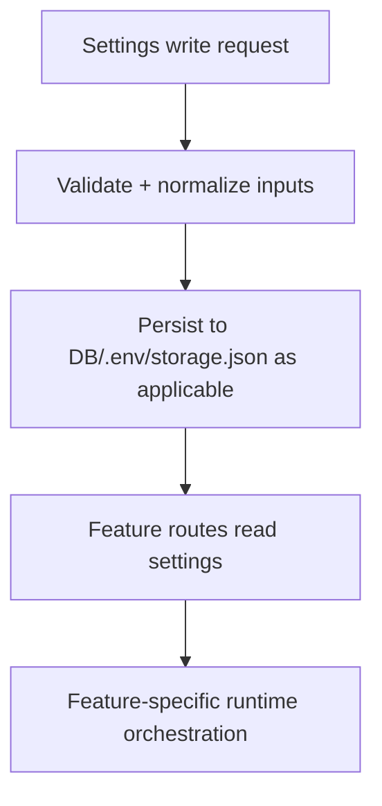

# Settings Backend Specification

## Status
- Type: Current behavior + target architecture
- Audience: Agents
- Last validated: 2026-05-26
- Companion checklist: [docs/Specs/settings-refactor-checklist.md](docs/Specs/settings-refactor-checklist.md)
- Overlap companion (import AI): [docs/Specs/batch-tagging-backend-spec.md](docs/Specs/batch-tagging-backend-spec.md)
- Overlap companion (backup destinations): [docs/Specs/backup-restore-backend-spec.md](docs/Specs/backup-restore-backend-spec.md)
- Overlap companion (first-import action defaults/overrides): [docs/Specs/first-import-actions-backend-spec.md](docs/Specs/first-import-actions-backend-spec.md)

## Purpose
Define backend architecture and functionality for application settings across all current settings consumers, including:
- Admin Settings route contracts.
- Settings storage and normalization semantics.
- Cross-surface settings consumption in import, tagging actions, backup, and disclaimer gating.

## Scope
In scope:
- Settings key registry, defaults, descriptions, and storage medium semantics.
- Endpoint contracts for `/admin/settings/*` and map of downstream consumers.
- Input coercion, normalization, and validation behavior.
- Cross-module precedence and compatibility constraints.

Out of scope:
- Deep feature internals for import tagging, backup execution, and first-import flow details already owned by companion specs.
- Frontend styling details beyond request/context contracts.

## Terminology
- Setting key: Namespaced string key stored in the `settings` table.
- Settings consumer: Route/service that reads or writes a setting and applies it to runtime behavior.
- Runtime parse: Conversion from persisted string to typed runtime value (bool/int/enum).
- Desktop data root: User-selected home folder persisted in `storage.json` for desktop mode.

## Current Behavior Architecture

### Component Map

Key modules:
- [src/routes/settings.py](src/routes/settings.py)
- [src/services/settings_service.py](src/services/settings_service.py)
- [templates/admin/settings.html](templates/admin/settings.html)
- [src/routes/bulk_import.py](src/routes/bulk_import.py)
- [src/routes/tagging_actions.py](src/routes/tagging_actions.py)
- [src/routes/maintenance.py](src/routes/maintenance.py)
- [src/main.py](src/main.py)
- [src/routes/disclaimer.py](src/routes/disclaimer.py)

## Settings Registry and Storage Semantics (Current)

### Key Registry and Defaults
Canonical key definitions:
- `disclaimer_accepted`: [src/services/settings_service.py#L30](src/services/settings_service.py#L30)
- `backup.database_destination`: [src/services/settings_service.py#L31](src/services/settings_service.py#L31)
- `backup.designs_destination`: [src/services/settings_service.py#L32](src/services/settings_service.py#L32)
- `import.last_browse_folder`: [src/services/settings_service.py#L33](src/services/settings_service.py#L33)
- `ai.tier2_auto`: [src/services/settings_service.py#L34](src/services/settings_service.py#L34)
- `ai.tier3_auto`: [src/services/settings_service.py#L35](src/services/settings_service.py#L35)
- `ai.batch_size`: [src/services/settings_service.py#L36](src/services/settings_service.py#L36)
- `ai.delay`: [src/services/settings_service.py#L37](src/services/settings_service.py#L37)
- `import.commit_batch_size`: [src/services/settings_service.py#L38](src/services/settings_service.py#L38)
- `image.preference`: [src/services/settings_service.py#L39](src/services/settings_service.py#L39)

Defaults map:
- [src/services/settings_service.py#L41](src/services/settings_service.py#L41)

Descriptions map:
- [src/services/settings_service.py#L55](src/services/settings_service.py#L55)

### Storage Layers
- Primary mutable settings storage: DB key/value table via `get_setting` and `set_setting`.
  - [src/services/settings_service.py#L92](src/services/settings_service.py#L92)
  - [src/services/settings_service.py#L104](src/services/settings_service.py#L104)
- API key storage: `.env` + process env (`GOOGLE_API_KEY`) through service methods.
  - [src/services/settings_service.py#L144](src/services/settings_service.py#L144)
  - [src/services/settings_service.py#L161](src/services/settings_service.py#L161)
- Desktop data-root pointer storage: `storage.json` in desktop mode.
  - [src/services/settings_service.py#L227](src/services/settings_service.py#L227)
  - [src/services/settings_service.py#L253](src/services/settings_service.py#L253)
- Disclaimer compatibility marker: shared file plus DB flag.
  - [src/services/settings_service.py#L24](src/services/settings_service.py#L24)
  - [src/services/settings_service.py#L124](src/services/settings_service.py#L124)
  - [src/services/settings_service.py#L136](src/services/settings_service.py#L136)

## Endpoint Contracts (Current)

### Admin Settings Endpoints

| Method | Path | Handler | Evidence |
|---|---|---|---|
| GET | `/admin/settings/` | `settings_page` | [src/routes/settings.py#L39](src/routes/settings.py#L39) |
| GET | `/admin/settings/browse-data-root` | `browse_data_root` | [src/routes/settings.py#L71](src/routes/settings.py#L71) |
| POST | `/admin/settings/` | `save_settings` | [src/routes/settings.py#L80](src/routes/settings.py#L80) |

#### GET `/admin/settings/`
Contract:
- Renders current values for settings-backed controls and system paths.
- Returns key-presence state for Google API key.
- Exposes mode-dependent data-root configurability (`desktop` only).

Evidence:
- [src/routes/settings.py#L39](src/routes/settings.py#L39)
- [templates/admin/settings.html#L1](templates/admin/settings.html#L1)

#### GET `/admin/settings/browse-data-root`
Contract:
- Opens folder picker and returns JSON response.
- Success shape: `{"path": "..."}`.
- Fallback shape: `{"error": "..."}` with HTTP 200 when picker unavailable.

Evidence:
- [src/routes/settings.py#L71](src/routes/settings.py#L71)

#### POST `/admin/settings/`
Request form fields:
- `google_api_key`
- `data_root`
- `ai_tier2_auto`
- `ai_tier3_auto`
- `ai_batch_size`
- `ai_delay`
- `import_commit_batch_size`
- `image_preference`

Behavior:
- Persists API key via `.env` service when provided.
- Persists desktop data root when in desktop mode and value is non-blank.
- Persists AI/import/image settings to DB.
- Checkbox omission semantics: unchecked values are written as `false`.
- Batch-size strings are normalized and clamped before write.
- Redirect success: `303 /admin/settings/?saved=1`.
- Redirect error: `303 /admin/settings/?error=1`.

Evidence:
- [src/routes/settings.py#L80](src/routes/settings.py#L80)
- [src/routes/settings.py#L109](src/routes/settings.py#L109)
- [src/routes/settings.py#L119](src/routes/settings.py#L119)

## App-Wide Settings Consumers (Current)

### Import Routes
Consumers:
- last browse folder read/write:
  - [src/routes/bulk_import.py#L98](src/routes/bulk_import.py#L98)
  - [src/routes/bulk_import.py#L113](src/routes/bulk_import.py#L113)
- AI/import/image settings reads in precheck/confirm paths:
  - [src/routes/bulk_import.py#L310](src/routes/bulk_import.py#L310)
  - [src/routes/bulk_import.py#L313](src/routes/bulk_import.py#L313)
  - [src/routes/bulk_import.py#L315](src/routes/bulk_import.py#L315)
  - [src/routes/bulk_import.py#L318](src/routes/bulk_import.py#L318)
  - [src/routes/bulk_import.py#L323](src/routes/bulk_import.py#L323)
  - [src/routes/bulk_import.py#L507](src/routes/bulk_import.py#L507)
  - [src/routes/bulk_import.py#L510](src/routes/bulk_import.py#L510)
  - [src/routes/bulk_import.py#L512](src/routes/bulk_import.py#L512)
  - [src/routes/bulk_import.py#L515](src/routes/bulk_import.py#L515)
  - [src/routes/bulk_import.py#L654](src/routes/bulk_import.py#L654)
  - [src/routes/bulk_import.py#L657](src/routes/bulk_import.py#L657)
  - [src/routes/bulk_import.py#L659](src/routes/bulk_import.py#L659)
  - [src/routes/bulk_import.py#L662](src/routes/bulk_import.py#L662)
  - [src/routes/bulk_import.py#L681](src/routes/bulk_import.py#L681)

### Tagging Actions Route
Consumers:
- [src/routes/tagging_actions.py#L60](src/routes/tagging_actions.py#L60)
- [src/routes/tagging_actions.py#L61](src/routes/tagging_actions.py#L61)
- [src/routes/tagging_actions.py#L62](src/routes/tagging_actions.py#L62)

### Backup/Maintenance Routes
Consumers:
- [src/routes/maintenance.py#L194](src/routes/maintenance.py#L194)
- [src/routes/maintenance.py#L195](src/routes/maintenance.py#L195)
- [src/routes/maintenance.py#L212](src/routes/maintenance.py#L212)
- [src/routes/maintenance.py#L237](src/routes/maintenance.py#L237)
- [src/routes/maintenance.py#L238](src/routes/maintenance.py#L238)
- [src/routes/maintenance.py#L245](src/routes/maintenance.py#L245)
- [src/routes/maintenance.py#L267](src/routes/maintenance.py#L267)
- [src/routes/maintenance.py#L302](src/routes/maintenance.py#L302)
- [src/routes/maintenance.py#L303](src/routes/maintenance.py#L303)

### Disclaimer Gate and Route
Consumers:
- middleware gate:
  - [src/main.py#L83](src/main.py#L83)
  - [src/main.py#L98](src/main.py#L98)
- disclaimer route:
  - [src/routes/disclaimer.py#L34](src/routes/disclaimer.py#L34)
  - [src/routes/disclaimer.py#L57](src/routes/disclaimer.py#L57)

## Normalization, Coercion, and Validation Contracts

### Batch-Size Input Normalization in Settings Route
- Normalizer: `_normalize_optional_batch_size`.
- Blank and invalid values normalize to empty string.
- Integer values clamp to range `[1, 10000]`.

Evidence:
- [src/routes/settings.py#L20](src/routes/settings.py#L20)

### Runtime Bool Coercion
- Truthy parser `_is_truthy` accepts `1`, `true`, `yes`, `y`, `accepted` (case-insensitive after strip).

Evidence:
- [src/services/settings_service.py#L119](src/services/settings_service.py#L119)

### Image Preference Validation
- Persisted only when value is `2d` or `3d`; invalid values are ignored.

Evidence:
- [src/routes/settings.py#L117](src/routes/settings.py#L117)

### Backup Destination Normalization
- Backup destinations are normalized before compare/persist in maintenance routes.

Evidence:
- [src/routes/maintenance.py#L142](src/routes/maintenance.py#L142)
- [src/routes/maintenance.py#L219](src/routes/maintenance.py#L219)

## Current Known Gaps and Constraints
- `ai.delay` is persisted by settings but import service orchestration does not consume a delay argument directly.
  - [src/routes/settings.py#L110](src/routes/settings.py#L110)
  - [docs/Specs/batch-tagging-backend-spec.md](docs/Specs/batch-tagging-backend-spec.md)
- Settings-related defaults differ by execution surface (for example import commit defaults versus unified backfill commit defaults) and are documented in feature-specific specs.
  - [docs/Specs/batch-tagging-backend-spec.md](docs/Specs/batch-tagging-backend-spec.md)
  - [docs/Specs/backfilling-backend-spec.md](docs/Specs/backfilling-backend-spec.md)
- Desktop data-root setting is mode-scoped; non-desktop modes do not expose writable data-root configuration.
  - [src/routes/settings.py#L52](src/routes/settings.py#L52)

## Target Architecture

### Target Principles
- Keep one canonical settings contract for keys, defaults, storage, and normalization.
- Keep feature execution semantics in feature-specific specs, with explicit references to this settings contract.
- Keep settings writes idempotent and safe under partial form submission.
- Keep data-root and API-key persistence behavior explicit and testable.

### Target Runtime Shape

### Compatibility Requirements
- Preserve existing key names unless migration is documented.
- Preserve route contracts for `/admin/settings/` and `/admin/settings/browse-data-root`.
- Preserve checkbox-false-on-absence behavior.
- Preserve safe fallback behavior for unavailable folder picker.

## Overlap Ownership and Delegation
- Import AI tier execution, `batch_limit` semantics, and import-tier orchestration remain owned by [docs/Specs/batch-tagging-backend-spec.md](docs/Specs/batch-tagging-backend-spec.md).
- Backup route/service orchestration and restore behavior remain owned by [docs/Specs/backup-restore-backend-spec.md](docs/Specs/backup-restore-backend-spec.md).
- First-import action context override behavior remains owned by [docs/Specs/first-import-actions-backend-spec.md](docs/Specs/first-import-actions-backend-spec.md).

## Verification and Test Anchors
- Settings route tests:
  - [tests/test_routes.py#L1784](tests/test_routes.py#L1784)
  - [tests/test_routes.py#L1807](tests/test_routes.py#L1807)
  - [tests/test_routes.py#L1823](tests/test_routes.py#L1823)
  - [tests/test_routes.py#L1909](tests/test_routes.py#L1909)
  - [tests/test_routes.py#L1919](tests/test_routes.py#L1919)
  - [tests/test_routes.py#L1990](tests/test_routes.py#L1990)
  - [tests/test_routes.py#L2001](tests/test_routes.py#L2001)
  - [tests/test_routes.py#L3778](tests/test_routes.py#L3778)
- Settings service tests:
  - [tests/test_services.py#L780](tests/test_services.py#L780)
  - [tests/test_services.py#L800](tests/test_services.py#L800)
- Import behavior overlap tests:
  - [tests/test_bulk_import_extra.py](tests/test_bulk_import_extra.py)

## Companion Refactor Checklist
Use [docs/Specs/settings-refactor-checklist.md](docs/Specs/settings-refactor-checklist.md) for change-gated implementation and review.
