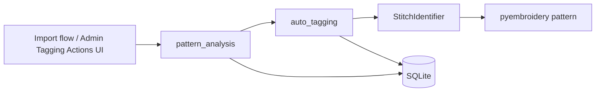
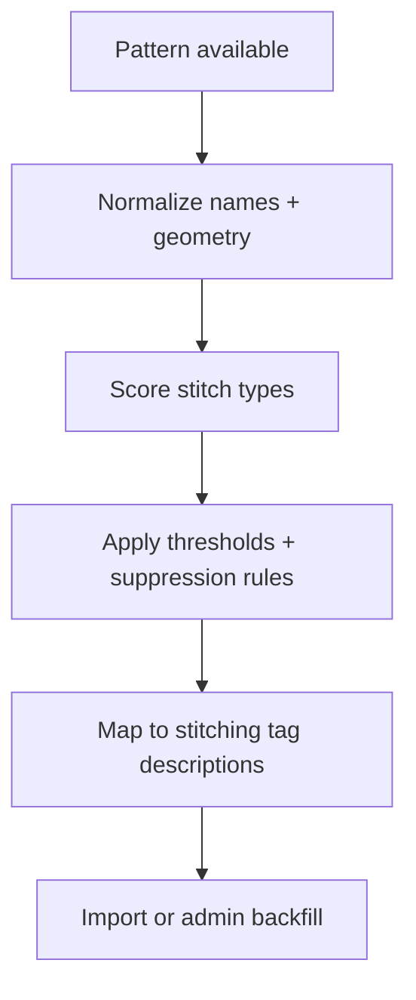

# Stitch Types Backend Specification

## Status
- Type: Current behavior + target architecture
- Audience: Agents
- Last validated: 2026-05-24
- Companion checklist: [docs/Specs/stitch-types-refactor-checklist.md](docs/Specs/stitch-types-refactor-checklist.md)
- User guidance companion: [docs/User-Facing-Guidance/STITCH_TYPES.md](docs/User-Facing-Guidance/STITCH_TYPES.md)
- Overlap references: [docs/Specs/backfilling-backend-spec.md](docs/Specs/backfilling-backend-spec.md), [docs/Specs/batch-tagging-backend-spec.md](docs/Specs/batch-tagging-backend-spec.md)

## Purpose
Define the backend architecture and functionality for stitch-type definition and stitching-tag backfilling.

This feature currently analyses embroidery pattern geometry locally and maps the results to stitching tags. It is used both during import and from Admin Tagging Actions.

## Scope
In scope:
- StitchIdentifier architecture and scoring behavior.
- Stitching-tag suggestion and tag-description mapping.
- Import and admin backfill integration points.
- Current limitations, gaps, and roadmap direction.

Out of scope:
- Preview-image matching based on user-supplied examples.
- AI-assisted tag suggestion internals beyond the stitching-tag bridge.
- User-facing styling or layout details.

## Terminology
- StitchIdentifier: The local pattern-analysis class in `src/services/stitch_identifier.py` that scores stitch types from geometry.
- Stitching tags: Tags in the `stitching` group, such as `Filled`, `Satin Stitch`, and `Line Outline`.
- Current implementation: The 8 stitch types already implemented in code.
- Planned expansion: The older 10-type concept plan that also discussed `redwork` and `blackwork`.
- Local stitching backfill: The in-app stitching action that updates existing designs without API calls.

## Current Behavior Architecture

### Component Map

Key modules:
- [src/services/stitch_identifier.py](src/services/stitch_identifier.py)
- [src/services/auto_tagging.py](src/services/auto_tagging.py)
- [src/services/pattern_analysis.py](src/services/pattern_analysis.py)
- [src/services/bulk_import.py](src/services/bulk_import.py)
- [src/services/unified_backfill.py](src/services/unified_backfill.py)
- [src/routes/tagging_actions.py](src/routes/tagging_actions.py)

### Release Posture
- Canonical stitch-type analysis is local and pattern-based.
- The current release exposes stitching detection through import and Admin Tagging Actions.
- Stitching-tag detection is geometry-driven and does not depend on example-image matching.

### Core Data Touchpoints
- `StitchIdentifier` class: [src/services/stitch_identifier.py#L6](src/services/stitch_identifier.py#L6)
- `identify_stitches()`: [src/services/stitch_identifier.py#L40](src/services/stitch_identifier.py#L40)
- `get_detailed_analysis()`: [src/services/stitch_identifier.py#L124](src/services/stitch_identifier.py#L124)
- Stitch-type-to-tag mapping: [src/services/auto_tagging.py#L347](src/services/auto_tagging.py#L347)
- Stitching analysis bridge: [src/services/auto_tagging.py#L360](src/services/auto_tagging.py#L360)
- Shared pattern-analysis hook: [src/services/pattern_analysis.py#L141](src/services/pattern_analysis.py#L141)

Fields and inputs used by the flow:
- `filename`, `folder_name`, and pattern geometry from `pyembroidery.EmbPattern`.
- `Design.tags` and `Design.tags_checked` for backfill/import integration.
- `Tag.description` and `Tag.tag_group` for stitching-tag resolution.

### Endpoint and Service Contracts (Current)

| Surface | Path / Function | Role | Evidence |
|---|---|---|---|
| Import service | `confirm_import` | Runs the stitching analysis as part of import-time tagging | [src/services/bulk_import.py#L407](src/services/bulk_import.py#L407) |
| Import analysis hook | `analyze_pattern(..., needs_stitching=True)` | Shared computation entrypoint for stitching-tag detection | [src/services/pattern_analysis.py#L189](src/services/pattern_analysis.py#L189) |
| Admin backfill runner | `run_stitching_backfill_action` | Runs stitching detection for existing designs | [src/services/auto_tagging.py#L639](src/services/auto_tagging.py#L639) |
| In-app stitching bridge | `suggest_stitching_from_pattern()` | Converts StitchIdentifier outputs into stitching tag descriptions | [src/services/auto_tagging.py#L360](src/services/auto_tagging.py#L360) |

### StitchIdentifier Behavior (Current)

Implemented stitch types:
- `applique`
- `cross_stitch`
- `cutwork`
- `filled`
- `ith`
- `lace`
- `outline`
- `satin`

Name-based precedence is currently implemented for:
- `ith`
- `applique`
- `cross_stitch`
- `lace`

Evidence:
- Type list: [src/services/stitch_identifier.py#L7](src/services/stitch_identifier.py#L7)
- Name keywords: [src/services/stitch_identifier.py#L18](src/services/stitch_identifier.py#L18)
- Name-driven confidence in tests: [tests/test_stitch_identifier.py#L13](tests/test_stitch_identifier.py#L13), [tests/test_stitch_identifier.py#L17](tests/test_stitch_identifier.py#L17), [tests/test_stitch_identifier.py#L24](tests/test_stitch_identifier.py#L24), [tests/test_stitch_identifier.py#L31](tests/test_stitch_identifier.py#L31)

Current scoring and suppression behavior includes:
- satin precedence and fallback rules
- lace suppression of filled
- cross_stitch suppression of applique, filled, and satin
- applique suppression of satin and outline
- near-threshold mixed-type fallback for certain fill-heavy designs

Evidence:
- `identify_stitches()` fallback and suppression logic: [src/services/stitch_identifier.py#L40](src/services/stitch_identifier.py#L40)
- outline fallback test: [tests/test_stitch_identifier.py#L47](tests/test_stitch_identifier.py#L47)
- satin fallback and precedence tests: [tests/test_stitch_identifier.py#L73](tests/test_stitch_identifier.py#L73), [tests/test_stitch_identifier.py#L86](tests/test_stitch_identifier.py#L86), [tests/test_stitch_identifier.py#L103](tests/test_stitch_identifier.py#L103)
- mixed near-threshold behavior: [tests/test_stitch_identifier.py#L149](tests/test_stitch_identifier.py#L149)

### Import and Backfill Behavior (Current)

Import-time stitching detection is part of the standard pattern-analysis flow and runs without external API calls.

Admin Tagging Actions uses the same stitching analysis bridge for existing designs, including the unverified-only backfill path.

Evidence:
- Import service integration: [src/services/bulk_import.py#L243](src/services/bulk_import.py#L243)
- Shared pattern analysis for stitching: [src/services/pattern_analysis.py#L141](src/services/pattern_analysis.py#L141)
- Admin stitching action tests: [tests/test_bulk_import_extra.py#L764](tests/test_bulk_import_extra.py#L764), [tests/test_bulk_import_extra.py#L833](tests/test_bulk_import_extra.py#L833), [tests/test_bulk_import_extra.py#L856](tests/test_bulk_import_extra.py#L856)

### Current Known Gaps and Constraints
- The current implementation covers 8 stitch types, not the 10-type concept in the older plan.
- `redwork` and `blackwork` are discussed in the old plan but are not implemented in `src/services/stitch_identifier.py`.
- The implementation is app-integrated in `src/services/`, not packaged as a portable `pyembroidery` extension.
- The current analysis is geometry-based, not example-image-based.

## Target Architecture

This section captures the intended direction for future refactors while keeping current behavior stable.

### Target Principles
- Keep the current geometry-based analysis as the default operational path.
- Make stitching-tag outputs explicit and traceable from score to tag description.
- Preserve import-time and admin backfill parity where possible.
- Treat example-image matching as a separate future capability if it returns.
- Keep portability discussions explicit: app-integrated convenience vs reusable module packaging.

### Target Runtime Shape

### Target Contract Improvements
- Add stronger documentation for score precedence and suppression rules.
- Make the 8-now / 10-later boundary explicit in code comments and docs.
- If redwork and blackwork are added, document their detection criteria and test anchors before release.
- Consider a reusable core detector only if there is a real cross-app reuse requirement.

### Roadmap Comparison

| Option | What it means | Tradeoff |
|---|---|---|
| App-integrated current model | Keep StitchIdentifier in `src/services/` and use it through import/backfill paths | Easier to ship, easier to wire into current app, less portable |
| Portable module direction | Package the detector as a standalone reusable component | More reusable, but adds packaging and dependency overhead |

The current codebase is already optimized around the app-integrated model.

## Verification and Test Anchors
- `tests/test_stitch_identifier.py` verifies constructor expectations, name-based detection, threshold behavior, and the current suppression/fallback model.
- `tests/test_bulk_import_extra.py` verifies stitching detection integration in import and backfill flows.
- `tests/test_legacy_tagging_actions.py` verifies stitching action behavior for unverified designs.
- `tests/test_services.py` contains additional stitching bridge coverage.

Useful anchors:
- [tests/test_stitch_identifier.py#L9](tests/test_stitch_identifier.py#L9)
- [tests/test_stitch_identifier.py#L73](tests/test_stitch_identifier.py#L73)
- [tests/test_bulk_import_extra.py#L764](tests/test_bulk_import_extra.py#L764)
- [tests/test_bulk_import_extra.py#L833](tests/test_bulk_import_extra.py#L833)
- [tests/test_services.py#L3466](tests/test_services.py#L3466)

## Companion Refactor Checklist
Use [docs/Specs/stitch-types-refactor-checklist.md](docs/Specs/stitch-types-refactor-checklist.md) for change-gated implementation and review.

Related guidance:
- [docs/User-Facing-Guidance/STITCH_TYPES.md](docs/User-Facing-Guidance/STITCH_TYPES.md)
- [docs/User-Facing-Guidance/TAGGING_ACTIONS_BACKFILL.md](docs/User-Facing-Guidance/TAGGING_ACTIONS_BACKFILL.md)