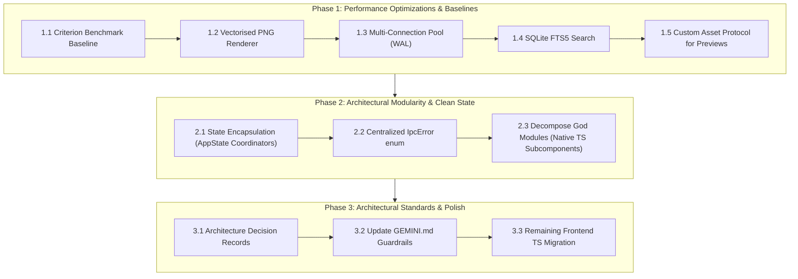

# Architectural & Code Quality Review: Performance & Maintainability Plan

This document outlines the architectural review and improvement plan for **Embroidery Catalogue**, focusing on **runtime performance**, **long-term maintainability for new contributors**, and **software engineering best practices**.

---

## 1. Executive Summary of Findings

| Focus Area | Current State | Key Opportunity | Impact |
| :--- | :--- | :--- | :--- |
| **Benchmarking Baseline** | No automated performance or parsing benchmarks | Criterion micro-benchmarks across formats & renderers | Establishes baselines & catches performance regressions |
| **Preview Rendering** | Antialiased line segments iterated per-pixel offset ($O(r^2 \cdot N)$) | Single-pass stroke rasterization / parallel render pool | **10×–20× faster** thumbnail generation |
| **Database Concurrency** | Single connection pool (`max_connections(1)`) | Multi-connection pool (`max_connections(5)`) in WAL mode | Prevents UI freezes during bulk imports & backfills |
| **State Management** | Static global atomic/mutex variables across services | Encapsulation inside `AppState` | Eliminates test pollution & race hazards |
| **Error Handling** | Inconsistent `Result<T, String>` and raw string errors | Centralized `IpcError` enum with typed error codes | Structured, actionable UI errors and clean signatures |
| **Module Modularity** | Multiple 2,000+ line "God modules" (Rust & Svelte) | Domain decomposition into cohesive sub-components | Drastically reduces onboarding friction & merge conflicts |
| **Frontend Typing** | JSDoc annotations in `.svelte` / `.js` files | Native Svelte 5 TypeScript `<script lang="ts">` | Eliminates runtime type errors across IPC boundary |
| **Thumbnail IPC** | Base64 strings encoded/decoded over JSON IPC | Custom Tauri URI scheme / streaming binary protocol | **33% lower memory** & instantaneous card image loading |

---

## 2. Deep Dive & Improvement Plan

### 🚀 Phase 1: High-Impact Performance Optimizations & Baselines

#### 1.1 Micro-Benchmarking Baseline Harness
* **Location:** `benches/` using `criterion`
* **Implementation:**
  Scaffold Criterion benchmarks measuring baseline throughput on standard `.pes`, `.jef`, `.dst`, `.vp3`, `.hus` fixtures before optimizations:
  * Binary parsing throughput (MB/s).
  * Stitch identification calculation time.
  * 2D and 3D PNG rendering speed.
* **Reason:** Captures the unoptimized baseline upfront so we can scientifically measure and prove the 10×–20× rendering and concurrency improvements.

---

#### 1.2 Vectorised / Single-Pass Preview Rendering Engine
* **Location:** `src/png_writer.rs`
* **Current Implementation:**
  `draw_segment_2d` and `draw_segment_3d` draw thick antialiased lines by executing nested coordinate loops:
  ```rust
  for ox in -thread_radius..=thread_radius {
      for oy in -thread_radius..=thread_radius {
          if (ox * ox) + (oy * oy) > thread_radius * thread_radius { continue; }
          draw_antialiased_line_segment_mut(img, ...);
      }
  }
  ```
  For a 3D preview with thread radius $r=3$, this executes up to **49 antialiased line rasterizations per stitch** across 3 passes (shadow, core, highlight). For a design with 50,000 stitches, this results in **~7.35 million line draw calls per thumbnail**.
* **Proposed Change:**
  1. Replace nested offset loops with a single-pass thick line polygon/capsule rasterizer or Bresenham ribbon stroke with anti-aliased edge blending.
  2. Utilize `rayon` data-parallelism when generating previews in batch passes (`services::image_generation`).
* **Reason:** Generates thumbnails 10×–20× faster, shortening bulk import and backfill indexing from minutes to seconds on large libraries.

---

#### 1.3 SQLite Concurrency via Multi-Connection Pool in WAL Mode
* **Location:** `src/database/connection.rs`
* **Current Implementation:**
  The pool is configured with `.max_connections(1)`. While SQLite only allows one active writer at a time, in **WAL mode** (`PRAGMA journal_mode = WAL`), SQLite natively supports **multiple concurrent readers alongside an active writer**.
* **Chosen Architectural Decision:**
  Configure a unified multi-connection pool with `max_connections(5)` in WAL mode.
  - **Zero Signature Churn:** Preserves existing `&SqlitePool` parameter types across all ~200+ service functions and Tauri commands.
  - **Non-blocking UI Reads:** Up to 4-5 concurrent read queries (search, browse pagination, counts, dropdown filters) execute simultaneously in parallel, even while a bulk import or AI backfill write transaction is active in the background.
  - **Clean Restore Hot-Swapping:** Centralizes pool lifecycle within `PoolHolder` in `AppState` without coordinating separate split-pool lifecycles.
* **Implementation Invariants & Safety Constraints:**
  1. **WAL & Pragmas on Unified Pool:**
     * Maintain existing pragmas (`PRAGMA journal_mode = WAL`, `PRAGMA auto_vacuum = INCREMENTAL`, `PRAGMA synchronous = NORMAL`, `PRAGMA busy_timeout = 30000`, `PRAGMA foreign_keys = ON`) configured cleanly upon opening the pool.
  2. **Lifecycle & Pool Swapping (`PoolHolder`):**
     * The multi-connection pool remains fully encapsulated in `AppState`'s swappable holder (`PoolHolder`).
     * Database restore and data-root migrations cleanly close all connections in the pool before replacing it, preventing Windows file lock conflicts during database file rename/swap operations.
  3. **Managed State Rule:**
     * Deprecate and remove standalone static pools (e.g. `BULK_IMPORT_DB_POOL`), channeling all background tasks through Tauri managed `AppState`.
* **Reason:** Prevents UI browse pagination, filter dropdowns, and search queries from blocking or timing out while a bulk import or AI backfill is writing in the background.

---

#### 1.4 SQLite Full-Text Search (FTS5) for Instant Querying
* **Location:** `src/routes/designs.rs`
* **Current Implementation:**
  General search builds dynamic `LIKE '%...%'` queries across `filename`, `filepath`, and tag descriptions. `LIKE '%query%'` cannot use standard B-Tree indexes and requires full table scans.
* **Proposed Change:**
  1. Add an SQLite `FTS5` virtual table (e.g. `designs_fts`) indexing `filename`, `filepath`, and denormalized tag text, kept in sync via SQLite triggers on `designs` and `design_tags`.
  2. Use `MATCH` queries in `designs.rs`.
* **Reason:** Reduces search latency on 50,000+ design catalogues from 100ms+ to <2ms, with built-in prefix matching and token ranking.

---

#### 1.5 Binary / Custom URI Protocol for Thumbnail Transport
* **Location:** `src/routes/designs.rs` & `frontend/src/lib/views/BrowseView.svelte`
* **Current Implementation:**
  Thumbnails are sent to the frontend as Base64-encoded strings inside JSON payloads (`getBrowseDesignPreviews`).
* **Proposed Change:**
  Register a custom Tauri protocol handler (e.g. `embroidery-preview://design/{id}`) or use Tauri v2's asset streaming protocol that returns raw PNG bytes with `image/png` MIME type and `Cache-Control` headers.
* **Reason:** Eliminates Base64 encoding CPU overhead (~33% payload bloat), avoids holding thousands of Base64 strings in JavaScript heap, and lets the browser cache and decode images off the main UI thread.

---

### 🧱 Phase 2: Architectural Modularity, State & Error Contracts

#### 2.1 Eliminate Static Process Globals in Favor of Managed State
* **Locations:**
  * `src/routes/bulk_import.rs` (`BULK_IMPORT_CONTEXT_STORE`, `BULK_IMPORT_DB_POOL`, `BULK_IMPORT_STOP_REQUESTED`, `BULK_IMPORT_APP_HANDLE`, etc.)
  * `src/services/backfill.rs` (`STOP_REQUESTED`, `BACKFILL_RUNNING`)
* **Current Implementation:**
  Global static `OnceLock<Mutex<...>>` and `AtomicBool` are scattered across route and service files.
* **Proposed Change:**
  Encapsulate all background task managers, cancellation tokens, and session context caches within a dedicated `TaskCoordinator` / `BulkImportCoordinator` struct injected via Tauri's managed `AppState`.
* **Reason:** Ensures clean lifecycle management, allows parallel test execution without `#[serial]` annotations, prevents cross-test state leakage, and prevents dangling background tasks during app shutdown. **Must be performed before decomposing modules** to avoid exposing private statics across multiple files.

---

#### 2.2 Unify Error Types Across Backend and IPC Bridge (`IpcError`)
* **Locations:** `src/error.rs`, `src/database/connection.rs`, `src/routes/`
* **Current Implementation:**
  Some routes return `Result<T, String>`, others return custom structs, and errors are converted to strings with `.map_err(|e| e.to_string())`.
* **Proposed Change:**
  1. Define a centralized `#[derive(thiserror::Error, serde::Serialize)]` enum `IpcError` with structured error codes (e.g. `NotFound`, `DatabaseBusy`, `InvalidFormat`, `PermissionDenied`).
  2. Implement `From<sqlx::Error>`, `From<std::io::Error>`, and `From<AppError>` for `IpcError`.
  3. Mirror `IpcError` in TypeScript under `frontend/src/lib/types/errors.ts`.
* **Reason:** Establishes the strong error contract **before** splitting modules, so all newly created domain submodules use clean `Result<T, IpcError>` signatures without requiring a secondary refactor pass.

---

#### 2.3 Decompose "God Modules" into Focused Domain Submodules
* **Locations:**
  * `src/routes/designs.rs` (2,858 lines)
  * `src/routes/bulk_import.rs` (2,551 lines)
  * `src/services/backfill.rs` (2,119 lines)
  * `frontend/src/lib/views/BrowseView.svelte` (2,300 lines)
  * `frontend/src/lib/views/ImportView.svelte` (1,800+ lines)
* **Proposed Change:**
  * **Rust Routes (`designs.rs`):** Split into `src/routes/designs/` containing:
    * `browse.rs` (query building, pagination, filtering)
    * `details.rs` (single design fetching, preview retrieval)
    * `metadata.rs` (updating ratings, verification flags, project associations)
    * `tags.rs` (assigning, removing, and batch-toggling image & stitching tags)
    * `deletion.rs` (safe trashing and deletion operations)
  * **Rust Routes (`bulk_import.rs`):** Split into `src/routes/bulk_import/` containing:
    * `scanner.rs` (filesystem scanning and metadata pre-extraction)
    * `session.rs` (context caching and wizard step tracking)
    * `batch_importer.rs` (batch design insertion and commit loops)
  * **Frontend Views (Native Svelte 5 TypeScript):** Extract cohesive sub-components directly as `<script lang="ts">` with typed `$props<{ ... }>()`:
    * `BrowseSearchBar.svelte` (general search input, debounce logic, search-in checkboxes)
    * `BrowseFilterPanel.svelte` (collapsible filter panel for designer, tags, source, hoop, dimensions, rating)
    * `BrowseGrid.svelte` / `BrowseCard.svelte` (card rendering, row & card selection handling)
    * `BrowseBulkActionsModal.svelte` (bulk tagging, project assignment, and verification dialogs)
* **Reason:** Drastically improves code comprehension for new developers, isolates unit test boundaries, and prevents Git merge conflicts during concurrent development.

---

### 🛠️ Phase 3: Architectural Standards & Final Polish

#### 3.1 Architecture Decision Records
* **Location:** `docs/architecture_decisions/`
* **Proposed Implementation:**
  Document key architectural invariants (such as those currently noted in `GEMINI.md`) as formal lightweight Architecture Decision Records:
  * `001-immutable-original-files.md`: Immutable original files & non-destructive cataloguing.
  * `002-config-json-data-root.md`: Data root configuration stored in `config.json` rather than SQLite.
  * `003-tagging-isolation.md`: Strict isolation of Image Tags vs Technical Stitching Tags.
  * `004-recovery-mode-gating.md`: Database recovery mode side-effect gating.
  * `005-sqlite-wal-connection-pool.md`: SQLite WAL multi-connection pool & pragma lifecycle.
* **Reason:** Ensures future developers understand the *historical context and rationales* behind non-obvious design decisions before making architectural refactors.

---

#### 3.2 Update GEMINI.md Architectural Guardrails
* **Location:** `GEMINI.md`
* **Proposed Implementation:**
  Embed permanent developer and AI agent constraints into `GEMINI.md` to prevent future architectural regressions and avoid massive refactorings:
  1. **Production Module Size Limit:** Production Rust modules and Svelte views must remain under **500 lines**. Require domain decomposition into submodules (`browse.rs`, `details.rs`, `metadata.rs`, `tags.rs`, `deletion.rs`) rather than monolithic files.
  2. **Zero Static Process Globals:** Absolute ban on standalone `static Mutex<...>` and `static OnceLock<...>` in routes and services. All coordinators and background managers must be injected via `AppState`.
  3. **Structured IPC Error Enum:** All Tauri commands must return typed `Result<T, IpcError>` rather than converting errors to raw strings via `.map_err(|e| e.to_string())`.
  4. **Native Svelte 5 TypeScript Rule:** All new and modified components must use `<script lang="ts">` with typed runes and `$props<{ ... }>()`.
  5. **Rendering & Parsing Performance Discipline:** Ban nested $O(r^2 \cdot N)$ coordinate loops; require single-pass vectorised algorithms verified by Criterion micro-benchmarks.
* **Reason:** Ensures every future agent turn automatically loads and strictly enforces these architectural boundaries before writing code.

---

#### 3.3 Native Svelte 5 TypeScript Migration for Remaining Views
* **Location:** `frontend/src/lib/views/`
* **Proposed Implementation:**
  Migrate remaining legacy `.js` services and `.svelte` views to `<script lang="ts">` using typed runes and props.
* **Reason:** Delivers complete end-to-end compile-time type safety across the entire Svelte frontend.

---

## 3. Implementation Roadmap


