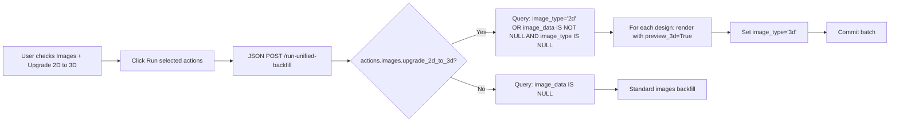
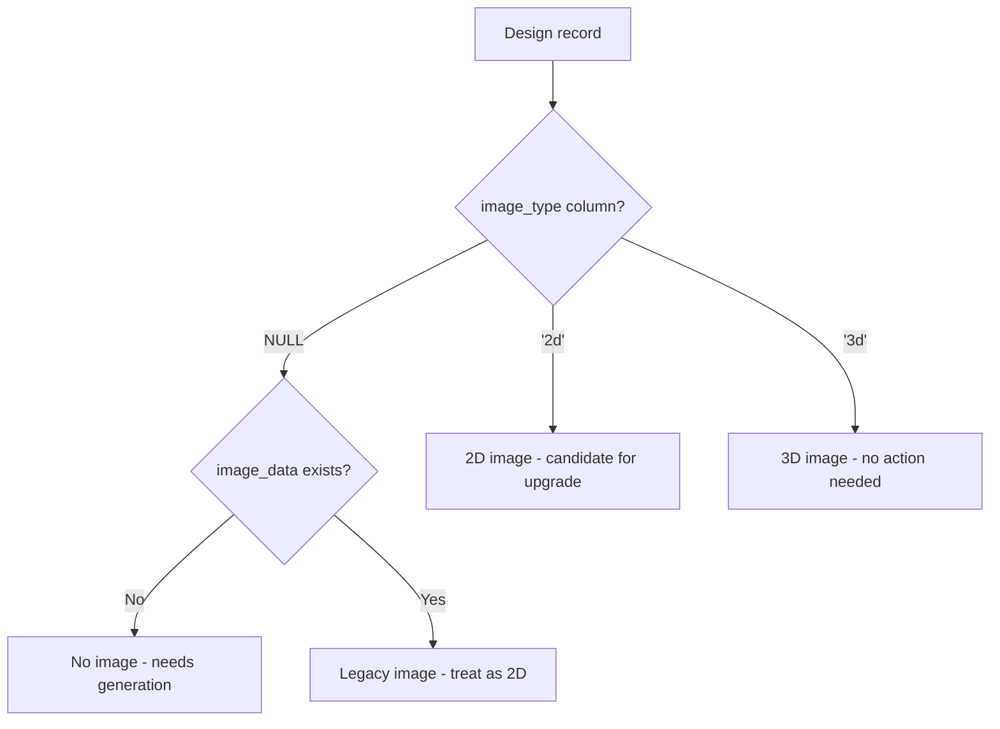

# Plan: 2D to 3D Image Upgrade

**Note on indexing:** The `image_type` column has very low cardinality (only 3 values: NULL, '2d', '3d'), so a B-tree index would not be selective enough to be beneficial. Queries against this column are infrequent bulk admin operations (tagging actions page), not hot-path lookups. Therefore, **no index is needed** — the overhead of index maintenance on every image write outweighs the marginal query benefit.

**Backfill strategy for existing images:** Existing rows with `image_data IS NOT NULL` will be backfilled as `image_type = '2d'`. The 2D preview option was recently added and is the default for bulk operations, so existing images are most likely 2D renders. If any are actually 3D, the upgrade option will simply re-render them (no data loss — it overwrites with the same 3D result).

## Overview

Currently, the app can render preview images in either 2D (fast, small) or 3D (detailed, larger). The user wants:
1. A button on the **design detail page** to render a 3D preview for an individual design.
2. An option on the **tagging actions page** to upgrade existing 2D images to 3D.
3. A way to **detect which images are 2D vs 3D** — either by image_data size heuristics or a new DB column.

## Decision: New `image_type` Column

We'll add an `image_type` column to the `designs` table. This is more reliable than size heuristics (which could have false positives/negatives) and allows easy querying. Values:
- `NULL` — no image has been generated
- `"2d"` — a 2D preview was rendered
- `"3d"` — a 3D preview was rendered

This also future-proofs for any additional render types.

---

## Task 1: Add `image_type` Column + Alembic Migration

### Files to modify:
- [`src/models.py`](src/models.py:136) — Add `image_type` column to `Design` class
- New file: `alembic/versions/0011_add_image_type.py`

### Details:
1. Add to [`Design`](src/models.py:136):
   ```python
   image_type: Mapped[str | None] = mapped_column(String(10), nullable=True)
   ```
2. Create Alembic migration `0011_add_image_type.py` that:
   - Adds `image_type VARCHAR(10)` column to `designs` table
   - Backfills existing rows: if `image_data IS NOT NULL` set `image_type = '2d'` (the 2D option was recently added and is the default for bulk operations, so existing images are most likely 2D renders)
   - Down-revision: `0010_add_stitch_color_counts`

---

## Task 2: Update `_render_preview` and Image Generation to Set `image_type`

### Files to modify:
- [`src/services/preview.py`](src/services/preview.py:304) — No change needed to `_render_preview` itself (it already accepts `preview_3d` param)
- [`src/services/unified_backfill.py`](src/services/unified_backfill.py:306) — Update `run_images_action_runner` to set `design.image_type`
- [`src/services/unified_backfill.py`](src/services/unified_backfill.py:500) — Update worker path to return `image_type` in result dict
- [`src/services/unified_backfill.py`](src/services/unified_backfill.py:913) — Update main process write logic to set `image_type` from worker results
- [`src/services/designs.py`](src/services/designs.py:262) — Update `create()` auto-backfill to set `image_type`
- [`backfill_images.py`](backfill_images.py:150) — Update to set `image_type`

### Details:
1. In `run_images_action_runner` (unified_backfill.py, line ~316): After rendering, set:
   ```python
   design.image_type = "2d" if not preview_3d else "3d"
   ```
2. In the worker `_process_design_batch_worker` (line ~504): Add `"image_type"` to the result dict:
   ```python
   result["image_type"] = "2d" if not preview_3d else "3d"
   ```
3. In the main process write loop (line ~913): Apply `image_type` from result:
   ```python
   if r.get("image_type") is not None:
       design_obj.image_type = r["image_type"]
   ```
4. In `designs.py` `create()` (line ~269): After rendering, set `design.image_type = "3d"` (since it calls `_render_preview` without `preview_3d=False`, default is 3d).
5. In `backfill_images.py` (line ~150): After rendering, set `design.image_type = "2d" if args.preview_2d else "3d"`.

---

## Task 3: "Render 3D Preview" Button on Design Detail Page

### Files to modify:
- [`src/routes/designs.py`](src/routes/designs.py:368) — Add a new POST endpoint
- [`templates/designs/detail.html`](templates/designs/detail.html:44) — Add button in the image panel

### Details:
1. Add new route in [`src/routes/designs.py`](src/routes/designs.py):
   ```python
   @router.post("/{design_id}/render-3d-preview", response_class=RedirectResponse)
   def render_3d_preview(design_id: int, db: Session = Depends(get_db)):
       """Render a 3D preview image for a single design."""
       design = svc.get_by_id(db, design_id)
       if not design:
           raise HTTPException(status_code=404, detail="Design not found.")
       
       # Resolve file path
       full_path = _resolve_design_full_path(db, design)
       if not os.path.isfile(full_path):
           raise HTTPException(status_code=404, detail="Design file not found.")
       
       try:
           import pyembroidery
           from src.services.preview import _render_preview
           pattern = pyembroidery.read(full_path)
           if pattern is None:
               raise HTTPException(status_code=500, detail="Could not read embroidery file.")
           
           design.image_data = _render_preview(pattern, preview_3d=True)
           design.image_type = "3d"
           
           # Also update dimensions if missing
           bounds = pattern.bounds()
           if bounds:
               min_x, min_y, max_x, max_y = bounds
               design.width_mm = round((max_x - min_x) / 10.0, 2)
               design.height_mm = round((max_y - min_y) / 10.0, 2)
           
           db.commit()
           logger.info("Rendered 3D preview for design %d (%s)", design_id, design.filename)
       except Exception as exc:
           logger.exception("Failed to render 3D preview for design %d: %s", design_id, exc)
           raise HTTPException(status_code=500, detail=str(exc))
       
       return RedirectResponse(f"/designs/{design_id}", status_code=303)
   ```

2. In [`templates/designs/detail.html`](templates/designs/detail.html), inside the image panel (around line 44-50), add a button below the image:
   ```html
   
     
     <div class="mt-2 flex gap-2 no-print">
       <form method="post" action="/designs/{{ design.id }}/render-3d-preview">
         <button type="submit" class="text-xs bg-indigo-600 text-white px-3 py-1 rounded hover:bg-indigo-700"
                 title="Re-render this preview in 3D (replaces current image)">
           ✓ 3D PreviewRender 3D Preview
         </button>
       </form>
     </div>
   
     <div class="text-gray-400 text-sm">No preview available</div>
     <form method="post" action="/designs/{{ design.id }}/render-3d-preview" class="mt-2 no-print">
       <button type="submit" class="text-xs bg-indigo-600 text-white px-3 py-1 rounded hover:bg-indigo-700">
         Generate 3D Preview
       </button>
     </form>
   
   ```

---

## Task 4: "Update 2D Images to 3D" Option on Tagging Actions Page

### Files to modify:
- [`templates/admin/tagging_actions.html`](templates/admin/tagging_actions.html:269) — Add checkbox in the images options section
- [`src/routes/tagging_actions.py`](src/routes/tagging_actions.py:126) — Update `run_unified_backfill` to pass the new option
- [`templates/admin/tagging_actions.html`](templates/admin/tagging_actions.html:400) — Update JS to include new option in payload

### Details:
1. In [`templates/admin/tagging_actions.html`](templates/admin/tagging_actions.html), in the `#images-options` div (line ~269), add:
   ```html
   <div id="images-options" class="ml-6 hidden space-y-1">
     <label><input type="checkbox" name="images_redo" value="1" id="images_redo" /> Re-process all images</label>
     <label class="block mt-1"><input type="checkbox" name="images_2d" value="1" id="images_2d" /> Use fast 2D preview (skip 3D rendering)</label>
     <label class="block mt-1"><input type="checkbox" name="images_upgrade_2d_to_3d" value="1" id="images_upgrade_2d_to_3d" /> Upgrade existing 2D images to 3D</label>
   </div>
   ```

2. In the JS `runUnifiedBackfill()` function (line ~418), update the images action payload:
   ```javascript
   } else if (action === 'images') {
     actions.images = {
       redo: form.images_redo.checked,
       upgrade_2d_to_3d: form.images_upgrade_2d_to_3d.checked
     };
   }
   ```

3. In [`src/routes/tagging_actions.py`](src/routes/tagging_actions.py), the `run_unified_backfill` endpoint already propagates `preview_3d` into `actions["images"]`. The `upgrade_2d_to_3d` option will be passed through in the body and added to `actions["images"]` automatically by the existing code (line 145-146). No route change needed.

---

## Task 5: Update Unified Backfill Images Action to Support 2D→3D Upgrade

### Files to modify:
- [`src/services/unified_backfill.py`](src/services/unified_backfill.py:718) — Update the images action query logic

### Details:
The current images query (line 718-731):
```python
if "images" in actions:
    img_opts = actions["images"]
    redo = img_opts.get("redo", False)
    q = db.query(Design)
    if not redo:
        q = q.filter(Design.image_data.is_(None))
    for d in q.all():
        ...
        design_map[d.id].needs_images = True
```

We need to add a third mode: **upgrade 2D to 3D**. When `upgrade_2d_to_3d` is `True`:
- Include designs where `image_type == '2d'` (or `image_data IS NOT NULL` and `image_type IS NULL` for legacy rows)
- Re-render them with `preview_3d=True`
- Set `image_type = '3d'`

Updated logic:
```python
if "images" in actions:
    img_opts = actions["images"]
    redo = img_opts.get("redo", False)
    upgrade_2d = img_opts.get("upgrade_2d_to_3d", False)
    
    if redo:
        # Re-process all designs regardless of current state
        q = db.query(Design)
    elif upgrade_2d:
        # Only designs that have 2D images (or legacy images without type set)
        q = db.query(Design).filter(
            (Design.image_type == "2d") | 
            ((Design.image_data.isnot(None)) & (Design.image_type.is_(None)))
        )
    else:
        # Only designs with no image at all
        q = db.query(Design).filter(Design.image_data.is_(None))
    
    for d in q.all():
        ...
```

The `preview_3d` option should be **forced to True** when `upgrade_2d_to_3d` is set, since the whole point is to get 3D renders. In the worker and sequential paths, the `preview_3d` setting from `img_opts` is already used — we just need to ensure it's `True` when upgrading.

In the sequential `run_images_action_runner` (line 306-338), the code already reads `preview_3d = img_opts.get("preview_3d", True)` — no change needed there.

In the worker `_process_design_batch_worker` (line 500-504), the code already reads `preview_3d = img_opts.get("preview_3d", True)` — no change needed there either.

---

## Task 6: Update the Images Action Query Logic to Detect 2D Images

This is covered in Task 5 above. The key change is in [`src/services/unified_backfill.py`](src/services/unified_backfill.py:718-731).

Additionally, we should update the `DesignWorkItem` dataclass (line 43) to carry the `image_type` field so the worker knows what the current state is:

```python
@dataclass
class DesignWorkItem:
    ...
    image_data: bytes | None = None
    image_type: str | None = None  # NEW
    ...
```

And populate it in the images query section:
```python
design_map[d.id].image_type = d.image_type  # NEW
```

This isn't strictly necessary for the worker logic (since the worker just renders based on `preview_3d`), but it's good practice for traceability.

---

## Summary of All Changes

| # | File | Change |
|---|------|--------|
| 1 | [`src/models.py`](src/models.py:136) | Add `image_type: Mapped[str \| None]` column to `Design` |
| 2 | `alembic/versions/0011_add_image_type.py` | New migration: add `image_type` column, backfill existing |
| 3 | [`src/services/unified_backfill.py`](src/services/unified_backfill.py:43) | Add `image_type` to `DesignWorkItem` dataclass |
| 4 | [`src/services/unified_backfill.py`](src/services/unified_backfill.py:306) | Set `design.image_type` in `run_images_action_runner` |
| 5 | [`src/services/unified_backfill.py`](src/services/unified_backfill.py:500) | Return `image_type` in worker result dict |
| 6 | [`src/services/unified_backfill.py`](src/services/unified_backfill.py:718) | Update images query to support `upgrade_2d_to_3d` mode |
| 7 | [`src/services/unified_backfill.py`](src/services/unified_backfill.py:913) | Apply `image_type` from worker results in main process |
| 8 | [`src/services/designs.py`](src/services/designs.py:262) | Set `image_type = "3d"` in `create()` auto-backfill |
| 9 | [`backfill_images.py`](backfill_images.py:150) | Set `image_type` after rendering |
| 10 | [`src/routes/designs.py`](src/routes/designs.py) | Add `POST /{design_id}/render-3d-preview` endpoint |
| 11 | [`templates/designs/detail.html`](templates/designs/detail.html:44) | Add "Render 3D Preview" button |
| 12 | [`templates/admin/tagging_actions.html`](templates/admin/tagging_actions.html:269) | Add "Upgrade 2D images to 3D" checkbox |
| 13 | [`templates/admin/tagging_actions.html`](templates/admin/tagging_actions.html:418) | Update JS to send `upgrade_2d_to_3d` in payload |

## Flow Diagrams

### Design Detail Page Flow
```mermaid
flowchart LR
    A[User clicks Render 3D Preview] --> B[POST /designs/{id}/render-3d-preview]
    B --> C[Read embroidery file via pyembroidery]
    C --> D[_render_previewpattern, preview_3d=True]
    D --> E[Set design.image_data = PNG bytes]
    E --> F[Set design.image_type = '3d']
    F --> G[Commit to DB]
    G --> H[Redirect back to detail page]
    H --> I[Page reloads showing new 3D image]
```

### Tagging Actions Page Flow


### Image Type Detection Logic


---

## Migration Strategy

The Alembic migration `0011_add_image_type.py` will:
1. Add the `image_type VARCHAR(10)` column (nullable)
2. Backfill existing rows: `UPDATE designs SET image_type = '2d' WHERE image_data IS NOT NULL`
   - The 2D preview option was recently added and is the default for bulk operations, so existing images are most likely 2D renders
   - If any are actually 3D, the upgrade option will simply re-render them (no data loss — it overwrites with the same 3D result)
3. This is a non-destructive, additive change with no downtime
